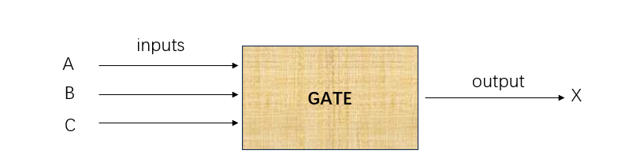

Boolean Logic
=====

引言
------------
上一个章节，我们一直在讨论二进制数据的所代表的不同含义，接下来我们将讨论Boolean logic, Boolean logic 是通过二进制的另外一种表达形式：控制, 通过读取不同 bit 的value，可以获得不同的结果,接下来我们先介绍组成BolleanLogic的基本的单元： logic gate

逻辑门(Logic Gate)
------------

概念
^^^^^^^^^^^
有1个以上的输入(Inputes),经过这个小型电路后，只有1个输出(output)，如下图

公式: 这个小型电路设计 隐含有一个数学公式(否则输出就是混乱的)

真值表(Truth Table): 用来描述 inputs到output的关系映射

比如 假设有ABC三个输入， 输出 = X ,公式：输入有两个1，X=1,否则X=0,下面是一个例子：

+-----+------+------+-------+
|  输入             | 输出  |
+=====+======+======+=======+
|A    |  B   |  C   |  X    |
+-----+------+------+-------+
|  0  |  0   |  0   |   0   |
+-----+------+------+-------+
|  0  |  0   |  1   |   0   |
+-----+------+------+-------+
|  0  |  1   |  0   |   0   |
+-----+------+------+-------+
|  0  |  1   |  1   |   1   |
+-----+------+------+-------+
|  1  |  0   |  0   |   0   |
+-----+------+------+-------+
|  1  |  0   |  1   |   0   |
+-----+------+------+-------+
|  1  |  1   |  0   |   1   |
+-----+------+------+-------+
|  1  |  1   |  1   |   0   |
+-----+------+------+-------+

现实应用
^^^^^^^^^^^
本节通过一个现实生活中很小的例子,来看一下boolean logic的应用 旨在更好的理解

.. note::

   我喜欢经常使用现实中的例子做类比或者参考，这样会更加生动并加深理解

让我们想像一下，野马轿车,如果你很熟悉汽车，你一定知道他最大的特色之一是他的车尾灯：

我想说当他流水灯亮起来的时候 帅爆了，流水灯？你应该想到了 就是第一个灯亮 第二个、第三再亮 然后重复循环，OK 这样的软件/硬件怎么设计？

 + 一个定时器: 用来表示滴答
 + 一个2bits计数器：作为控制器，枚举不同的状态, 每次滴答，计数加1， 为什么是2bits？ 因为一共有四个状态: 灯1亮 灯12亮 灯123亮 灯123(灭) 
 
让我们用真值表来表示一下：假设A B是我们的2bit控制器 我们有三个输出(三个真值表) 输出分别控制 灯1 灯2 灯3，因为输入是一样的，我们把三个真值表合成一个:
 
+-----+------+------+-------+-------+
|  输入      |    输出              |
+=====+======+======+=======+=======+
|A    |  B   |  灯1 |   灯2 |  灯3  |
+-----+------+------+-------+-------+
|  0  |  0   |  0   |   0   |   0   |
+-----+------+------+-------+-------+
|  0  |  1   |  1   |   0   |   0   |
+-----+------+------+-------+-------+
|  1  |  0   |  1   |   1   |   0   |
+-----+------+------+-------+-------+
|  1  |  1   |  1   |   1   |   1   |
+-----+------+------+-------+-------+

让我们在看一下每个灯的控制逻辑(公式)：
 
 + 灯1亮(灭)的条件是：当AB输入任意1个是1亮，或者AB输入都为0的时候灭
 + 灯2亮(灭)的条件是：当A输入1亮，A输入0则灭
 + 灯3亮(灭)的条件是：当AB全部输入1亮，否则灭
 
 

