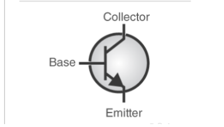
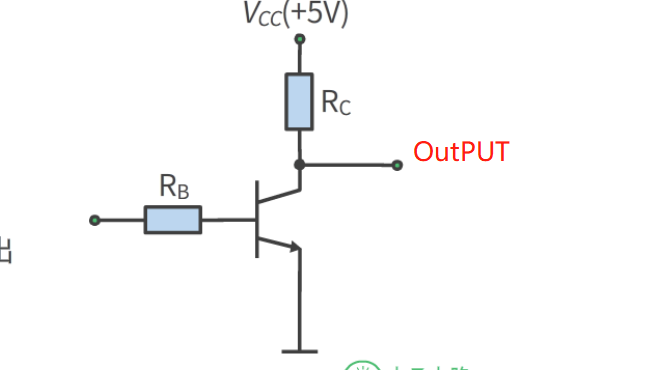
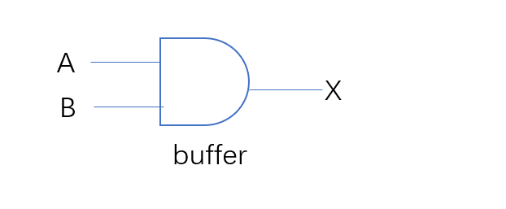
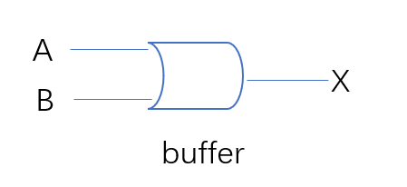

===========
计算机原理
===========

本章内容主要来源于以下视频资源的学习

https://cs224.cs.vassar.edu/ ： 一门大学课程，关注于 ISA 和 CPU设计  
  
https://www.youtube.com/playlist?list=PLxfrSxK7P38X7XfG4X8Y9cdOURvC7ObMF ：一门油管的系列课程，关注于计算机底层设计以及数学相关的理论

https://www.youtube.com/watch?v=tpIctyqH29Q&list=PL8dPuuaLjXtNlUrzyH5r6jN9ulIgZBpdo ： 一门有关的计算机科学快速入门

前言
=====

为什么要学习计算机原理
------------------------
在信息越来越爆炸的今天，在时间越来越宝贵的今天，所有人在学习之前总要问自己一个问题，why？如果不搞定这个问题,那就可能只是三分钟热度，无法持久
无论是做操作系统开发，还是上层应用开发，了解计算机工作原理都是必要的，用一个不太恰当的比喻：
一名司机，或许根本不需要了解发动机或者是变速箱是如何工作的，也可以驾驶汽车，但是如果清楚工作原理，可以让你变成一个具备下述条件的司机： 
  
  - 清楚换挡逻辑，可以很轻松的让你的汽车油耗比其他人低
  - 汽车故障: 对于简单故障，可以自己尝试定位问题，说不定只是螺丝松了

这门课程目的也是如此，不清楚计算机工作原理，或许也能写上层应用代码，但是你的代码性能可能就是往往不如其他人，学习这门课程，尤其是对于操作系统开发工程师，更是必须的.总而言之，我相信在学习完这些基础，你会变得
 
 - 更值钱
 - 更清楚上层应用或者操作系统为什么要那样实现，而不是这样实现

本门课程主要是聚焦于下图标注的层级

.. image:: ./images/1.png
 :width: 800px
 
参考教材: cpmputer systems

计算机的前世今生
-----------------
你可能已经听惯了这类说辞，比如XXX在XX年发明了第一台计算机，XX是第一个女程序员，XX年发明了第一台超级计算机等等，好吧，但是你真的清楚吗？比如 为什么一定需要计算机呢？没有计算机人类不是也可以生活的很好吗？计算机的出现到底改变了什么？

本小节内容主要来自 Crash Course computer since的前三集 强烈建议你看一遍: https://www.youtube.com/watch?v=LN0ucKNX0hc&list=PL8dPuuaLjXtNlUrzyH5r6jN9ulIgZBpdo&index=3

我仅针对这部分内容做一些自己的总结

计算的存在：
  计算这个工作自古就有，事实上有数学这个概念以后就存在了，人类社会离开了计算，社会生活无法正常开展，比如你需要用1斤粮食换2块布，10斤粮食换20块布，经济交易中必须要数学计算。

计算机的存在：
  computer在表示计算机之前，表示的是一类职业，一类专门做数学计算的人员，中国也有，比如最早的"掌柜"，算盘一定是基本技能，也并不是人人都会计算，对吗？回想百年之前的中国，当识字尚且是困难，更何况数学？今天，无论是计算器、计算机都可以帮助我们完成复杂的数学计算，一切这些都可以叫计算机
  
什么驱动计算机的发展：
  我认为是辩证的，有人说计算机的出现改变了社会，不可否认，但是也必须承认，社会的发展促使了计算机的发展，当人类进入蒸汽时代，当人类的社会生产力发生了巨大进步的时候，社会对于计算量的成百千万倍的需求，必然导致要有对应的"工具"出现，匹配以同等的社会发展程度

暂且想到这里，最后总结一下，计算“机”的本质就是计算，古老的计算机1秒甚至几十秒计算一次，现在的计算机，一秒可以计算上亿次,仅此而已，当然要完成1秒上亿次的计算，必然要搞定某些技术，恰好，我们要研究的，就是探讨这些技术

关于顺序
---------
说实话，由于在学习以及阅读这门课程相关资料的时候，不同老师都有不同的讲课顺序，而这些知识可能又是错综复杂 互相依赖的，在梳理过程中 我也真的很头疼，但是最终我决定，我的笔记顺序将按照
抽象的逻辑 +  基础知识(和体系无关)的顺序

先说明一下什么是抽象逻辑，计算机原理，大部分都存在 封装(抽象)的概念，比如： 

 - 半导体晶体管是最基础的电子电路 
 - 逻辑门是 半导体晶体管 组成的，到了这一层以后，可以不用在关注 半导体晶体管
 - ALU是 逻辑门 组成的， 到了这一层以后，可以不用在关注 逻辑门
 - 依次类推

当然有些知识，可能不具有这样的特性，比较独立，我们就单独作为章节讲解

逻辑门和布尔代数
================
我大学在学习 布尔代数的时候，感觉老师就是在讲 什么AND OR,虽然学到最后，考试也都没有问题，但是还是不知道学了这玩意有什么用，如今再次学习，不得不说是恍然大悟

我先把我自己关于这块的一点点理解说一下：计算机完成计算的实现，本质上就是逻辑运算，也叫真值表排列吧，我先举一个例子，你可以屏蔽掉相关术语的使用，关于一个加法的实现： 0+0=0，1+0=1. 1+1 = 2 可以变成下面的真值表：
这里涉及到二进制、也涉及到真值表，这些概念以后你都会了解，但是如果你已经是一名程序员，我相信你也不陌生这些概念，这里最神奇的地方就在于，我们理所应当认为的数学计算，居然变成了逻辑表达式，而逻辑表达式，最后又可以变成电路图，电路图最后又可以画在电路板上,这样一个能够每秒运行1亿次的加法器就出现了

+-----+------+------+-------+
|  输入      |    输出      | 
+=====+======+======+=======+
|A    |  B   |  进位|  个位 |
+-----+------+------+-------+
|  0  |  0   |  0   |   0   |
+-----+------+------+-------+
|  0  |  1   |  0   |   1   |
+-----+------+------+-------+
|  1  |  0   |  0   |   1   |
+-----+------+------+-------+
|  1  |  1   |  1   |   0   |
+-----+------+------+-------+

所以，我想说，计算机内部实际上就是由基础的门组成的复杂电路，这些电路总是能在某个条件下，完成特定的计算，所以，学习这些基础门成为了一个必要

基本概念
---------
有1个以上的输入(Inputes),经过这个小型电路后，只有1个输出(output)，如下图

.. image:: ./images/1.png
  :width: 400px

公式: 这个小型电路设计 隐含有一个数学公式(否则输出就是混乱的)

真值表(Truth Table): 用来描述 inputs到output的关系映射

比如 假设有ABC三个输入， 输出 = X ,公式：输入有两个1，X=1,否则X=0,下面是一个例子：

+-----+------+------+-------+
|  输入             | 输出  |
+=====+======+======+=======+
|A    |  B   |  C   |  X    |
+-----+------+------+-------+
|  0  |  0   |  0   |   0   |
+-----+------+------+-------+
|  0  |  0   |  1   |   0   |
+-----+------+------+-------+
|  0  |  1   |  0   |   0   |
+-----+------+------+-------+
|  0  |  1   |  1   |   1   |
+-----+------+------+-------+
|  1  |  0   |  0   |   0   |
+-----+------+------+-------+
|  1  |  0   |  1   |   0   |
+-----+------+------+-------+
|  1  |  1   |  0   |   1   |
+-----+------+------+-------+
|  1  |  1   |  1   |   0   |
+-----+------+------+-------+

 - 组合模拟电路 ： 直观表达
 - 组合真值代数表达式 ： 数学表达
 - 真值表 ： 结果表达

晶体管
-------
在开始讲门之前，要先在讲一下晶体管，门不是凭空出现的，他最终其实还是由晶体管实现的，可以理解为晶体管是计算里面最小的单元了，他长这样： 

通过控制Base，实现电流的通路，非常简单，就可以把他当成是开关，开关开启，电流通，开关关闭，电流不通，
对应两个状态：通 和 不通

bit
-------
已经知道计算机内部使用的是二进制，1 Bit 只有两个状态 0，1,关于计算机为什么使用0和1，很简单，因为电路在设计上，通过表达通不通只有两种状态，其实可能还有其他原因，比如电压的稳定性，不过多解释了，在这里，我们可以简单的把之前晶体管的状态用1个bit表示，通：1 不通：0 

Inverter(Not Gate)
-------------------
已经有了晶体管和bit的概念，我们继续看第一个基础logic gate： 非门

:定义:  输入1，输出0. 输出0， 输出1

如何实现
^^^^^^^^
在晶体管，我们知道，输入1 输出1 输入0 输出0是很好实现的，那么怎么实现非门？其实也很简单 如下图

 
当输入Rb = 0,下面电路不通， 但是OUTPUT 会处于高电压，因此输出是1 
当输入Rb = 1,下面电路通， 但是OUTPUT 会处于低电压，因此输出是0 

真值表
^^^^^^^^

+-----+-------+
| 输入| 输出  |
+=====+=======+
|A    |  X    |
+-----+-------+
|  0  |  1    |
+-----+-------+
|  1  |  0    |
+-----+-------+

电路表达式
^^^^^^^^^^^^^^^^^^^
.. image:: ./images/4.png
  :width: 400px

左边是输入，中间的三角形表达buffer(用于反转的电路) 右边的圆是输出

数学表达式
^^^^^^^^^^^^

.. math::

   X = \overline{A}

And Gate
----------
与门

:定义: 输入全都是1，输出1； 如果输入有任意1个0，输出0

.. note::

	下面我们输入有两个假定A B，但是实际输入可以是任意多个

如何实现
^^^^^^^^
其实可以想像程就是一个电路串联，只要有一个开关关闭，电路不通即可

真值表
^^^^^^^^

+-----+------+------+
|  输入      | 输出 |
+=====+======+======+
|A    |  B   |   X  |
+-----+------+------+
|  0  |  0   |  0   |
+-----+------+------+
|  0  |  1   |  0   |
+-----+------+------+
|  1  |  0   |  0   |
+-----+------+------+
|  1  |  1   |  1   |
+-----+------+------+

电路表达式
^^^^^^^^^^

  
数学表达式
^^^^^^^^^^^

.. math::

   X = A \cdot B

OR Gate
--------

:定义:  输入任意一个是，输出1； 如果输入全部为0，输出0

如何实现
^^^^^^^^
其实可以想像程就是一个电路并联，只要有一个开关开启，电路就能导通

真值表
^^^^^^^

+-----+------+------+
|  输入      | 输出 |
+=====+======+======+
|A    |  B   |   X  |
+-----+------+------+
|  0  |  0   |  0   |
+-----+------+------+
|  0  |  1   |  1   |
+-----+------+------+
|  1  |  0   |  1   |
+-----+------+------+
|  1  |  1   |  1   |
+-----+------+------+

电路表达式
^^^^^^^^^^^

  
数学表达式
^^^^^^^^^^^

.. math::

   X = A + B

组合门
-------
我们已经知道基本的三个逻辑门： 非门 与门 或门， 其实还有一个异或门，我并不想把他当成基础门，因为他的实现是基于前面三个基础门实现的，不管怎么说，目前为止，我们已经可以抛弃掉晶体管这个东西了，以后我们都会使用晶体管组装程的逻辑门，晶体管到现在已经完成了他的使命，有了基础门这一层抽象，我们接下来就要尝试做更加复杂的事情了，但是别怕，最终也就像现在一样，你不会在关心基础门，而是只是使用他更高一层的抽象 

组合门可以完成的工作有很多，就比如CPU里面的加减法单元，又或者是CPU里面的逻辑单元，只要能够完成这个目标： 
定义了N个输出，并且你确定了这N个输出经过组合门以后，出来的是你的预期，OK，这个组合门就完成了他的使命，但是怎么样去实现这个目标？这就继续需要我们接下来的理论基础

布尔恒等式
-----------
让我们从一个例子入手，现在有一个代数式：

.. math::

   X = A + \overline{A} \cdot B
   
利用我们之前所学 我们可以推导出他的电路和真值表

+-----+------+------------------+--------------------------+--------------------------+--------------------------+
|      输入  |          输出                                                                                     |
+=====+======+==================+==========================+==========================+==========================+
|A    |  B   |  \overline{A}    |  \overline{A} \cdot B    | A + \overline{A} * B     |        A+B               |
+-----+------+------------------+--------------------------+--------------------------+--------------------------+
|0    |  0   |         1        |          0               |             0            |             0            |
+-----+------+------------------+--------------------------+--------------------------+--------------------------+
|0    |  1   |         1        |          1               |             1            |             1            |
+-----+------+------------------+--------------------------+--------------------------+--------------------------+
|1    |  0   |         0        |          0               |             1            |             1            |
+-----+------+------------------+--------------------------+--------------------------+--------------------------+
|1    |  1   |         0        |          0               |             1            |             1            |
+-----+------+------------------+--------------------------+--------------------------+--------------------------+

请注意上面真值表，我们额外增加了一列, A+B，虽然这个代数式形式上和我们要的不一样，但是我们发现他们真值表的输出是一样的

在对比一下他们的电路结构图

.. image:: ./images/7.png
 :width: 400px

无论如何，A+B在电路上会更加简洁，从电气特点上来看，就要更加节省功耗、布局更加简单，更不容易出错，既然有这么多的好处，
在结果一样的情况下， 我们当然更希望使用第二个电路,那么怎么样才能知道一个代数表达式的恒等式？ 

:定义: 相同的输入（变量），两个布尔代数表达式，推导出的真值表结果是是一样的，这两个代数表达式是恒等式

基本恒等式
-----------
上一个小节，我们观察到可以通过代数恒等式简化原有复杂的逻辑，这就好比我们知道 (A+B+C+D) * 0 = 0
接下来，我们从四个维度来观察 基本逻辑门的性质

:计算因子=自己: 

.. math::

  A \cdot A  = A
  
.. math::

  A + A  = A
  
.. math::
 
  A \oplus A = 0 
  
.. note:
   活学活用，在汇编中，如果希望初始化一个变量=0，使用 MOV A, #0, 这条汇编隐含有会访问两次内存，第一次从内存获取指令，第二次从内存获取常量
   利用 XOR 的特性，可以改为： XOR A, A; 所以在看到这个汇编指令，要知道这是 clear A 的快速指令

:计算因子= A的反:

.. math::

  A \cdot \overline{A} = 0

.. math::

  A + \overline{A} = 1
  
.. math::

  A \oplus \overline{A} = 1  
 
:计算因子=1:

.. math::

  A \cdot 1  = A

.. math::

  A + 1  = 1
  
.. math::
 
  A \oplus 1 = \overline{A}
  
:计算因子=0:

.. math::

  A \cdot 0  = 0

.. math::

  A + 0  = A
  
.. math::

  A \oplus 0 = A

上述结论 都可以通过真值表推导出来，后续我们在学习按位计算 会用到这些基本恒等式

布尔代数式性质
------------------
本节会介绍布尔代数的 交换律、结合律、分配律；这些都可以通过真值表证明

交换律(Commutative Law)
^^^^^^^^^^^^^^^^^^^^^^^^^^ 

.. math::

  A + B  = B + A

.. math::

  A \cdot B  = B \cdot A

结合律(Associative Law)
^^^^^^^^^^^^^^^^^^^^^^^^^^ 

.. math::

  A + (B + C) = (A + B) + A   

.. math::

  A \cdot (B \cdot C) = (A \cdot B) \cdot A 
  
分配律(Distributive Law)
^^^^^^^^^^^^^^^^^^^^^^^^^^ 
  
.. math::

  A \cdot (B + C) = A \cdot B + A \cdot C

请自行通过真值表证明 接下来我们看一个不是那么明显的恒等式

应用
^^^^^^^

.. math::

  A + B \cdot C = (A + B) \cdot (A + C)

证明此恒等式 需要用到基本恒等式 和 交换律 结合律 分配律

德摩根定律
^^^^^^^^^^^

Not Gate并不适用布尔代数式的特性(分配律、交换律、结合律)

.. math::

  \overline{A \cdot B} !=  \overline{A} \cdot \overline{B}
  
+-----+------+------+---------------+----------+----------+---------------+---------------+
|  输入      | 输出                                                                       |
+=====+======+======+===============+==========+==========+===============+===============+
|A    |  B   |  A*B |  Inverse(A*B) |Inverse(A)|Inverse(B)| IN(A)*IN(B)   |IN(A)+IN(B)    |
+-----+------+------+---------------+----------+----------+---------------+---------------+
|0    |  0   |   0  |  1            |   1      |    1     |       1       |       1       |
+-----+------+------+---------------+----------+----------+---------------+---------------+
|0    |  1   |   0  |  1            |   1      |    0     |       0       |       1       |
+-----+------+------+---------------+----------+----------+---------------+---------------+
|1    |  0   |   0  |  1            |   0      |    1     |       0       |       1       |
+-----+------+------+---------------+----------+----------+---------------+---------------+
|1    |  1   |   1  |  0            |   0      |    0     |       0       |       0       |
+-----+------+------+---------------+----------+----------+---------------+---------------+

但是下述恒等式成立

.. math::

  \overline{A \cdot B} =  \overline{A} + \overline{B}
  

  
同理可证得 

.. math::

  \overline{A+B} = \overline{A} \cdot \overline{B}

.. image:: ./images/8.png
 :width: 400px

练习
^^^^^^
我们已经学习了布尔代数的基本表达式，让我们通过几个练习，看看在简化逻辑上能帮助我们多少

:练习1:

.. math::

  A + A \cdot B  = A \cdot 1 + A \cdot B  = A (1 + B) = A

:练习2:

.. math::

  A + \overline{A} \cdot B  = (A + \overline{A}) \cdot (A + B) = 1 \cdot (A + B) = A + B

:练习3:

.. math::

  \overline{A+B+C} \cdot B =  (\overline{A} \cdot \overline{B} \cdot \overline{C}) \cdot B
   = \overline{A} \cdot \overline{C} \cdot (\overline{B} \cdot B)
   = (\overline{A} \cdot \overline{C}) \cdot 0
   = 0

:练习4:

.. math::

   (A+B) \cdot (B + \overline{A} ) = A \cdot B + A \cdot \overline{A} + B \cdot B + B \cdot  \overline{A} 
    = A \cdot B + 0 + B + B  \cdot  \overline{A}
    = B \cdot (A + 1 + \overline{A})	 
	= B \cdot (1 + A + \overline{A}) = B \cdot 1 = B

:练习5:

.. math::

   A \cdot B \cdot \overline{C}  + B \cdot \overline{C} \cdot D +  \overline{A + \overline{B} + C} 
   =  A \cdot B \cdot \overline{C}  + B \cdot \overline{C} \cdot D + \overline{A} \cdot B \cdot \overline{C}
   = B \cdot \overline{C} \cdot (A + D + \overline{A}) 
   = B \cdot \overline{C} \cdot (A+\overline{A} + D) 
   = B \cdot \overline{C} \cdot (1 + D)  
   = B \cdot \overline{C}

SOP(Sum Of Product)
---------------------
经过之前学习，我们对电路、真值表、代数表达式、代数表达式简化这些概念已经有了很清晰的认识
OK，我们也可以从一个代数表达式推导出 真值表和电路图，那么有没有可能从任意的真值表 推导出代数表达式？
事实上 我真的很喜欢这章，这节内容把数学的美又一次完美呈现了出来 

假定我们有A B C 三个输入，我给出的逻辑语义是：如果正好有两个相邻的输入相等，输出1,让我们看一下他的真值表

+-----+------+------+-------+
|  输入             | 输出  |
+=====+======+======+=======+
|A    |  B   |  C   |  X    |
+-----+------+------+-------+
|  0  |  0   |  0   |   0   |
+-----+------+------+-------+
|  0  |  0   |  1   |   1   |
+-----+------+------+-------+
|  0  |  1   |  0   |   0   |
+-----+------+------+-------+
|  0  |  1   |  1   |   1   |
+-----+------+------+-------+
|  1  |  0   |  0   |   1   |
+-----+------+------+-------+
|  1  |  0   |  1   |   0   |
+-----+------+------+-------+
|  1  |  1   |  0   |   1   |
+-----+------+------+-------+
|  1  |  1   |  1   |   0   |
+-----+------+------+-------+

请问 是否能够从上述真值表直接推导出 布尔表达式？反正我第一眼傻了，让我们看看通过下面的学习能不能解决这个问题？

我们已经知道 AND GATE， 只有当所有输入都为1，输出为1, 如果我把这个唯一的一任意在输出行上下移动呢？我只需要把那行的输入 如果是0 进行反转即可
比如如果第一行是1，则三个都取反，第二行1,前两个取反，以此类推

+-----+------+------+-------+----------------------------------+
|  输入             |                输出                      |
+=====+======+======+=======+==================================+
|A    |  B   |  C   |  A*B*C|  Inverse(A)*Inverse(B)*Inverse(C)|
+-----+------+------+-------+----------------------------------+
|  0  |  0   |  0   |   0   |  1    |
+-----+------+------+-------+----------------------------------+
|  0  |  0   |  1   |   0   |  0    |
+-----+------+------+-------+----------------------------------+
|  0  |  1   |  0   |   0   |  0    |
+-----+------+------+-------+----------------------------------+
|  0  |  1   |  1   |   0   |  0    |
+-----+------+------+-------+----------------------------------+
|  1  |  0   |  0   |   0   |  0    |
+-----+------+------+-------+----------------------------------+
|  1  |  0   |  1   |   0   |  0    |
+-----+------+------+-------+----------------------------------+
|  1  |  1   |  0   |   0   |  0    |
+-----+------+------+-------+----------------------------------+
|  1  |  1   |  1   |   0   |  0    |
+-----+------+------+-------+----------------------------------+

目前，我们知道，通过AND GATE，我们可以得到一个只有一行输出是1的真值表，回到我们一开始的真值表，如果多个1怎么办呢？
通过下面的真值表 我相信你已经猜出来了，我们可以把真值表的1，拆成N(1的数量)个输出的 OR GATE，那么就会得到

+-----+------+------+-------+-------+-------+-------+-------+
|  输入             |           输出                        |
+=====+======+======+=======+=======+=======+=======+=======+
|A    |  B   |  C   |  X    | X0    | X1    | X2    |  X3   |
+-----+------+------+-------+-------+-------+-------+-------+
|  0  |  0   |  0   |   0   | 0     | 0     | 0     | 0     |
+-----+------+------+-------+-------+-------+-------+-------+
|  0  |  0   |  1   |   1   | 1     | 0     | 0     |  0    |
+-----+------+------+-------+-------+-------+-------+-------+
|  0  |  1   |  0   |   0   | 0     | 0     | 0     | 0     |
+-----+------+------+-------+-------+-------+-------+-------+
|  0  |  1   |  1   |   1   | 0     | 1     | 0     |  0    |
+-----+------+------+-------+-------+-------+-------+-------+
|  1  |  0   |  0   |   1   | 0     | 0     | 1     | 0     |
+-----+------+------+-------+-------+-------+-------+-------+
|  1  |  0   |  1   |   0   | 0     | 0     | 0     | 0     |
+-----+------+------+-------+-------+-------+-------+-------+
|  1  |  1   |  0   |   1   | 0     | 0     | 0     |  1    |
+-----+------+------+-------+-------+-------+-------+-------+
|  1  |  1   |  1   |   0   | 0     | 0     | 0     | 0     |
+-----+------+------+-------+-------+-------+-------+-------+

.. math::

   X = X0 + X1 + X2 + X3 =  \overline{A} \cdot \overline{B}  \cdot C  +  \overline{A} \cdot B  \cdot C  +  
       A \cdot \overline{B}  \cdot \overline{C}  + A \cdot B  \cdot \overline{C}
	 =  (\overline{B} +  \cdot B) \overline{A} \cdot C +   A \cdot \overline{C} ( \overline{B} + B )
	 = 1 \cdot  \overline{A} \cdot C +  A \cdot \overline{C}   \cdot 1 
	 = \overline{A} \cdot C  + A \cdot \overline{C}

异或门
-------

XOR 全拼是 EXCLUSIVE OR GATE 

:定义: 输入是奇数个1，输出1， 输入是偶数个1，输出0

一般习惯把异或门也作为基础门电路，但是实际上，异或门的电路设计其实还是通过三种基础门构成的，只是他确实也经常使用

奇偶校验
^^^^^^^^^^
奇偶校验是XOR GATE的一个现实应用，在数据传输过程中，可能会有1bit数据丢失，通过额外扩展1bit实现下面功能
 
 - 偶校验: 数据位+扩展位 总是会保证1的个数是偶数个 如果数据位有奇数个1 则扩展位补1 否则补0(什么都不做)
 - 奇校验: 数据位+扩展位 总是会保证1的个数是奇数个 如果数据位有奇数个1 则扩展位补0(什么都不做) 否则补1

无论是哪种校验，都是通过1的数量的奇偶来判断的, 接收端怎么样解决丢失的1bit数据的恢复呢? 
假如丢失了1bit数据，在偶校验条件下，则数据位(除去丢失的1bit)+扩展位 所有bit xor值应该是0,如果不是0,则丢失的1bit是1，否则是0

.. image:: ./images/9.png
  :width: 400px

电路实现设计
^^^^^^^^^^^^^^
我们已知真值表如下：

+-----+------+------+
|  输入      | 输出 |
+=====+======+======+
|A    |  B   |  X   |
+-----+------+------+
|  0  |  0   |  0   |
+-----+------+------+
|  0  |  1   |  1   |
+-----+------+------+
|  1  |  0   |  1   |
+-----+------+------+
|  1  |  1   |  0   |
+-----+------+------+

利用上一个章节的 SOP 方法，可以把真值表拆解为

+-----+------+------+-----+
|  输入      | 输出       |
+=====+======+======+=====+
|A    |  B   |  X0  | X1  |
+-----+------+------+-----+
|  0  |  0   |  0   |  0  |
+-----+------+------+-----+
|  0  |  1   |  1   |  0  |
+-----+------+------+-----+
|  1  |  0   |  0   |  1  |
+-----+------+------+-----+
|  1  |  1   |  0   |  0  |
+-----+------+------+-----+

数学表达式推导为：

.. math::

   X = X0 + X1 = \overline{A} \cdot B + A \cdot \overline{B} 

逻辑门在CPU设计中的应用
-------------------------
上一个章节，我们已经从原理上，说明了从真值表推导电路的方法，这节，OK，让我们通过几个实际场景，尝试自己设计一些组合门

ALU
^^^^^^^
这是一个CPU 现实应用，假如我们现在要对两个8bit字节相加 让我们看看如何用逻辑门实现，由于已经有非常好的示例，参考下面视频讲解即可
https://thecrashcourse.com/courses/how-computers-calculate-the-alu-crash-course-computer-science-5/

锁存
^^^^^
参考下面讲解
https://thecrashcourse.com/courses/registers-and-ram-crash-course-computer-science-6/

总结
----
通过本节的学习，我们需要完成从半导体晶体管 到 逻辑门的过度，以后我们只需要认为逻辑门是不同晶体管组合构成的电路即可，好比是魔方， 半导体晶体管 是最基础的颗粒，我们通过这些颗粒组成了一些固定的形状，后续，我们只需要使用这些固定形状的积木，而不需要在关注颗粒，这就是抽象

内存基本原理
=============
参考
https://www.youtube.com/watch?v=7J7X7aZvMXQ&t=527s 
https://thecrashcourse.com/courses/registers-and-ram-crash-course-computer-science-6/

 .. image:: ./images/2.png
 :width: 800px

上图展示了内存数据通道，这里展示的一个内存条 一共有 8个 芯片，这8个芯片并行工作

 - 21位的地址总线
 - 7位的控制总线
 - 一个chip里面有8个bank group， 每个bank group 有4个bank 也就是一个chip有32个bank，以我们这里的16G内存条，每个chip容量就是2GB，32个bank，每个bank就是64MB
 - 每个bank有8192列 65536行，65536 * 8192 / 8/1024  =  65536 KB = 64MB
 - 一个chip内部寻址 需要31位地址总线，3bit选择group， 2bit选择bank，16bit选择行，10bit选择列
 - 10bit = 1024，可以选择 8192 列，因为我们默认芯片是按照8bit寻址的，也就是一个地址可以传输8bit，下一个地址就是下一个8bit
 - 寻址需要31bit，但是只有21位地址总线，地址分两次传输，前21位(3+2+16) 作为行地址 后十位列地址第二次传送

我们需要知道: 

 - 内存的cell 是利用了锁存的技术实现了存储
 - 内存每次加载和存储，都需要经过CPU 的寄存器，CPU 的寄存器和内存直连
 - 内存地址编码 是32位或者64位对齐的

数据(DATA)
==========
上一个小节，我们一直在和电路打交道，这一小节是一个独立的小节，我们将探讨计算机中的数据

关于进制
---------
在一开始，我们讲过，计算机是用来计算的，那这里就不能忽视掉 "计算的内容"，这就是计算机处理的数据，我们已经指导计算机使用的是二进制，相信通过前一章学习，你也明白为什么是二进制 而不是其他进制，因为计算机计算单元都是逻辑门组成的，他只能接收 0 和 1 ，因此计算机使用了二进制

关于数据含义
--------------
计算机不知道数据的含义，只负责数据计算，数据的含义由使用的人作为解释者解释；
这句话我需要讲一下 ： 计算机只提供计算能力： 这里隐含有  程序 和 数据 都不归计算机管, 比如一个二进制： 000011110001111 他是什么含义，由使用这个数据的程序解释，另外就算是程序本身，也是写程序的人决定的，计算机只负责加载程序 并执行，他不对数据解释

计算机是如何表达图片的？
 放大任何一张照片，你会看到图片就是一个一个小格子组成的，这些小格子实际上就是我们常说的像素格子，一个相机，像素越高，意味着一张照片拥有的像素格子越多，照片越细腻，每个像素格子其实就代表一个颜色，颜色是通过 RGB 来表示: Red Green Blue，red gree blue 每种颜色又被分为 256个等级,也就是颜色通过三原色被分为了 256*256*256种颜色，https://www.rapidtables.com/web/color/RGB_Color.html 你可以通过这个网址自己进行调色；

一张照片，由很多个像素格子组成，而每个像素格子代表一种颜色，不同的颜色连续组合在一起，就变成了照片，而每个像素格子，又可以通过 3个数字表示，也就是照片可以通过 无数个 3个数字表示 

计算机参与的一切工作本质上都是数据的处理

 - 电子温度计：电子温度计通过温度对电压的影响，把不同电压分为了不同的挡位，每个挡位对应不同的温度

基础常识
--------

byte&word
^^^^^^^^^^
由于1个bit 只能表示两种状态，我们需要以某种方式组装更多bit 表示更多含义，习惯于使用byte和word
老生常谈，多个bit组合 可以代表任何事情，取决你怎么解释他

 - 1byte = 8 bit 
 - 1byte 有256个状态
 - 1word = ? bit，取决于架构的定义 1word = 指针的大小 也就是可以寻址的范围
 - 32位可寻址内存范围4GB，内存寻址我们假设认为是按照字节寻址，也就是一个地址可以存储8bit,
    4294967296 * 8bit = 4294967296 byte = 4GB 关于内存工作原理 参考内存章节

二进制&转换&数据类型大小
^^^^^^^^^^^^^^^^^^^^^^^^
不在这里讲了 过于基础

内存编址
^^^^^^^^^
我们可以认为内存是字节寻址的，也就是我们编程说的 地址+1 的含义是什么，为什么内存地址+1代表移动了1byte(8bit) 就是建立在内存地址是按照byte编址的；简单粗暴点：
可以认为内存就是一个非常大的数组，数组元素大小是1BYTE， 这个数组的 index 就是内存地址

数据类型的存储
^^^^^^^^^^^^^^^
int short long 这些变量是怎么存储的？ 

变量访问: 变量的含义就是 一段地址的起始位置的别名，比如 int a,他占用四个字节，起始位置从 -0x1000开始，如果访问a，我们给CPU的地址就是 0x1000，内存大小4字节

大小端
^^^^^^^
大小端让类型存储变得稍微复杂了一点，回顾上个小节，我们已经知道: 

 - 一个int 占 4 个byte 内存
 - 变量*int a*表示的是 占用4个内存的首地址 

OK，现在我们有变量int a = 0x12345678 也有了四个byte 内存地址，我们可能会想当然的认为这四个内存
里面是按照顺序存放的 地址: 0x100: 0x12  0x101: 0x23 0x102: 0x56 0x103: 0x78 

非常不幸的并不一定是，其实我们在想一下，内存是怎么存放的对于使用变量的人重要吗？
当我们定义一个变量 *int a* 我们只是说 我有一个 数字，需要存储到这四个内存字节，而且当我使用这个变量计算
的时候，CPU自己需要能够清楚 他表示的数字，并且计算正确就行了。
换句话说，CPU自己决定数字放在这4个内存的顺序，并且读取的时候，按照存放顺序取出来就行

所以回到主题，计算机对于变量的实际内存排序有两种方式，大端和小端 

 - 大端：习惯上就是我们认为的，变量按照内存地址顺序，从低地址到高地址，顺序存放
 - 小端：和大端相反，变量按照内存地址顺序，从高地址到低地址，顺序存放

至于char * 和 结构体这种复合类型，参考http://uprprc.net/2017/10/10/little-endian.html 

bitwise基本计算
^^^^^^^^^^^^^^^^^^
逻辑运算
|  & ^ ~ 分别对应 或、与、XOR 以及 取反  

位移计算： 
  - 左移： 抛弃掉左边的bit，右边的bit 使用0填充
  - 逻辑右移  抛弃掉右边的bit，左边的bit 使用0填充
  - 算数右移：抛弃掉右边的bit，左边的bit 使用符号位填充

符号位
^^^^^^^
就算不是在计算机中，我们表示符号，也需要一个特殊的 “+-” 号，计算机只有bit，因此为了表示符号，使用最高有效位表示符号

比如： 1011 如果是无符号 他就是 11  有符号就是 -3 

但是符号数这里有个问题 1+ -1 = 0   0001 + 1001 = 1010  != 0  
为了满足这个特性，让我们看一下补码： 
6  =  0101 ；-6 =  1010(6取反)  6+-6 = 1111；不等于0，只需要在给补码加1即可 

所以，了解为什么需要补码 要比死记硬背 要更有意思 

1 = 0001  6 = 0110 -6 = 1010  1+-6 = 1011  5 = 0101 -5 = 1011

补码的另外一个特征就是：无论是从正数到复数，还是复数到正数，公式是一样的 取反+1

bitwise高阶计算
^^^^^^^^^^^^^^^
设置某个bit为1 ：OR 掩码：  掩码为1,设置为1  掩码为0， bit 不变
设置某个bit为0 ：AND 掩码： 掩码为0,设置为0, 掩码为1， bit不变
反转某个bit为 ： XOR 掩码： 掩码为1,反转，   掩码为0， bit不变

:定义: 输入是奇数个1，输出1， 输入是偶数个1，输出0

指令集
=======
https://www.youtube.com/watch?v=teWC3tP4jwQ
我们将正式进入ISA 的设计和学习；

 - CISC ：复杂指令
 - RISC ：简单指令集 

本章节主要引用 X86体系 的指令集

基本语法格式
-------

https://www.youtube.com/watch?v=teWC3tP4jwQ
参考该视频 总结如下： 
 - CPU其实主要打交道的对象就是内存,从计算指令到 计算本身的输入和输出，都依赖主存
 - 基本语法表示：Ins SOURCE DEST
 - 立即数：$123 
 - 寄存器表示是内存地址：(%reg) 
 - 立即数内存地址： 123 

X86一共16个通用寄存器,R表示使用8byte，E表示4byte，没有前缀：2byte,  H/L(高8bit 低8bit)
 - (R/E)AX(l/h) (R/E)BX (R/E)CX (R/E)DX: rax eax ax, al,al
 - (R/E)SI(l): rsi, esi, si, sil
 - (R/E)DI(l): rdi, edi, di, dil
 - (R/E)SP(l): rsp, esp, sp, spl
 - (R/E)BP(l) ：rbp, ebp, bp, bpl
 - R8-16(D/W/B)： 8个通用寄存器, r8, r8d, r8w, r8b

指令后缀： b(byte) w(2 byte) l(4 byte) q(8 byte)

LEA指令
---------
第一个指令，load effective address 计算内存地址,并把结果保存到目标寄存器，主要用于计算数组、结构体内某个元素的内存地址，公式是: A + B*y + C 
让我们看一下为什么是这个公式，以及实际应用, 

已知某个基础类型(char short int long)数组，基址为0x100，计算任意一个数组下标元素的地址:0x100 + index *(1,2,4,8) 

已知某个结构体基址X，以及某个元素的在结构体内偏移是Y,，求该元素的地址:  X + Y 

已知某个结构体数组基址X，结构体的大小为Y, 偏移Z，求任意一个数组下标内的元素地址: X + Y*index + D (这个公式实际上并不正确 继续往下看)  

知识点总结: 
 - leaq 完成内存地址的计算
 - 单纯复制: 寄存器A保存的内存地址copy到寄存器B  leaq (%regA), %regB
 - 基本偏移: 寄存器A的内存地址经过指定偏移8 并存储到寄存器B leaq  8(%regA) regB
 - 数组访问: 寄存器A的内存地址，经过REGB的偏移， 并存储到寄存器C leaq (%regA，%regB) regC
 - 数组高级访问: 允许对下标左移1，2，4，8： leaq (%regA，%regB, （1,2,4,8） ) regC
 - 计算内存地址的通用格式 D(%regA, %regB, scale_factor) = (%regA+regB*scale_factor + D)
 
注意: 由于 scale number 只能是1,2,4,8 让我们在回到之前说的 这个公式能否计算结构体数组元素的地址
已知某个结构体数组基址0x100，结构体的大小为20(0x14), 数组内元素偏移16，求第100个下标内的元素地址: 
 可以表达为:  0x100 + 20 * 100 + 16  由于scale_factor 只能是 1 2 4 8 所以没有办法应用 应该替换为： 
 0x100 + 8 * 250 + 16，但是编译器会不会这么聪明呢？可以自己实验一下 

经过实验，该指令更通常的用法是： 
 - 栈变量索引: D作为一个常量表示栈上的变量偏移，regA栈指针， regB是index，scale_factor表示基础类型大小偏移
 - 全局变量索引: D作为一个常量表示全局变量基址，regA不使用， regB是index，scale_factor表示基础类型大小偏移
 - 总结就是，Lea索引基础类型是非常快的，但是索引结构体数组，编译器处理不好

计算不同地址，不同后缀指令 需要配合恰当寄存器使用
 - leab (%rax) al 
 - leaw (%rax) %ax
 - leal (%rax) %eax

注意： 该指令也可能被用来做数学计算，不一定就是计算地址

MOV指令
---------
movq source(立即数、寄存器、内存地址) dest(寄存器，内存地址) 

实现如下功能: 

 - 加载立即数到寄存器或内存地址:  movq $123  rax/ movq $123  (%rax)
 - 把寄存器内容 copy到寄存器或内存地址 : movq rax rbx /movq rax (%rbx)  
 - 从内存地址copy到寄存器:  movq (%rax), %rdx
 - 不支持内存到内存的数据转移
 
关于内存地址格式, 支持： 
 - 内存地址立即数： 0X100
 - 寄存器地址访问: （%rax） 
 - 寄存器地址偏移:  D(%rax) = D + rax 
 - 寄存器index+偏移: D（%rax,%rbx） = D + rax + rbx
 - 寄存器index scale + 偏移: D（%rax,%rbx, [1,2,4,8]） = D + rax + rbx * [1,2,4,8]

关于内存地址，基本上和LEA类似，支持内存地址的计算

两个操作数的指令
-----------------
和mov 类似，还有其他一些两个操作数的计算指令 

 - ADD SRC, DEST: DEST = DEST+SRC
 - SUB SRC, DEST: DEST = DEST - SRC
 - imu SRC, DEST: DEST = DEST * SRC
 - SAR SRC, DEST: DEST = DEST >> SRC （算术右移）
 - shr SRC, DEST：DEST = DEST >> SRC 逻辑右移
 - shl SRC, DEST: DEST = DEST << SRC 左移：
 - xor SRC, DEST: DEST = DEST ^ SRC 
 - and：   DEST = DEST & SRC
 - OR： DEST = DEST | SRC 

一个操作数的指令
-----------------
 - INC DEST : DEST = DEST+1
 - DEC DEST : DEST = DEST -1 
 - NEG DEST : DEST = -DEST
 - NOT DEST : DEST = ~DEST  

处理器状态描述
-----------------
在之前，我们探讨了一些基本的指令 比如内存地址计算，内存和寄存器的值得移动，以及一些基本得计算指令，也简单介绍过了X86体系下得16个基本寄存器 - r8-r15 
 - r(a,b,c,d)x
 - rsi rdi rsp rbp 
上面得16个通用寄存器，主要是用来存储过程变量，也就是计算过程中 主要用于临时存储，还有一些特殊得寄存器 

 - RIP： 记录当前执行指令内存地址
 - EFLAGS： 记录最近一条指令得执行结果(不是计算结果)

EFLAGS(CS) 寄存器不能够被计算人员访问设置，他的设置由体系架构设置， 该寄存器通过利用不同BIT，表示上一条指令得执行结果，虽然如此，但是一般一条指令射击一个BIT

 - CF： 表示2进制计算时 是否发生了进位或者借位
 - OF： 是否发生了补码溢出 

我们这里需要辨析一下这两个标志位，一是容易混淆，而是为了复习并加深理解，让我们回忆之前得课程，CPU是二进制得逻辑电路计算，他并不尝试去对 数据解释，因此他没有十进制、也没有正负数得概念，但是作为程序员，也就是人类世界，又存在这种含义，怎么办呢？那就只能通过人编写得程序去理解，我们这里使用ADD 加法指令举例 

.. code-block:: c 
 
	mov $150, %al
	add %al, %al

CF的意义：
已经知道一个al寄存器只有1byte，范围是 0-255, 很明显上面的计算超出了这个范围，因此当计算完成，CF 标志会被置位， 同理，减法也一样，当两个寄存器发生了减法运算，如果发生了借位(也就是 A -B, A<B) CF 也会被设置为1，总而言之，在计算机电路，CF是否设置，仅和两个寄存器的计算结果有关，本身其实和程序是不是在进行有符号、无符号运算无关

OF的意义:
在让我们看一下OF标志位，他和CF 最大区别就是，他表示的是有 *十进制*符号数的溢出结果，关于符号数溢出我们之前也讲了，比如1byte，表示的范围是 127 到 -128，如果两个正数相加，超过了127(最高位1) 则会变成复数，也就是每次计算，CPU会假设当前计算是有符号的计算，如果发生了补码溢出，OF标志被置为1 

至于程序认为 操作数是有符号还是无符号，取决于程序解释，如果认为是有符号计算，则需要OF的标志位，如果程序认为是无符号计算，则需要通过CF判断

ZF: 用来表示上一条指令的计算结果 是否为0 
SF：用来表示上一条指令的符号位

一些其他需要注意的点： 
 - 对于逻辑运算(与 或 非 等) CF 和 OF 标志位被设置位0(不应该使用)
 - 对于shif 移位操作， CF 被设置为最后移出的位，OF 设置为0(不应该使用)
 - 递增、递减指令，会设置 OF(溢出)和 ZF(0标识位)  但是不会改变CF (不应该使用)

