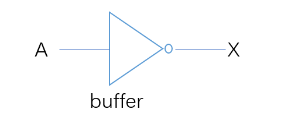
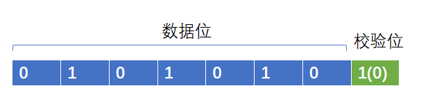
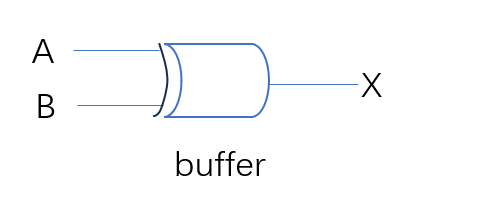
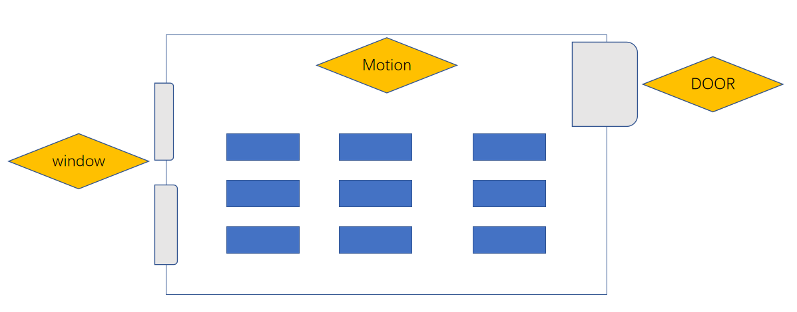
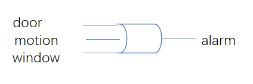
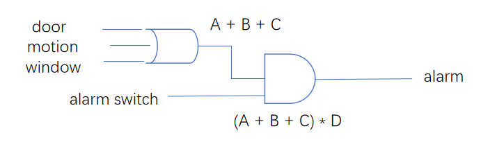
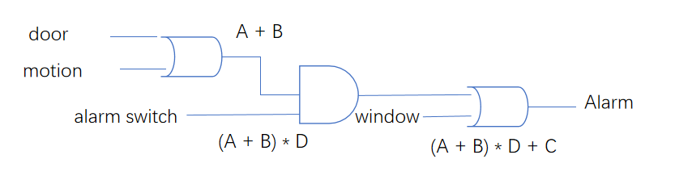
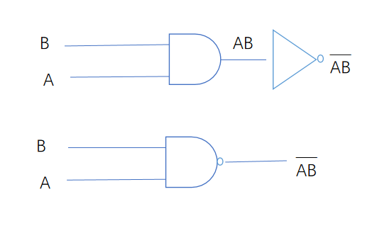
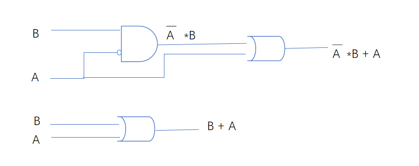
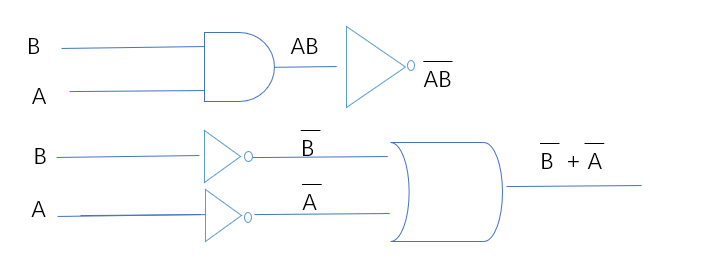

===============
Boolean Logic
===============

我们将讨论二进制的另外一种应用: 布尔表达
通过几种基础的微型电路，结合二级制的输入，可以组合成为复杂的控制电路

要求掌握
========
通过本章学习，应该能够掌握
 
 - 描述逻辑门的定义
 - 描述逻辑门的作用&实际应用 
 - 描述逻辑门的三种表达形式：电路、真值表、代数表达式
 - 分别描述三种基础逻辑门的电路、代数形式、真值表
 - 能够从 代数形式(电路) 推导出 电路(代数)、真值表 
 - 描述代数恒等式的作用
 - 证明布尔代数恒等式

逻辑门(Logic Gate)
===================

基本概念
---------
有1个以上的输入(Inputes),经过这个小型电路后，只有1个输出(output)，如下图

.. image:: ./images/1.png
  :width: 400px

公式: 这个小型电路设计 隐含有一个数学公式(否则输出就是混乱的)

真值表(Truth Table): 用来描述 inputs到output的关系映射

比如 假设有ABC三个输入， 输出 = X ,公式：输入有两个1，X=1,否则X=0,下面是一个例子：

+-----+------+------+-------+
|  输入             | 输出  |
+=====+======+======+=======+
|A    |  B   |  C   |  X    |
+-----+------+------+-------+
|  0  |  0   |  0   |   0   |
+-----+------+------+-------+
|  0  |  0   |  1   |   0   |
+-----+------+------+-------+
|  0  |  1   |  0   |   0   |
+-----+------+------+-------+
|  0  |  1   |  1   |   1   |
+-----+------+------+-------+
|  1  |  0   |  0   |   0   |
+-----+------+------+-------+
|  1  |  0   |  1   |   0   |
+-----+------+------+-------+
|  1  |  1   |  0   |   1   |
+-----+------+------+-------+
|  1  |  1   |  1   |   0   |
+-----+------+------+-------+

现实应用
---------
本节通过一个现实生活中很小的例子,来看一下boolean logic的应用 旨在更好的理解

.. note::

   我喜欢经常使用现实中的例子做类比或者参考，这样会更加生动并加深理解

让我们想像一下，野马轿车,如果你很熟悉汽车，你一定知道他最大的特色之一是他的车尾灯：

我想说当他流水灯亮起来的时候 帅爆了，流水灯？你应该想到了 就是第一个灯亮 第二个、第三再亮 然后重复循环，OK 这样的软件/硬件怎么设计？

 + 一个定时器: 用来表示滴答
 + 一个2bits计数器：作为控制器，枚举不同的状态, 每次滴答，计数加1， 为什么是2bits？ 因为一共有四个状态: 灯1亮 灯12亮 灯123亮 灯123(灭) 
 
让我们用真值表来表示一下：假设A B是我们的2bit控制器 我们有三个输出(三个真值表) 输出分别控制 灯1 灯2 灯3，因为输入是一样的，我们把三个真值表合成一个:
 
+-----+------+------+-------+-------+
|  输入      |    输出              |
+=====+======+======+=======+=======+
|A    |  B   |  灯1 |   灯2 |  灯3  |
+-----+------+------+-------+-------+
|  0  |  0   |  0   |   0   |   0   |
+-----+------+------+-------+-------+
|  0  |  1   |  1   |   0   |   0   |
+-----+------+------+-------+-------+
|  1  |  0   |  1   |   1   |   0   |
+-----+------+------+-------+-------+
|  1  |  1   |  1   |   1   |   1   |
+-----+------+------+-------+-------+

让我们在看一下每个灯的控制逻辑(公式)：
 
 + 灯1亮(灭)的条件是：当AB输入任意1个是1亮，或者AB输入都为0的时候灭
 + 灯2亮(灭)的条件是：当A输入1亮，A输入0则灭
 + 灯3亮(灭)的条件是：当AB全部输入1亮，否则灭

逻辑门表达形式
--------------
上一小节我们通过一个现实场景，观察了逻辑门的应用，让我们在回头看看其中用到了哪些方法或者工具公式
 
 - 组合模拟电路 ： 直观表达
 - 组合真值代数表达式 ： 数学表达
 - 真值表 ： 结果表达
 

基础逻辑门
===========

Inverter(Not Gate)
-------------------

:定义:  输入1，输出0. 输出0， 输出1

真值表
^^^^^^^^

+-----+-------+
| 输入| 输出  |
+=====+=======+
|A    |  X    |
+-----+-------+
|  0  |  1    |
+-----+-------+
|  1  |  0    |
+-----+-------+

电路表达式
^^^^^^^^^^^^^^^^^^^

左边是输入，中间的三角形表达buffer(用于反转的电路) 右边的圆是输出

数学表达式
^^^^^^^^^^^^

.. math::

   X = \overline{A}

And Gate
----------

:定义: 输入全都是1，输出1； 如果输入有任意1个0，输出0

.. note::

	下面我们输入有两个假定A B，但是实际输入可以是任意多个

真值表
^^^^^^^^

+-----+------+------+
|  输入      | 输出 |
+=====+======+======+
|A    |  B   |   X  |
+-----+------+------+
|  0  |  0   |  0   |
+-----+------+------+
|  0  |  1   |  0   |
+-----+------+------+
|  1  |  0   |  0   |
+-----+------+------+
|  1  |  1   |  1   |
+-----+------+------+

电路表达式
^^^^^^^^^^
.. image:: ./images/4.png
  :width: 400px
  
数学表达式
^^^^^^^^^^^

.. math::

   X = A \cdot B

OR Gate
--------

:定义:  输入任意一个是，输出1； 如果输入全部为0，输出0

真值表
^^^^^^^

+-----+------+------+
|  输入      | 输出 |
+=====+======+======+
|A    |  B   |   X  |
+-----+------+------+
|  0  |  0   |  0   |
+-----+------+------+
|  0  |  1   |  1   |
+-----+------+------+
|  1  |  0   |  1   |
+-----+------+------+
|  1  |  1   |  1   |
+-----+------+------+

电路表达式
^^^^^^^^^^^
.. image:: ./images/5.png
  :width: 400px
  
数学表达式
^^^^^^^^^^^

.. math::

   X = A + B

XOR Gate
-----------
XOR 全拼是 EXCLUSIVE OR GATE 

:定义: 输入是奇数个1，输出1， 输入是偶数个1，输出0

奇偶校验
^^^^^^^^^^
奇偶校验是XOR GATE的一个现实应用，在数据传输过程中，可能会有1bit数据丢失，通过额外扩展1bit实现下面功能
 
 - 偶校验: 数据位+扩展位 总是会保证1的个数是偶数个 如果数据位有奇数个1 则扩展位补1 否则补0(什么都不做)
 - 奇校验: 数据位+扩展位 总是会保证1的个数是奇数个 如果数据位有奇数个1 则扩展位补0(什么都不做) 否则补1

无论是哪种校验，都是通过1的数量的奇偶来判断的, 接收端怎么样解决丢失的1bit数据的恢复呢? 
假如丢失了1bit数据，在偶校验条件下，则数据位(除去丢失的1bit)+扩展位 所有bit xor值应该是0,如果不是0,则丢失的1bit是1，否则是0

真值表
^^^^^^^^

+-----+------+------+
|  输入      | 输出 |
+=====+======+======+
|A    |  B   |   X  |
+-----+------+------+
|  0  |  0   |  0   |
+-----+------+------+
|  0  |  1   |  1   |
+-----+------+------+
|  1  |  0   |  1   |
+-----+------+------+
|  1  |  1   |  0   |
+-----+------+------+

电路表达式
^^^^^^^^^^^

数学表达式
^^^^^^^^^^^^^^^^^^^

.. math::

   X = A \oplus B

组合门
=======

我们已经学习了四种最基础的logic gate：Not，And, Or , Xor; 组合门我们暂且使用和逻辑门一样的定义：
有多个inputs，经过一个逻辑电路，输出1个output; 说是组合门，其实是指这个逻辑电路也是由基础的gate组成

从一个现实应用开始
------------------

接下来继续从一个实际场景入手

如上图，我们假设有一间教室有： 
 
 - 窗户监视器: 坚实窗户是否遭到破坏 
 - 门探测器: 检测教室门是否被打开
 - 动作探测器：探测教室内部是否有物体移动
 - 报警系统： 根据教室的三个传感器输入，决定是否发出警报
 
最简单的报警条件: 
 如果窗户被破坏  OR  门被打开  OR  监测到人员移动，就发生告警，则电路图设计为下面即可 
 

当上述三个探测器，任意一个发生感应 就进行告警，仅仅通过一个 OR GATE 完成 ；但是实际情况往往不是这样的;
在白天，老师和学生都会在教室里面走动，所以 motion 和 door detectors 总是会触发，这种情况下不应该有告警，
所以，我们可以通过在增加一个警报系统开关 

 - 系统开关：控制告警系统开启关闭， 白天关闭，晚上开启
 
更复杂的报警条件： 
 如果 （窗户被破坏 OR 门被打开 OR 监测到人员移动）AND （告警系统开启），就发生告警，则电路设计需要改为: 
 

这里我们使用了之前学习过得基础门的数学表达式，还记得吗，A or B or C = A+B+C, (A+B+C) AND D =  (A+B+C)*D 
让我们在考虑一下更现实的情况，窗户被破坏，我们可能更加希望他一定会产生告警，而不需要受其他条件影响

更加复杂的报警条件：
 如果 窗户被破坏 OR ((门被打开 OR 监测到人员移动）AND （告警系统开启）)，就发生告警:
 

 
接下来让我们尝试推导一下这个组合门的真值表,真值表推导也是从最基础的gate 依次推导

+-----+------+------+-------+-------+-------+------------+
|          输入             |        输出                |
+=====+======+======+=======+=======+=======+============+
|A    |  B   |  C   |  D    |   A+B |(A+B)*D| (A+B)*D + C| 
+-----+------+------+-------+-------+-------+------------+
|  0  |  0   |  0   |   0   |   0   |   0   |      0     |
+-----+------+------+-------+-------+-------+------------+
|  0  |  0   |  0   |   1   |   0   |   0   |      0     |
+-----+------+------+-------+-------+-------+------------+
|  0  |  0   |  1   |   0   |   0   |   0   |      1     |
+-----+------+------+-------+-------+-------+------------+
|  0  |  0   |  1   |   1   |   0   |   0   |      1     |
+-----+------+------+-------+-------+-------+------------+
|  0  |  1   |  0   |   0   |   1   |   0   |      0     |
+-----+------+------+-------+-------+-------+------------+
|  0  |  1   |  0   |   1   |   1   |   1   |      1     |
+-----+------+------+-------+-------+-------+------------+
|  0  |  1   |  1   |   0   |   1   |   0   |      1     |
+-----+------+------+-------+-------+-------+------------+
|  0  |  1   |  1   |   1   |   1   |   1   |      1     |
+-----+------+------+-------+-------+-------+------------+
|  1  |  0   |  0   |   0   |   1   |   0   |      0     |
+-----+------+------+-------+-------+-------+------------+
|  1  |  0   |  0   |   1   |   1   |   1   |      1     |
+-----+------+------+-------+-------+-------+------------+
|  1  |  0   |  1   |   0   |   1   |   0   |      1     |
+-----+------+------+-------+-------+-------+------------+
|  1  |  0   |  1   |   1   |   1   |   1   |      1     |
+-----+------+------+-------+-------+-------+------------+
|  1  |  1   |  0   |   0   |   1   |   0   |      0     |
+-----+------+------+-------+-------+-------+------------+
|  1  |  1   |  0   |   1   |   1   |   1   |      1     |
+-----+------+------+-------+-------+-------+------------+
|  1  |  1   |  1   |   0   |   1   |   0   |      1     |
+-----+------+------+-------+-------+-------+------------+
|  1  |  1   |  1   |   1   |   1   |   1   |      1     |
+-----+------+------+-------+-------+-------+------------+

NAND Gate
----------

.. note::
 
  额外介绍一下低电平有效，我们已经知道逻辑门的输出都是一个个bool值，现实中由于电气电路原因，很多片选使能确往往不是我们想的：给一个高电平1 开启，低电平0 关闭 往往都是相反的，因为高电平更容易收到干扰(真实原因更多需要电气知识，小白一个，不深究了)

上图是一个NAND GATE的电路图 我们观察到，Note gate 会以一种更加简便的方式隐含在电路图

布尔代数式
===========

我们已经学习了逻辑门的三种表达式： 电路图、代数式、真值表；电路、真值表都是相对固定的表达方式，代数式本身会存在数学特有的特点

我们也知道 可以通过代数式推导出其他两种形式,那么代数式能帮助我们解决什么问题，为什么我们要继续证明他

让我们从一个例子入手，现在有一个代数式：

.. math::

   X = A + \overline{A} \cdot B
   
利用我们之前所学 我们可以推导出他的电路和真值表

+-----+------+------------------+--------------------------+--------------------------+--------------------------+
|      输入  |          输出                                                                                     |
+=====+======+==================+==========================+==========================+==========================+
|A    |  B   |  \overline{A}    |  \overline{A} \cdot B    | A + \overline{A} * B     |        A+B               |
+-----+------+------------------+--------------------------+--------------------------+--------------------------+
|0    |  0   |         1        |          0               |             0            |             0            |
+-----+------+------------------+--------------------------+--------------------------+--------------------------+
|0    |  1   |         1        |          1               |             1            |             1            |
+-----+------+------------------+--------------------------+--------------------------+--------------------------+
|1    |  0   |         0        |          0               |             1            |             1            |
+-----+------+------------------+--------------------------+--------------------------+--------------------------+
|1    |  1   |         0        |          0               |             1            |             1            |
+-----+------+------------------+--------------------------+--------------------------+--------------------------+

请注意上面真值表，我们额外增加了一列, A+B，虽然这个代数式形式上和我们要的不一样，但是我们发现他们真值表的输出是一样的

在对比一下他们的电路结构图

无论如何，A+B在电路上会更加简洁，从电气特点上来看，就要更加节省功耗、布局更加简单，更不容易出错，既然有这么多的好处，
在结果一样的情况下， 我们当然更希望使用第二个电路,那么怎么样才能知道一个代数表达式的恒等式？ 

:定义: 相同的输入（变量），两个布尔代数表达式，推导出的真值表结果是是一样的，这两个代数表达式是恒等式

基本恒等式
-----------
上一个小节，我们观察到可以通过代数恒等式简化原有复杂的逻辑，这就好比我们知道 (A+B+C+D) * 0 = 0
接下来，我们从四个维度来观察 基本逻辑门的性质

:计算因子=自己: 

.. math::

  A \cdot A  = A
  
.. math::

  A + A  = A
  
.. math::
 
  A \oplus A = 0 
  
.. note:
   活学活用，在汇编中，如果希望初始化一个变量=0，使用 MOV A, #0, 这条汇编隐含有会访问两次内存，第一次从内存获取指令，第二次从内存获取常量
   利用 XOR 的特性，可以改为： XOR A, A; 所以在看到这个汇编指令，要知道这是 clear A 的快速指令

:计算因子= A的反:

.. math::

  A \cdot \overline{A} = 0

.. math::

  A + \overline{A} = 1
  
.. math::

  A \oplus \overline{A} = 1  
 
:计算因子=1:

.. math::

  A \cdot 1  = A

.. math::

  A + 1  = 1
  
.. math::
 
  A \oplus 1 = \overline{A}
  
:计算因子=0:

.. math::

  A \cdot 0  = 0

.. math::

  A + 0  = A
  
.. math::

  A \oplus 0 = A

上述结论 都可以通过真值表推导出来，后续我们在学习按位计算 会用到这些基本恒等式

布尔代数式性质
------------------
本节会介绍布尔代数的 交换律、结合律、分配律；这些都可以通过真值表证明

交换律(Commutative Law)
^^^^^^^^^^^^^^^^^^^^^^^^^^ 

.. math::

  A + B  = B + A

.. math::

  A \cdot B  = B \cdot A

结合律(Associative Law)
^^^^^^^^^^^^^^^^^^^^^^^^^^ 

.. math::

  A + (B + C) = (A + B) + A   

.. math::

  A \cdot (B \cdot C) = (A \cdot B) \cdot A 
  
分配律(Distributive Law)
^^^^^^^^^^^^^^^^^^^^^^^^^^ 
  
.. math::

  A \cdot (B + C) = A \cdot B + A \cdot C

请自行通过真值表证明 接下来我们看一个不是那么明显的恒等式

应用
^^^^^^^

.. math::

  A + B \cdot C = (A + B) \cdot (A + C)

证明此恒等式 需要用到基本恒等式 和 交换律 结合律 分配律

德摩根定律
^^^^^^^^^^^

Not Gate并不适用布尔代数式的特性(分配律、交换律、结合律)

.. math::

  \overline{A \cdot B} !=  \overline{A} \cdot \overline{B}
  
+-----+------+------+---------------+----------+----------+---------------+---------------+
|  输入      | 输出                                                                       |
+=====+======+======+===============+==========+==========+===============+===============+
|A    |  B   |  A*B |  Inverse(A*B) |Inverse(A)|Inverse(B)| IN(A)*IN(B)   |IN(A)+IN(B)    |
+-----+------+------+---------------+----------+----------+---------------+---------------+
|0    |  0   |   0  |  1            |   1      |    1     |       1       |       1       |
+-----+------+------+---------------+----------+----------+---------------+---------------+
|0    |  1   |   0  |  1            |   1      |    0     |       0       |       1       |
+-----+------+------+---------------+----------+----------+---------------+---------------+
|1    |  0   |   0  |  1            |   0      |    1     |       0       |       1       |
+-----+------+------+---------------+----------+----------+---------------+---------------+
|1    |  1   |   1  |  0            |   0      |    0     |       0       |       0       |
+-----+------+------+---------------+----------+----------+---------------+---------------+

但是下述恒等式成立

.. math::

  \overline{A \cdot B} =  \overline{A} + \overline{B}
  

  
同理可证得 

.. math::

  \overline{A+B} = \overline{A} \cdot \overline{B}

练习
^^^^^^
我们已经学习了布尔代数的基本表达式，让我们通过几个练习，看看在简化逻辑上能帮助我们多少

:练习1:

.. math::

  A + A \cdot B  = A \cdot 1 + A \cdot B  = A (1 + B) = A

:练习2:

.. math::

  A + \overline{A} \cdot B  = (A + \overline{A}) \cdot (A + B) = 1 \cdot (A + B) = A + B

:练习3:

.. math::

  \overline{A+B+C} \cdot B =  (\overline{A} \cdot \overline{B} \cdot \overline{C}) \cdot B
   = \overline{A} \cdot \overline{C} \cdot (\overline{B} \cdot B)
   = (\overline{A} \cdot \overline{C}) \cdot 0
   = 0

:练习4:

.. math::

   (A+B) \cdot (B + \overline{A} ) = A \cdot B + A \cdot \overline{A} + B \cdot B + B \cdot  \overline{A} 
    = A \cdot B + 0 + B + B  \cdot  \overline{A}
    = B \cdot (A + 1 + \overline{A})	 
	= B \cdot (1 + A + \overline{A}) = B \cdot 1 = B

:练习5:

.. math::

   A \cdot B \cdot \overline{C}  + B \cdot \overline{C} \cdot D +  \overline{A + \overline{B} + C} 
   =  A \cdot B \cdot \overline{C}  + B \cdot \overline{C} \cdot D + \overline{A} \cdot B \cdot \overline{C}
   = B \cdot \overline{C} \cdot (A + D + \overline{A}) 
   = B \cdot \overline{C} \cdot (A+\overline{A} + D) 
   = B \cdot \overline{C} \cdot (1 + D)  
   = B \cdot \overline{C}

