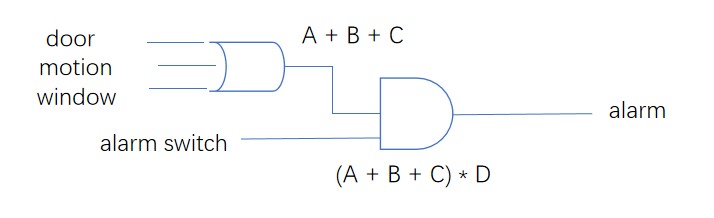

Xor gate
---------

奇偶校验
^^^^^^^^^

奇偶校验是XOR GATE的一个现实应用，在数据传输过程中，可能会有1bit数据丢失，通过额外扩展1bit实现下面功能
 
 - 偶校验: 数据位+扩展位 总是会保证1的个数是偶数个 如果数据位有奇数个1 则扩展位补1 否则补0(什么都不做)
 - 奇校验: 数据位+扩展位 总是会保证1的个数是奇数个 如果数据位有奇数个1 则扩展位补0(什么都不做) 否则补1

无论是哪种校验，都是通过1的数量的奇偶来判断的, 接收端怎么样解决丢失的1bit数据的恢复呢? 
假如丢失了1bit数据，在偶校验条件下，则数据位(除去丢失的1bit)+扩展位 所有bit xor值应该是0,如果不是0,则丢失的1bit是1，否则是0

.. image:: ./images/7.png
  :width: 400px

组合门
---------

我们已经学习了四种最基础的logic gate：Not，And, Or , Xor; 组合门我们暂且使用和逻辑门一样的定义：
有多个inputs，经过一个逻辑电路，输出1个output; 说是组合门，其实是指这个逻辑电路也是由基础的gate组成

接下来继续从一个实际场景入手

.. image:: ./images/8.png
  :width: 400px

如上图，我们假设有一间教室有： 
 
 - 窗户监视器: 坚实窗户是否遭到破坏 
 - 门探测器: 检测教室门是否被打开
 - 动作探测器：探测教室内部是否有物体移动
 - 报警系统： 根据教室的三个传感器输入，决定是否发出警报
 
第一种报警条件: 
 如果窗户被破坏  OR  门被打开  OR  监测到人员移动，就发生告警，则电路图设计为下面即可 
 
.. image:: ./images/9.png
  :width: 400px

当上述三个探测器，任意一个发生感应 就进行告警，仅仅通过一个 OR GATE 完成 ；但是实际情况往往不是这样的;
在白天，老师和学生都会在教室里面走动，所以 motion 和 door detectors 总是会触发，这种情况下不应该有告警，
所以，我们可以通过在增加一个警报系统开关 

 - 系统开关：控制告警系统开启关闭， 白天关闭，晚上开启
 
所以在我们第一种假设只后 又有了第二种条件： 
 如果 （窗户被破坏 OR 门被打开 OR 监测到人员移动）AND （告警系统开启），就发生告警，则电路设计需要改为: 
 

这里我们使用了之前学习过得基础门的数学表达式
 

 
 

 
   
   