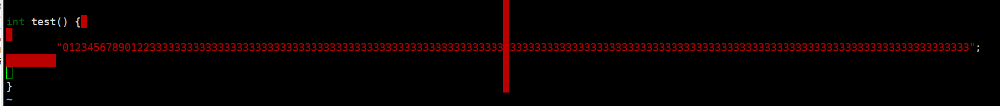

.. _环境准备:

========
环境准备
========
花了半天时间，把自己当前用到的开发环境整理汇总一下，最终的虚拟机开发镜像 如果需要可以私信我

镜像个人定制化
==============

git 用户配置
--------------
.. code-block:: console
    :linenos:
	
	$ git config --global config.user xxxx
	$ git config --global config.email xxxx

操作系统的安装
==============
这章不想讲太多，就是在vmware安装一个虚拟机，这次选择了非常火的openeuler 系统

基本配置
----------

 - 硬盘: 120G LVM（root:50 home:65） 后期可以自己通过lvm继续扩容 
 - 内存: 8G 
 - cores: 8核心
 - 系统版本： openEuler-22.03-LTS-SP2-x86_64 
 - 初始密码: test(root)/@Developer123
 
VMware 正常选择镜像安装系统即可 

开启VMware虚拟化
-----------------
虚拟机内部如果希望继续使用qemu，需要开启vmware 支持VT，

在虚拟机设置->处理器->虚拟化引擎

遇到问题参考: https://blog.csdn.net/qq_46499134/article/details/124231658

如何连接虚拟机
--------------
你可以使用 secureCRT/xshell等这类终端工具，通过ssh登录本地虚拟机，本地虚拟机IP可以通过*ip  addr*确认

基本环境安装配置
=================

代理安装配置
--------------
下载 v2ray-linux-64.zip
https://github.com/v2fly/v2ray-core/releases/tag/v5.4.1

.. code-block:: console
    :linenos:
	
	cd v2ray-linux-64
	
	chmod 755 v2ray
	chmod 755 v2ctl
	chmod 755 systemd/system/v2ray.service
	chmod 755 systemd/system/v2ray@.service
	sudo cp v2ray /usr/local/bin/
	sudo cp v2ctl /usr/local/bin/

	sudo cp systemd/system/v2ray.service /etc/systemd/system/
	sudo cp systemd/system/v2ray@.service /etc/systemd/system/
	
	sudo mkdir /usr/local/share/v2ray/
	sudo cp geoip.dat /usr/local/share/v2ray/
	sudo cp geosite.dat /usr/local/share/v2ray/
	
	sudo mkdir /var/log/v2ray/
	sudo touch  /var/log/v2ray/access.log 
	sudo touch  /var/log/v2ray/error.log
	sudo chmod 777   /var/log/v2ray/access.log 
	sudo chmod 777 /var/log/v2ray/error.log

在windows 上面把本地的v2ray的配置文件导出为config.json 

https://github.com/v2fly/v2ray-core/releases/tag/v4.31.0  

.. code-block:: console
    :linenos:
	
	sudo mkdir /usr/local/etc/v2ray/
	sudo cp config.json /usr/local/etc/v2ray/config.json
	# 启动V2ray
	sudo systemctl start v2ray
	# 检查V2ray状态
	sudo systemctl status v2ray

	# 设置V2ray开机自启动
	sudo systemctl enable v2ray
	# 测试
	$curl -x socks5://127.0.0.1:10808 https://www.google.com -v
	# 设置github代理
	$ git config --global http.proxy socks5://127.0.0.1:10808 
	$git config --global https.proxy socks5://127.0.0.1:10808
	
网络工具安装
--------------

.. code-block:: console
    :linenos:
	
	$ sudo yum install -y net-tools
	$ sudo apt-get install net-tools

git安装
---------

.. code-block:: console
    :linenos:
	
	$ sudo yum install -y git
	$ sudo apt-get install git

完成github用户配置 

.. code-block:: console
    :linenos:
	
	$ git config --global config.user xxxx
	$ git config --global config.email xxxxx
	$ sudo dnf config-manager --add-repo https://cli.github.com/packages/rpm/gh-cli.repo
    $ sudo dnf install gh
	$ gh auth login

完成github 统一走ssh 不走https (国内网太慢)
 
.. code-block:: console
    :linenos:
	
	$ git config --global url."git@github.com:".insteadOf "https://github.com/"

开发必要工具
--------------------

内核编译工具
^^^^^^^^^^^^^^^^

.. code-block:: console
    :linenos:

    $ sudo dnf install -y rpm-build openssl-devel bc rsync gcc gcc-c++ flex bison m4 elfutils-libelf-devel ncurses-devel
	$ sudo apt-get install git fakeroot build-essential ncurses-dev xz-utils libssl-dev bc flex libelf-dev bison
	
gdb安装
^^^^^^^^^^^^^^^^

.. code-block:: console
    :linenos:

    $ sudo dnf install -y gdb

.. _虚拟化环境:

虚拟化工具安装
--------------

x86模拟
^^^^^^^^^^^^

.. code-block:: console
    :linenos:
	
	$ sudo dnf groupinstall -y "Virtualization Host"
    $ sudo dnf install -y qemu-kvm virt-install virt-viewer
	$ sudo dnf install -y qemu-system-x86_64

其他架构模拟
^^^^^^^^^^^^

.. code-block:: console
    :linenos:
	
	$ sudo dnf install -y qemu-system-riscv  qemu-system-aarch64 qemu-system-arm

ctags/cscope索引工具安装
------------------------

推荐使用 *cscope* 和 *ctags*，安装命令: 

.. code-block:: console
    :linenos:

    $ sudo dnf install -y cscope exuberant-ctags

:扩展:
   
   - *cscope*：主要用于导航代码，例如在函数之间完成切换，能够找到符号的定义以及所有调用
   - *ctags*：Tagbar 插件需要，也可以用来导航，但是没有cscope 好用，只能跳转到函数定义，不能找到所有调用点
   
cscope 常用命令（vim 指令界面使用）： cs find c|d|e|f|g|i|s|t name

+----------+---------------------------------------+
| 命令     | 说明                                  |
+==========+=======================================+
|s         |  查找符号(变量)                       |
+----------+---------------------------------------+
| g        | 查找定义                              |
+----------+---------------------------------------+
|  d       |  查找本函数调用函数                   |
+----------+---------------------------------------+
|  c       |  查找调用者                           |
+----------+---------------------------------------+
|  t       |  查找字符串                           |
+----------+---------------------------------------+
|  f       | 查找文件                              |
+----------+---------------------------------------+
|  i       | 查找包含本文件的文件                  |
+----------+---------------------------------------+

.. _RUST环境安装:

RUST环境安装
================

安装
--------
https://rustwiki.org/zh-CN/book/ch01-01-installation.html

RUST提供了一些工具负责用于提升开发效率和标准:
 
 - Cargo，内置的依赖管理器和构建工具，它能轻松增加、编译和管理依赖，并使其在 Rust 生态系统中保持一致。
 - Rustfmt 确保开发者遵循一致的代码风格。熟悉clang-format/python-format的人对这个一定不陌生
 - Rust Language Server 为集成开发环境（IDE）提供了强大的代码补全和内联错误信息功能。

cargo 常用命令

 - 新建空项目: cargo build 
 - 项目文件 Cargo.toml :版本 依赖 说明
 - 项目文件 Cargo.lock: 记录依赖详细版本
 - 项目文件 src: 项目源码
 - 构建项目: cargo build {--release}
 - 构建文件 target/debug{release}/ : 构建产出
 - 构建并运行项目: cargo run 
 - 清理项目： cargo clean
 - 检查项目： cargo check
 - linter: cargo clippy

VIM配置
-------

:ref: `RUST-VIM`

VIM配置
=========

基本配置
---------

VIM源码安装
^^^^^^^^^^^
YCM 需要更高版本vim和python 支持 从源码升级： 

.. code-block:: console
    :linenos:
	
	$ git clone git@github.com:vim/vim.git
	$ cd vim/src
	$ ./configure --with-features=huge --enable-python3interp --enable-fail-if-missing
	$ make -j4
	$ sudo make install

vim插件管理
^^^^^^^^^^^^^
推荐使用pathogen作为插件管理: https://github.com/tpope/vim-pathogen  安装参考: 

.. code-block:: console
    :linenos:

	$ mkdir -p ~/.vim/autoload ~/.vim/bundle 
	$ curl -LSso ~/.vim/autoload/pathogen.vim https://tpo.pe/pathogen.vim
	
修改~/.vimrc 增加： 

.. code-block:: console
    :linenos:
	
	execute pathogen#infect()
	syntax on
	filetype plugin indent on

安装NERDTree插件
^^^^^^^^^^^^^^^^^
NERDTree时VIM的文件系统浏览器 使用该插件，用户可以直观地浏览复杂的目录层次结构，快速打开文件进行读取或编辑，并执行基本的文件系统操作。

.. code-block:: console
    :linenos:
	
	$ git clone git@github.com:preservim/nerdtree.git ~/.vim/bundle/nerdtree

配置vimrc：

 - 配置自动开启和自动退出
 - 配置F3 启动和隐藏目录树
 
.. code-block:: console
    :linenos:
	
	" Exit Vim if NERDTree is the only window remaining in the only tab.
	autocmd BufEnter * if tabpagenr('$') == 1 && winnr('$') == 1 && exists('b:NERDTree') && b:NERDTree.isTabTree() | quit | endif
	" Start NERDTree and put the cursor back in the other window.
	autocmd VimEnter * NERDTree | wincmd p
	nnoremap <F3> :NERDTreeMirror<CR>
	nnoremap <F3> :NERDTreeToggle<CR>

基本操作：以下命令都是在NEERDTREE页面操作

+----------+---------------------------------------+
| 命令     | 说明                                  |
+==========+=======================================+
|  ?       |  打开或者隐藏帮助面板                 |
+----------+---------------------------------------+
| 上下左右 | 选择文件或者目录                      |
+----------+---------------------------------------+
|  回车 |  展开目录/打开文件(退出上个文件)         |
+----------+---------------------------------------+
|  ctrl+w  |  两次 在目录树和文件之前切换          |
+----------+---------------------------------------+
|  t       |  以标签形式打开一个文件               |
+----------+---------------------------------------+
|  gt      | 标签之前切换                          |
+----------+---------------------------------------+
|  i/s     | 分割窗口打开                          |
+----------+---------------------------------------+

安装tagbar插件
^^^^^^^^^^^^^^^^^
Tagbar 是一个 Vim 插件，它提供了一种简单的方法来浏览当前文件的标签并概述其结构。它通过创建一个侧边栏来显示当前文件的 ctags 生成的标签（按其范围排序）来实现此目的。这意味着，例如 C++ 中的方法显示在定义它们的类下。

.. code-block:: console
    :linenos:
	
	$ git clone git@github.com:preservim/tagbar.git ~/.vim/bundle/tagbar

配置vimrc：

 - 配置F8 启动和隐藏tagbar
 
.. code-block:: console
    :linenos:
	
	nmap <F8> :TagbarToggle<CR>

安装vim airline插件
^^^^^^^^^^^^^^^^^^^^

.. code-block:: console
    :linenos:
	
	$ git clone git@github.com:vim-airline/vim-airline ~/.vim/bundle/vim-airline

补全插件：YCM
^^^^^^^^^^^^^^^^^^^^^

.. code-block:: console
    :linenos:
	
	$ git clone git@github.com:ycm-core/YouCompleteMe.git ~/.vim/bundle/YouCompleteMe
	$ cd  ~/.vim/bundle/YouCompleteMe 
	$ git submodule update --init --recursive
    $ cd ~/.vim/bundle/YouCompleteMe
	$ sudo dnf install -y cmake  python3-devel golang
    $ python3 install.py  --clangd-completer --clang-completer --rust-completer

配置vimrc:关闭自动加载提示

.. code-block:: console
    :linenos:
	
	let g:ycm_confirm_extra_conf = 1

VIM风格
^^^^^^^^^
配置vimrc：

.. code-block:: console
    :linenos:
	
	$ set t_Co=256
	

内核VIM配置
-------------

为什么需要
^^^^^^^^^^^^

 - Linux 不同于普通的C项目，他的代码非常庞大，我们需要只引用我们关心的代码
 - Linux 主干代码支持多个架构，我们只需要关心一个特定架构
 - Linux 有自己编码风格 我们需要使用内核编码风格
 - Linux 不使用标准C库，有自己的库，我们不应该索引libc 的头文件

为了提升开发效率，一般VIM对于不同语言的项目支持需要以下几个功能完成: 
  
  - 语法高亮等支持: VIM 自带
  - 函数间的跳转 (基于ctags/cscope) 
  - 函数的调用点 (基于cscope)
  - 代码补全 

本小节会指导完成阅读Linux需要的工具安装，以及索引的使用，无论如何，我假设你已经熟悉这些工具的使用，或者请自己搜索一下这些工具的使用方法 

语法配置
^^^^^^^^^^
首先配置80个字符长度限制 因为内核编码要求每行不应该超过80个字符
修改~/.vimrc 增加： 

.. code-block:: console
    :linenos:
	
	" 80 characters line
	set colorcolumn=81
	"execute "set colorcolumn=" . join(range(81,335), ',')
	highlight ColorColumn ctermbg=Black ctermfg=DarkRed

内核编码风格要求 行尾不应该有空白字符 请添加: 

.. code-block:: console
    :linenos:
	
	" Highlight trailing spaces
	" http://vim.wikia.com/wiki/Highlight_unwanted_spaces
	highlight ExtraWhitespace ctermbg=red guibg=red
	match ExtraWhitespace /\s\+$/
	autocmd BufWinEnter * match ExtraWhitespace /\s\+$/
	autocmd InsertEnter * match ExtraWhitespace /\s\+\%#\@<!$/
	autocmd InsertLeave * match ExtraWhitespace /\s\+$/
	autocmd BufWinLeave * call clearmatches()

配置完成之后，下面是一个显示测试

 
安装kernelsty插件
^^^^^^^^^^^^^^^^^^
后面章节会介绍linux 编码风格，在这里我们先安装遵循内核编码风格的vim 插件

.. code-block:: console
    :linenos:
	
	$cd ~/.vim/bundle &&  git clone git@github.com:vivien/vim-linux-coding-style.git
	
如果只希望对某些目录下代码应用kernel 风格，请在vimrc 中增加: 

.. code-block:: console
    :linenos:
	
	let g:linuxsty_patterns = [ "/usr/src/", "/linux" ]
	
自动补全设置
^^^^^^^^^^^^^
.. code-block:: console
    :linenos:
	
	$ git clone https://github.com/rdnetto/YCM-Generator.git
	$ cd YCM-Generator
	$ ./config_gen.py kernel_dir

内核代码索引生成
---------------------
:使用内核脚本创建索引文件: 内核提供了 scripts/tags.sh 脚本用于生成索引文件，但是应该通过make cscope  和 make tags 规则去运行该脚本，下面是一个示例

.. note::

    Please参考内核编译指导，建议先自己编译一遍内核,可以加快后续索引文件生成
	
.. code-block:: console
    :linenos:

    $ $ make O=. ARCH=x86_64(arm)  COMPILED_SOURCE=1 cscope tags

参数含义: 
  - *O=.* : 很明显了 输出索引文件的存放位置，如果你不希望他在当前目录下，请使用一个绝对路径，如果在kernel 目录下开发，请忽略
  - *ARCH=...*: 选择作为索引的CPU 架构， 会决定选择索引 arch/xxx 目录
  - *SUBARCH=...*： 选择作为索引的子架构，比如board, 如果ARCH=arm SUBARCH=omap2 会选择 arch/arm/mach-omap2/ arch/arm/plat-omap/ 索引
  - *COMPILED_SOURCE=1*： 只索引编译的文件 如果希望索引没有编译的文件 请忽略  
  - *cscope&tags*: rule to make cscope/ctags index 
 
手动创建索引文件
-----------------
有些时候，也许 *tags.sh* 工作无法达到你的预期，这个时候 可以通过手动索引，下面的步骤参考来自: https://cscope.sourceforge.net/large_projects.html

首先，需要创建一个 *cscope.files* 文件列出你想要索引的文件

比如可以通过以下命令，列出索引文件 以及只列出 arch/arm 以及 OMAP platform 的文件 

.. code-block:: console
    :linenos:

    $find    $dir                                          \
        -path "$dir/arch*"               -prune -o    \
        -path "$dir/tmp*"                -prune -o    \
        -path "$dir/Documentation*"      -prune -o    \
        -path "$dir/scripts*"            -prune -o    \
        -path "$dir/tools*"              -prune -o    \
        -path "$dir/include/config*"     -prune -o    \
        -path "$dir/usr/include*"        -prune -o    \
        -type f                                       \
        -not -name '*.mod.c'                          \
        -name "*.[chsS]" -print > cscope.files
    $find    $dir/arch/arm                                 \
        -path "$dir/arch/arm/mach-*"     -prune -o    \
        -path "$dir/arch/arm/plat-*"     -prune -o    \
        -path "$dir/arch/arm/configs"    -prune -o    \
        -path "$dir/arch/arm/kvm"        -prune -o    \
        -path "$dir/arch/arm/xen"        -prune -o    \
        -type f                                       \
        -not -name '*.mod.c'                          \
        -name "*.[chsS]" -print >> cscope.files
    $find    $dir/arch/arm/mach-omap2/                     \
        $dir/arch/arm/plat-omap/                      \
        -type f                                       \
        -not -name '*.mod.c'                          \
        -name "*.[chsS]" -print >> cscope.files

以下是一个X86架构的示例 

.. code-block:: console
    :linenos:

    $find    $dir                                          \
        -path "$dir/arch*"               -prune -o    \
        -path "$dir/tmp*"                -prune -o    \
        -path "$dir/Documentation*"      -prune -o    \
        -path "$dir/scripts*"            -prune -o    \
        -path "$dir/tools*"              -prune -o    \
        -path "$dir/include/config*"     -prune -o    \
        -path "$dir/usr/include*"        -prune -o    \
        -type f                                       \
        -not -name '*.mod.c'                          \
        -name "*.[chsS]" -print > cscope.files
    $find    $dir/arch/x86                                 \
        -path "$dir/arch/x86/configs"    -prune -o    \
        -path "$dir/arch/x86/kvm"        -prune -o    \
        -path "$dir/arch/x86/lguest"     -prune -o    \
        -path "$dir/arch/x86/xen"        -prune -o    \
        -type f                                       \
        -not -name '*.mod.c'                          \
        -name "*.[chsS]" -print >> cscope.files

和脚本类似，如果你只在kernel下开发，替换 *dir=.*, 如果你在其他目录开发，替换为绝对路径 

接下来根据cscope.files 生成索引 

.. code-block:: console
    :linenos:
	
	$ cscope -b -q -k

接下来根据cscope.files 生成ctag索引数据库

.. code-block:: console
    :linenos:
	
	$ ctags -L cscope.files

现在应该拥有以下文件: 

- cscope.in.out
- cscope.out
- cscope.po.out
- tags

.. _RUST-VIM:

RUST vim配置
-------------

安装
^^^^^^
需要安装: 

  - rust-analyzer 
  - rust.vim 
  - nvm
  - vim-plug
  - coc.nvim
 
.. code-block:: console
    :linenos:
	
	$ rustup component add rust-analyzer 
	$ git clone --depth=1 git@github.com:rust-lang/rust.vim.git ~/.vim/bundle/rust.vim
	$ curl -o- https://raw.githubusercontent.com/nvm-sh/nvm/v0.39.3/install.sh | bash
	$ nvm install node
	$ curl -fLo ~/.vim/autoload/plug.vim --create-dirs https://raw.githubusercontent.com/junegunn/vim-plug/master/plug.vim

	$ 下面内容增加到 ~/.vimrc
	call plug#begin()
	Plug 'neoclide/coc.nvim', {'branch': 'release'}
	call plug#end()
	
	$下面内容在vim 命令行执行
	PlugInstall
	CocInstall coc-rust-analyzer

VIMRC 配置

.. code-block:: console
    :linenos:
	
	highlight CocFloating ctermbg=grey
	
	nnoremap <silent><nowait><expr> <C-f> coc#float#has_scroll() ? coc#float#scroll(1) : "\<C-f>"
	nnoremap <silent><nowait><expr> <C-b> coc#float#has_scroll() ? coc#float#scroll(0) : "\<C-b>"
	inoremap <silent><nowait><expr> <C-f> coc#float#has_scroll() ? "\<c-r>=coc#float#scroll(1)\<cr>" : "\<Right>"
	inoremap <silent><nowait><expr> <C-b> coc#float#has_scroll() ? "\<c-r>=coc#float#scroll(0)\<cr>" : "\<Left>"
	vnoremap <silent><nowait><expr> <C-f> coc#float#has_scroll() ? coc#float#scroll(1) : "\<C-f>"
	vnoremap <silent><nowait><expr> <C-b> coc#float#has_scroll() ? coc#float#scroll(0) : "\<C-b>"
	
    " if hidden is not set, TextEdit might fail.
	set hidden
	" Some servers have issues with backup files, see #649
	set nobackup
	set nowritebackup
	
	" You will have bad experience for diagnostic messages when it's default 4000.
	set updatetime=300
	
	" don't give |ins-completion-menu| messages.
	set shortmess+=c
	
	" always show signcolumns
	set signcolumn=yes
	
	" Use tab for trigger completion with characters ahead and navigate.
	" Use command ':verbose imap <tab>' to make sure tab is not mapped by other plugin.
	inoremap <silent><expr> <TAB>
		\ pumvisible() ? "\<C-n>" :
		\ <SID>check_back_space() ? "\<TAB>" :
		\ coc#refresh()
	inoremap <expr><S-TAB> pumvisible() ? "\<C-p>" : "\<C-h>"
	
	function! s:check_back_space() abort
	let col = col('.') - 1
	return !col || getline('.')[col - 1]  =~# '\s'
	endfunction
	
	" Use <c-space> to trigger completion.
	inoremap <silent><expr> <c-space> coc#refresh()
	
	" Use <cr> to confirm completion, `<C-g>u` means break undo chain at current position.
	" Coc only does snippet and additional edit on confirm.
	inoremap <expr> <cr> pumvisible() ? "\<C-y>" : "\<C-g>u\<CR>"
	" Or use `complete_info` if your vim support it, like:
	" inoremap <expr> <cr> complete_info()["selected"] != "-1" ? "\<C-y>" : "\<C-g>u\<CR>"
	
	" Use `[g` and `]g` to navigate diagnostics
	nmap <silent> [g <Plug>(coc-diagnostic-prev)
	nmap <silent> ]g <Plug>(coc-diagnostic-next)
	" Remap keys for gotos
	nmap <silent> gd <Plug>(coc-definition)
	nmap <silent> gy <Plug>(coc-type-definition)
	nmap <silent> gi <Plug>(coc-implementation)
	nmap <silent> gr <Plug>(coc-references)
	
	" Use K to show documentation in preview window
	nnoremap <silent> K :call <SID>show_documentation()<CR>
	
	function! s:show_documentation()
	if (index(['vim','help'], &filetype) >= 0)
		execute 'h '.expand('<cword>')
	else
		call CocAction('doHover')
	endif
	endfunction
	
	" Highlight symbol under cursor on CursorHold
	autocmd CursorHold * silent call CocActionAsync('highlight')
	
	" Remap for rename current word
	nmap <leader>rn <Plug>(coc-rename)
	
	" Remap for format selected region
	xmap <leader>f  <Plug>(coc-format-selected)
	nmap <leader>f  <Plug>(coc-format-selected)
	
	augroup mygroup
	autocmd!
	" Setup formatexpr specified filetype(s).
	autocmd FileType typescript,json setl formatexpr=CocAction('formatSelected')
	" Update signature help on jump placeholder
	autocmd User CocJumpPlaceholder call CocActionAsync('showSignatureHelp')
	augroup end
	
	" Remap for do codeAction of selected region, ex: `<leader>aap` for current paragraph
	xmap <leader>a  <Plug>(coc-codeaction-selected)
	nmap <leader>a  <Plug>(coc-codeaction-selected)
	
	" Remap for do codeAction of current line
	nmap <leader>ac  <Plug>(coc-codeaction)
	" Fix autofix problem of current line
	nmap <leader>qf  <Plug>(coc-fix-current)
	
	" Create mappings for function text object, requires document symbols feature of languageserver.
	xmap if <Plug>(coc-funcobj-i)
	xmap af <Plug>(coc-funcobj-a)
	omap if <Plug>(coc-funcobj-i)
	omap af <Plug>(coc-funcobj-a)
	
	" Use `:Format` to format current buffer
	command! -nargs=0 Format :call CocAction('format')
	
	" Use `:Fold` to fold current buffer
	command! -nargs=? Fold :call     CocAction('fold', <f-args>)
	
	" use `:OR` for organize import of current buffer
	command! -nargs=0 OR   :call     CocAction('runCommand', 'editor.action.organizeImport')
	
使用
^^^^^^

- K 查看文档
- 在诊断模式跳转 "\[g \]g"
- gd : 跳转到函数定义
- gr: list函数引用
- gi: 跳转到函数实现
- gy: 跳转到类型定义
- ctrl+o： 返回到刚才位置

	

