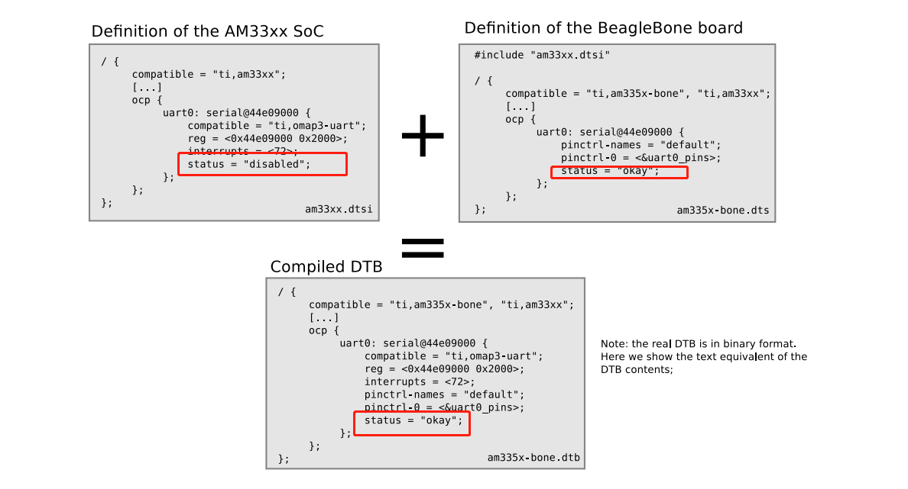

====================
Driver subsystem
====================

引言
======

驱动到底是什么
---------------
其实，严格意义上来说，我认为驱动程序并不算是操作系统的一部分 
我对驱动的定义是: 利用操作系统能力，通过编写一个程序，该程序能够和硬件完成正确的沟通，从而让硬件能够完成正确的工作

我对操作系统里面的驱动子系统的定义是: 操作系统提供一些抽象API，让调用API的用户完成正确的硬件访问

回顾上面的定义，驱动和驱动子系统应该是不同的两个东西，一个直接面对的是硬件，一个面对的是上层用户；

让我们在通过举例说明，比如SPI FLASH，假设生产SPI FLASH的厂家有A B C D四个厂家，他们对SPI硬件的实现可能不同，也可能不同SPI在存储大小、读写速率上规格不同，总之就是硬件可能是不相同的，这就带来一个问题，和这些硬件沟通的*驱动*是不同的；但是无论是哪个厂家哪种规格的SPI，对于用户而言，是不需要关心的，用户只需要你能够提供 读写接口就行

所以，我们常说的驱动工程师，往往是在和不同硬件打交道，而操作系统工程师，则是需要维护系统的抽象设计

设备树
======

前提知识
-----------

基本硬件外设
^^^^^^^^^^^^
.. image:: ./images/driver/1.png
 :width: 800px

上图是一个传统的片上系统的硬件布局，当然了，不同设备，可能在外设上会有一些差别，但是核心的诸如 CPU 、内存、存储、网卡这些一般都是存在的。

设备发现机制
^^^^^^^^^^^^
某些硬件是支持总线发现机制，也就是我们常说的动态识别，比如 USB 控制总线，支持发现机制，也就是可以通过动态加载驱动，总结如下: 
 - 比如 PCI(E) USB 支持发现机制
 - 在系统启动时，不需要知道会有哪些设备连接在总线上，可以先初始化总线，可以延时加载驱动
 - 设备上线时，可以被发现，并且系统可以枚举和识别出设备型号
 - 一般设备都有 vendor ID(厂家ID) product ID（产品ID）
 
当然还有一些硬件是不支持硬件发现的 比如

 - I2C，SPI，1-wire，CPU的内存映射
 - 系统必须要知道哪些设备连接在总线上，以及他们是如何和系统其他部分连接的
 - 在嵌入式设备上，此类总线往往经常使用

这些不支持自动发现的设备，是无法被系统动态识别出来的

历史演变
^^^^^^^^^^^^
为了解决无法被动态识别的设备，最一开始，在bootloader 和 操作系统，这些设备信息都是被硬编码的，比如在很早的linux版本中，如果选择了某个SOC，会对应的编译该SOC需要的设备文件，想想看 这有什么问题？ 

随着设备型号越来越多，linux为了支持这些设备，代码中就出现了越来越多的设备文件，这些设备文件往往驱动都可能是一样的，只是在不同SOC的接入描述可能不同，因此，也被Linux 称为垃圾文件

随后，为了解决这种问题，演变出来了 ACPI tables，ACPI table有设备厂商提供，该表描述了board信息， ACPI 被广泛应用于X86的系统架构，某些ARM64也提供了该能力，该方案解决了不同设备的硬件描述信息的抽象，解放了操作系统和bootloader 硬编码的问题，当然该能力需要类似于BIOS的支持，为了更加广泛解决这个问题，诞生了设备树

设备树文件
-----------

DTS(Device Tree Source): 
 - DTS是硬件配置和设备信息的一种人类可读的纯文本表示法。
 - 设备树文件一般被开发者写在以 .dts 后缀的文件中
 - DTS 文件通常位于内核源代码树中的 arch/<architecture>/boot/dts/ 目录下。
 - DTS 文件被编译成 DTB 文件，然后由引导加载程序加载，并在启动过程中由 Linux 内核解析。

DTB(Device Tree Blob): 
 - DTB 是 DTS 的编译二进制格式。
 - 它不是人类可读的，而是为了让内核和引导加载程序高效处理而设计的。
 - 以 ".dtb" 后缀结尾
 - 引导加载程序（如 U-Boot）会将 DTB 文件加载到内存中，并将其地址传递给内核。
 - 在启动过程中，内核会使用 DTB 中的信息来配置硬件和设置驱动程序。

DTS基本语法
-----------

.. code-block:: c
    :linenos:
	
	/ {
     node@0 {
		string-property = "string";
		string-list-property = "first string","second string";
		byte-data-property = [0x01 0x02 0x03 ...] 
		
		child-node@0 {
			first-chilid-property;
			reference-to-something = <&node1> 
		};
		
		childe-node@1 {
		   ...
		};
	 };
	 
	 node1: node@1 {
		a-cell-property = <1,2,3,4>
	 };
};

解释：
 - node@1: node 是节点名称，比如cpu memory， @后面的number标识 
 - 每个节点都有属性，属性支持不同的表达格式
 - 每个节点可以拥有子节点
 - lable 类似于锚点，可以被引用

一个简单的示例
--------------

.. image:: ./images/driver/1.png
 :width: 800px

假设上图是我们的一个SOC系统，我们使用一个DTS 文件尝试描述他： 

.. code-block:: c
    :linenos:
	
	#address-cells = <1>;
	#size-cells = <1>;
	compatible = "vendor1,board", "vendor2,soc";
	
	cpus {
		#address-cells = <1>;
		#size-cells = <0>;
		cpu0: cpu@0 {
			compatible = "arm,cortex-a9";
			device_type = "cpu";
			reg = <0>;
		};
		cpu1: cpu@1 {
			compatible = "arm,cortex-a9";
			device_type = "cpu";
			reg = <1>;
		};
	};
	memory@0 {
		device_type = "memory";
		reg = <0x0 0x20000000>;
	};
	chosen {
		bootargs = "";
		stdout-path = "serial0:115200n8";
	};

	soc {
		intc: interrupt-controller@f8f01000 { ... };
		i2c0: i2c@e0004000 { ... };
		usb0: usb@e0002000 { ... };
	};

};

我们先可以不需要关注这里的细节，先有个感官认识, DTS规定了有些描述必须存在，比如CPU 内存，也有些是可选的，比如SOC

关于dtsi和属性继承
-------------------
DTS可以用来描述当前系统的硬件信息，让我们看一下这个场景，比如 A B C D四个集成厂家的系统都使用了 同一个厂家的 中断控制器，该中断控制器DTS描述应该谁提供？很明显在这个场景下，出现了DTS复用的需求，因此DTS提供了DTSI的能力

 - 编译最终接收的依然是一个DTS文件
 - DTS 文件可以同 #include 包含其他dtsi文件
 - 最终的DTS文件，是由DTSI + DTS 文件组合覆盖而成的 

下图是一个示例 

可以看到，底层的SOC 定义了uart0的部分信息，最终board的DTS 又对该uart0进行了补充，最终实际参与编译的DTS文件会对该uar0信息进行汇总

.. image:: ./images/driver/4.png
 :width: 800px

上图是常见的继承使用方法

linux DTS构建
---------------

可以在内核的构建中看到,dtb构建通过平台选择构建
.. code-block:: c
    :linenos:
	
	# arch/arm64/boot/dts/marvell/Makefile
	dtb-$(CONFIG_ARCH_MVEBU) += armada-3720-db.dtb
	dtb-$(CONFIG_ARCH_MVEBU) += armada-3720-espressobin.dtb

常用的DTS 构建指令
 - make dtbs: 构建dtbs
 - make dt_bindings_check ： y验证是否支持 YAML bindings 
 - make dtbs_check：检查dtbs正确性 (因为dtc只支持语法检查)
 
linux 设备树调试
------------------
在 /sys/firmware/devicetree/base 目录下 可以看到当前系统使用的dts信息，dtb以sysfs的形式存储在这里

利用 *dtc -I  fs /sys/firmware/devicetree/base* 可以把DTB反编译成为 DTS

DTS OVERLAY
------------------
DTS 支持动态覆盖修改，该部分参考  
https://docs.kernel.org/devicetree/index.html#devicetree-overlays

DTS常用属性
------------------
实际上目前该规范分为两部分： 
 - 基本格式和基本硬件描述: https://www.devicetree.org/specifications/
 - Linux支持的各种扩展硬件描述: https://www.kernel.org/doc/Documentation/devicetree/bindings

compatible
^^^^^^^^^^^^
DTS 的 compatible 用于告诉系统，该设备适用于哪些平台的驱动，用于操作系统加载正确的驱动 
下面是一个DTS 的属性示例： 

.. code-block:: c
    :linenos:
	
	compatible = "arm,armv8-timer";

下面是内核平台驱动的定义示例：
 
.. code-block:: c
    :linenos:

	static const struct of_device_id imx_uart_dt_ids[] = {
		{ .compatible = "fsl,imx6q-uart", .data = ... },
		{ .compatible = "fsl,imx53-uart", .data = ... },
		{ .compatible = "fsl,imx1-uart", .data = ... },
		{ .compatible = "fsl,imx21-uart", .data = ... },
		{ /* sentinel */ }
	};
	MODULE_DEVICE_TABLE(of, imx_uart_dt_ids);
	
	static struct platform_driver imx_uart_platform_driver = {
		.probe = imx_uart_probe,
		.remove = imx_uart_remove,
		.id_table = imx_uart_devtype,
		.driver = {
			.name = "imx-uart",
			.of_match_table = imx_uart_dt_ids,
			.pm = &imx_uart_pm_ops,
		},
	};

cells
^^^^^^^
"cells" 是一个术语，用于描述设备树中的一些重要属性值，如地址、大小、中断等。Cells 是一个通用的术语，可以表示不同的整数值，具体的含义取决于它在特定属性中的上下文。

cells 的标准大小一般标识32bit大小 

 - address-cells/size-cells: 为reg属性服务，address-cells 表示该节点下子节点 reg 地址属性使用多少个bit，size-celss 表示描述该地址大小需要使用多少个celss，子节点可以覆盖修改

下面是一个示例：

.. code-block:: c
    :linenos:
	
	soc {
		compatible = "simple-bus";
		#address-cells = <1>; //定义该地址总线子节点 reg的地址使用32bit 
		#size-cells = <1>; //定义该地址总线子节点的 reg的大小使用32bit
		
		i2c@f1001000 {
			reg = <0xf1001000 0x1000>; //这里对应父节点 cells 的指定大小
			#address-cells = <1>; //定义I2C下子节点 reg 地址使用32bit 
			#size-cells = <0>; //定义I2C下子节点 reg 大小不占用大小
				
			eeprom@52 {
				reg = <0x52>;
			};
		};
	};

- interrupts-cells: 定义中断控制器下面的子节点 使用多少个中断

下面是一个示例：

.. code-block:: c
    :linenos:
	
	soc {
		intc: interrupt-controller@f1002000 {
			compatible = "foo,bar-intc";
			reg = <0xf1002000 0x1000>;
			interrupt-controller;
			#interrupt-cells = <2>; //限制中断控制器使用大小
		};
		
		i2c@f1001000 {
			interrupt-parent = <&intc>;
			/* Must have two cells */
			interrupts = <12 24>; //必须中断控制器定义大小一致
		};
	};

还有其他cells，但是本质上cells的定义主要是控制器的一种约束，控制器必须需要 n 个cells才能够确定下某个资源(比如时钟控制器 需要通过3个参数 确定使用哪个时钟)，因此使用控制器的人，必须也要提供对应数量参数

