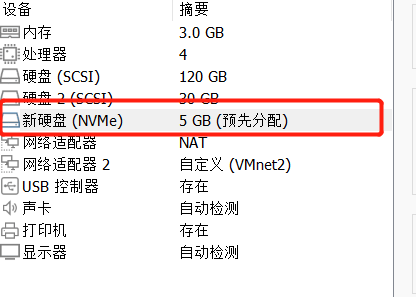

=============
磁盘&文件系统
=============

前言
=========

文件系统， 相信任何人对他都一定不陌生了，思考文件系统的本质，就不得不回归到存储的本质

冯诺依曼计算机模型中，存储作为和计算单元发生数据交换的一部分，用于给计算单元输入/存储数据，存储器广义上又被分为两种类型： 

  - 易失性存储: 无法永久性保存数据，下电后, 数据丢失；访问速度快 
  - 非易失(永久)性存储: 永久性存储数据，下电后数据不丢失，访问速度相对内存慢(也有SRAM)

上面的分类，是我们站在物理世界的视角进行的分类，如果站在操作系统视角:

 - 会把 *易失性存储* 作为内存介质，内存只能作为运行时的存储,关于内存不在本章介绍
 - 会把 *非易失(永久)性存储* 作为文件系统存储介质

有几个概念要再次澄清一下：

- 内存是操作系统的概念，不是物理产品，内存的形态和物理形式可以是多样的
- 文件系统是操作系统的概念，不是物理产品，文件系统的存储介质也是可以是多样的

本章将分为： 硬盘、驱动、文件系统三个维度介绍

机械硬盘
=========

基本工作原理
-------------

固态硬盘
=========

文件系统
=========

简介
-----

XFS文件系统
------------

实验
======

NVME虚拟机环境
----------------
基于已经安装的BClinux 配置NVME磁盘

创建协议层以及加载内核模块支持
.. code-block:: console
    :linenos:
	
	$ sudo  dnf install  -y rdma-core libibverbs libibverbs-utils rdma_rxe
	$ sudo  dnf install  -y rdma-core libibverbs libibverbs-utils rdma_rxe
	$ sudo modprobe rdma_rxe
	$ sudo rdma link add rxe_0 type rxe netdev ens33
	$ sudo ibv_devinfo -d rxe_0
	$ sudo modprobe nvmet
	$ sudo modprobe nvmet-rdma
	$ sudo modprobe nvme-rdma

配置NVME subsystem 

.. code-block:: console
    :linenos:
	
	$ sudo  dnf install  -y rdma-core libibverbs libibverbs-utils rdma_rxe
	$ sudo  dnf install  -y rdma-core libibverbs libibverbs-utils rdma_rxe
	$ sudo modprobe rdma_rxe
	$ sudo rdma link add rxe_0 type rxe netdev ens33
	$ sudo ibv_devinfo -d rxe_0
	$ sudo modprobe nvmet
	$ sudo modprobe nvmet-rdma
	$ sudo modprobe nvme-rdma
	#!/bin/bash
	# author: lincoln
	# date: 2023
	# content:
	#         1. intall rdma tools
	#         2. modprobe rdma & nvme
	# todo:
	#     1. add condition if the ubuntu tools have been installed
	#     2. check if the rdma & nvme have been modprobe
	#     3. other error check and log info 
	
	# NVMe target configuration
	# Assuming the following:
	# IP is 192.168.225.131/24
	# link is up
	
	# get local ip
	local_ip=`ifconfig -a|grep inet|grep -v 127.0.0.1|grep -v inet6|awk '{print $2}'|tr -d "addr:"​`
	
	modprobe rdma_rxe
	rdma link add rxe_0 type rxe netdev ens33  #注意修改
	modprobe nvmet
	modprobe nvmet-rdma
	modprobe nvme-rdma
	
	# 1、config nvme subsystem
	mkdir /sys/kernel/config/nvmet/subsystems/nvme-subsys
	cd /sys/kernel/config/nvmet/subsystems/nvme-subsys
	
	# 2、allow any host to be connected to this target
	echo 1 > attr_allow_any_host
	
	# 3、create a namesapce，example: nsid=10
	mkdir namespaces/10
	cd namespaces/10
	
	# 4、set the path to the NVMe device
	echo -n /dev/nvme0n1> device_path
	echo 1 > enable
	
	# 5、create the following dir with an NVMe port
	mkdir /sys/kernel/config/nvmet/ports/1
	cd /sys/kernel/config/nvmet/ports/1
	
	# 6、set ip address to traddr
	
	echo "${local_ip}" > addr_traddr
	
	# 7、set rdma as a transport type，addr_trsvcid is unique.
	echo rdma > addr_trtype
	echo 4420 > addr_trsvcid
	
	# 8、set ipv4 as the Address family
	echo ipv4 > addr_adrfam
	
	# 9、create a soft link
	ln -s /sys/kernel/config/nvmet/subsystems/nvme-subsys /sys/kernel/config/nvmet/ports/1/subsystems/nvme-subsys
	
	# 10、Check dmesg to make sure that the NVMe target is listening on the port
	dmesg -T| grep "enabling port"
	# 11 output info < ip/port>
	#  XXXX  nvmet_rdma: enabling port 1 (192.168.225.131:4420)

