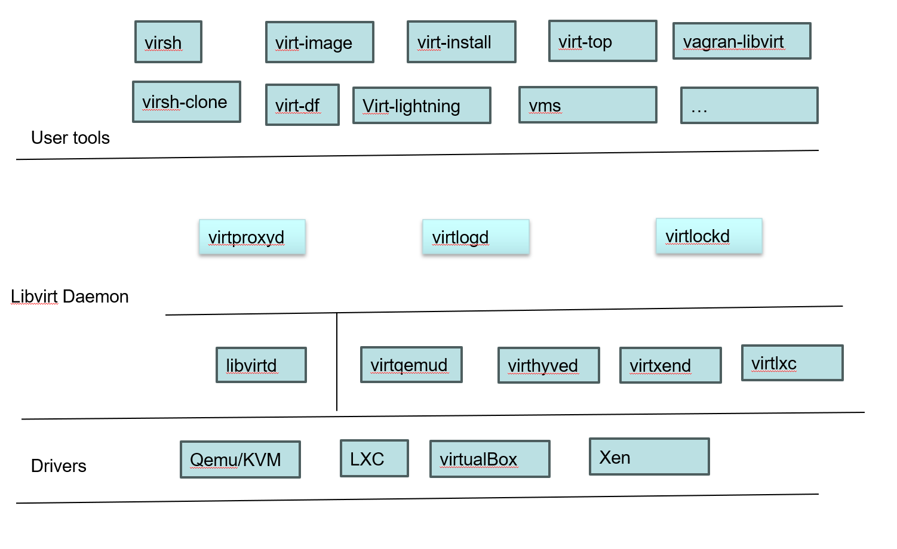

=============
虚拟化
=============

前言
=====

基本概念
----------

基本术语
^^^^^^^^
 - Host OS： 运行虚拟操作系统的宿主机
 - Guest OS/Virtual Machine/Domain/VM ： 一个虚拟操作系统
 - hypervisor: 虚拟机管理程序，顾名思义，就是负责创建、运行、管理虚拟机的程序，也叫VMM(Virtual Machine Monitor)

全/半虚拟化
^^^^^^^^^^^^
简单介绍一下全/半虚拟化，我们以X86作为举例

是否是全虚拟化还是半虚拟化，表象上取决于Guest OS是否感知宿主机的存在。是否需要修改操作系统代码,是否感知VMM的存在

我们已经知道，所谓的代码最终执行都是一些二进制的指令，当前固有的任何主流CPU架构，基于当今操作系统的设计，cpu都会有多个特权级, 一般用户代码拥有普通权限，操作系统内核代码拥有高级权限，这里的普通和高级区别在于 是否可以使用特权指令,用户代码必须要通过syscall或者某种手段进入内核，才能执行特权指令

特殊指令的约束对虚拟化提出了挑战，虚拟化一个核心挑战就是： 
 
 - 如何让GuestOS能够正确执行特权指令？
 - 如何保证GUEST OS执行特权指令，不破坏其他OS？
 
第一个解决方案，X86上，通过让GUEST OS 运行在 ring1, 利用VMM截获Guest OS特权指令并进行翻译之后，返回结果给GuestOS

上述方案显而易见的问题就是性能问题:  当GuestOS 在RING1 执行某个特权指令，会先触发异常(Ring1访问特权指令异常)，然后VMM 捕获异常，处理完，在返回异常

为了处理掉异常上下文切换开销，提出了第二个解决方案: hypercalls

hypercalls 存在的目标就是削减掉异常路径，通过修改GuestOS特权指令变为主动调用hypercalls
虽然性能得到了提升，但是也带了另外一个问题：GuestOS必须配合修改内核代码，显示调用hypercalls

硬件辅助虚拟化
^^^^^^^^^^^^^^^^
无论是之前的全虚拟化还是hypercalls半虚拟化，都有突出短板，软件解决不了的问题，那就通过硬件去解决
虚拟化要完成的目标: 

 - GuestOS 不需要任何修改,不感知VMM
 - GuestOS 尽可能获得最好的性能

现在主流CPU都提供了硬件辅助虚拟化，上图是X86的Intel-V技术，说简单一些，就是把基于软件异常处理动作更改为了硬件自动处理

在X86架构下，Intel提供了VMM-NonRoot 和ROOT(和原先一样)，通过CPU架构主动对虚拟化的支持，大大减小了虚拟化的上下文切换开销

拥有了硬件辅助的虚拟化，现在全虚拟化也几乎拥有了类似半虚拟化的性能

再谈hypervisor
^^^^^^^^^^^^^^
回顾之前对于全/半/硬件辅助虚拟化，我们可以看到VMM几乎都是处于Ring0或者是ROOT之下，业界对于hypervisor
有两种分类: type1/type2  参考: https://zh.wikipedia.org/wiki/Hypervisor

type1: 这些虚拟机管理程序直接运行在宿主机的硬件上来控制硬件和管理客操作系统
 
 - 硬件支持
 - VMM就是主操作系统
 - 效率高 
 
type2: 这些虚拟机管理程序运行在传统的操作系统上，就像其他计算机程序那样运行。

 - VMM就是普通的应用程序
 - 效率低

上述两种虚拟化以前一直还是有非常明显的区别的，比如我们在windows下使用的Vmware 又或者是QEMU，都是典型的type2，在一些商用场景，type1则被普遍使用

但是，随着Linux KVM的普及，两者的界限模糊了起来，接下来我们介绍KVM

KVM
^^^^^
Kernel-based Virtual Machine (KVM) is a 是 Linux 内核的虚拟化基础设施，可将其转变为hypervisor(虚拟机管理程序)。 它在2007年2月5日发布的内核版本2.6.20中被合并到Linux内核主线中。

:KVM type1&type2:
 KVM作为内核的一个模块，毋庸置疑是运行在Ring0的，直接在硬件之上运行,可以归于type2,但是又因为linux自身也是一个操作系统，KVM作为hypervisor只是复用了linux的内存调度等，实际上linux 也可以单独作为OS使用，并运行自己的应用软件，所以从这方面讲，KVM又属于type2，KVM的存在，模糊了传统VMM类型的定义

QEMU
^^^^^
简单介绍一下QEMU

QEMU（quick emulator）是一款由法布里斯·贝拉（Fabrice Bellard）等人编写的通用且免费的可执行硬件虚拟化的（hardware virtualization）开源仿真器（Emulator）。
其与Bochs，PearPC类似，但拥有高速（配合KVM），跨平台的特性。

QEMU的架构由纯软件实现，并在Guest与Host中间，来处理Guest的硬件请求，并由其转译给真正的硬件。
然而因为QEMU是纯软件实现的，所有的指令都要经过QEMU，使得性能很差，而配合KVM则可以解决这一问题。
QEMU虚拟化的思路是：提取Guest代码，翻译为TCG中间代码，而后翻译为Host代码。相当于实现了一个“中间人”的角色

libvirt
^^^^^^^^^
libvirt是一套用于管理硬件虚拟化的开源API、守护进程与管理工具。此套组可用于管理KVM、Xen、VMware ESXi、QEMU及其他虚拟化技术。libvirt内置的API广泛用于云解决方案开发中的虚拟机监视器编排层（Orchestration Layer）

libvirt&QEMU&KVM的关系
^^^^^^^^^^^^^^^^^^^^^^
前面简单介绍了一些基本概念，他们之前又到底是什么关系？

严格意义上来说，KVM\QEMU 都可以被看作为VMM,但是，基于QEMU在仿真的完备程度，对于多种硬件/IO/外设模拟的支持已经相当完善
KVM的主要优势在于对硬件辅助虚拟化的支持，但是对于其他设备支持又过于复杂，而且也并没有成为主要的性能瓶颈点，所以QEMU兼容了KVM的支持，在CPU和内存虚拟化兼容了KVM的能力，使得基于qemu的虚拟机性能获得了很大提升

libvirt是在公有云虚拟化场景下诞生的一个虚拟机管理工具，由于虚拟化技术和厂商的技术以及平台无法兼容，libvirt通过一层API兼容层，实现了对多种虚拟化技术在管理方面的统一管理

实验
^^^^^^^^^
在 :ref:`基于KVM运行虚拟机` 实验指引下，初尝KVM的魅力

libvirt
=======
虚拟化章节，重点本来是应该在虚拟化的具体实现上，libvirt作为虚拟化的API层，其实本身并不涉及到核心虚拟化技术的实现，但是在 作为虚拟化问题定位、状态监控上，他发挥了重大作用，我们本章节重点在于介绍livirt工具使用的了解上，可能会涉及到一些代码架构

本章内容大部分节选来自:https://libvirt.org/docs.html

基础架构
---------

libvirt源码基本上包含上述三个层级，

 - 一部分属于tools和外部API，对用户提供操作界面
 - 一部分以daemon的形式存在(支持单模式/模块化daemon)
 - 虚拟化能力的提供由driver负责提供

通过libvirt抽象层的封装，完成了两个功能
 - 屏蔽掉底层虚拟化技术实现/接口的不同
 - 对外提供统一的接口/命令行
 
源码安装&调试
--------------

构建
^^^^^
参考:https://libvirt.org/compiling.html

调试
^^^^^^^^^

工具的日志,需要通过环境变量打开: 

.. code-block:: c
	:linenos:
	
	$export LIBVIRT_DEBUG = {1 debug，2 info，3 warn，4 error}
	$export LIBVIRT_LOG_FILTERS = 
	$export LIBVIRT_LOG_OUTPUTS = 

代码的调试
.. code-block:: c
	:linenos:
	
	$ pwd
	/home/to/your/checkout/build
	$./run ./tools/virsh ....

守护进程
----------
我们已经知道，libvirt 可以提供两种daemon模型: 
 - 单体守护进程 (Monolithic Daemon)
 - 模块化守护进程 (Modular Daemons)

模块化的守护进程未来讲逐步替换掉单体模式，当前默认仍然是单体模式

运行模式
^^^^^^^^^
无论是单体或者是模块化守护进程，都支持两种运行模式 

 - 系统模式: 该运行模式下，拥有root权限， 拥有管理员权限，可以使用全部能力
 - 会话模式: 该运行模式，只有同一个UID下的用户/客户端可以访问，该模式下，守护进程可能不会具备全部功能 

简单点说： libvirtd 拥有root权限，可以使用系统所有资源，适合于服务器场景，session mode 适合个人

通信通道
^^^^^^^^^
libvirt守护进程对外提供API或者为工具提供访问能力，主要通过两种方法

 - 本地的UNIX socket
 - 远端的TCP端口

:单体守护进程系统模式下的通信通道:

  -  /var/run/libvirt/libvirt-sock : 提供完整的读写权限，libvirt提供API的主要通道
  - /var/run/libvirt/libvirt-sock-ro: 仅用来监控使用
  - /var/run/libvirt/libvirt-admin-sock: 用于管理和配置守护进程自身行为
  - TCP 16509 ： 一个not-tls监听端口 远端访问接口
  - TCP 16514 : 一个tls监听端口 远端访问接口

:单体守护进程会话模式下的通信通道:
和系统模式类似，只是目前前缀改为: /var/run/user/$UID

工具的使用
-----------
引用: https://libvirt.org/manpages/index.html

virt-install
^^^^^^^^^^^^
用于配置新的虚拟机

Driver框架
----------

QEMU
=====

KVM
=====

技术架构
=========

代码分析
=========

virsh
-------
在定位某个问题，因为需要从源头追踪一下，顺便梳理了一下

virsh 是libvirt 管理虚拟机的shell client工具，实际上严格意义来说不涉及到虚拟化的具体工作，主要作为前端 和 libvird 通信的前端工具 
但是工具又是我们经常需要接触的，一条命令敲下去之后，他后面发生了什么？我们如果需要继续追踪下去，那不得不回到最开始的地方，一步一步探索下去

 

命令解析管理模块
^^^^^^^^^^^^^^^^^^^^
vshControl 是通信交互模块的通道核心，负责前后台建联， cmdGroups则定义了相关命令行的实现

libvirtd
-----------

常用工具
=========

问题定位
=========

shutdown无反应
----------------

问题描述
^^^^^^^^^^^^
实验中的  :ref:`启动虚拟机测试` 虚拟机启动以后，通过virsh shutdown 虚拟机无反馈

环境特征: 

 - Vmware虚拟机 中 嵌套KVM二次虚拟化 
 - guest os 是一个最小系统，内核+buildroot
 - KVM host 版本：BClinux8.6 

 
操作步骤: 
 
 - 按照实验 启动内核后，功能正常，然后通过  virsh shutdown 尝试关闭虚拟机，虚拟机没有响应，依然正常工作，没有关闭

问题定位
^^^^^^^^
virsh shutdown定义位于./tools/virsh-domain.c  

.. image:: ./images/kvm/3.png
 :width: 400px

可以看到 virsh shutdown 支持4个模式，我们当前是没有传入mode，也尝试了指定mode，发现只有acpi可以执行下去

.. code-block:: c
	:emphasize-lines: 30
	:linenos:
	
	while (tmp && *tmp) {                                                        
        mode = *tmp;                                                             
        if (STREQ(mode, "acpi")) {                                               
            flags |= VIR_DOMAIN_SHUTDOWN_ACPI_POWER_BTN;                         
        } else if (STREQ(mode, "agent")) {                                       
            flags |= VIR_DOMAIN_SHUTDOWN_GUEST_AGENT;                            
        } else if (STREQ(mode, "initctl")) {                                     
            flags |= VIR_DOMAIN_SHUTDOWN_INITCTL;                                
        } else if (STREQ(mode, "signal")) {                                      
            flags |= VIR_DOMAIN_SHUTDOWN_SIGNAL;                                 
        } else if (STREQ(mode, "paravirt")) {                                    
            flags |= VIR_DOMAIN_SHUTDOWN_PARAVIRT;                               
        } else {                                                                 
            vshError(ctl, _("Unknown mode %s value, expecting "                  
                            "'acpi', 'agent', 'initctl', 'signal', "             
                            "or 'paravirt'"), mode);                             
            return false;                                                                                       
        }                                                                        
        tmp++;                                                                   
    }

	if (!(dom = virshCommandOptDomain(ctl, cmd, &name)))                         
        return false;                                                            
                                                                                 
    if (flags)                                                                   
        rv = virDomainShutdownFlags(dom, flags);                                 
    else                                                                         
        rv = virDomainShutdown(dom);                                             
                                                                                 
    if (rv != 0) {                                                               
        vshError(ctl, _("Failed to shutdown domain '%s'"), name);                
        return false;                                                            
    }
	

我们继续跟踪不带flags 的 virDomainShutdown，发现这样一段注释:

.. code-block:: console

	#Shutdown a domain, the domain object is still usable thereafter, but the domain OS is being stopped. Note that the guest OS may ignore the  request. Additionally, the hypervisor may check and support the domain  'on_poweroff' XML setting resulting in a domain that reboots instead of   shutting down. For guests that react to a shutdown request, the differences    from virDomainDestroy() are that the guests disk storage will be in a stable state rather than having the (virtual) power cord pulled, and  this command returns as soon as the shutdown request is issued rather  than blocking until the guest is no longer running.      
    If the domain is transient and has any snapshot metadata (see virDomainSnapshotNum()), then that metadata will automatically be deleted when the domain quits.  
    Returns 0 in case of success and -1 in case of failure.    

大致意思是说
  - guest os 可能会忽略关机请求
  - 会检查 on_poweroff的XML 状态(virsh dumpxml 获得)，决定是重启还是shutdown 
  - 关机和销毁的区别在于 正常关机，系统会处于稳定态，如果执行销毁可能会导致磁盘损坏
  - 成功返回0，失败返回-1 

结合我们命令行 并没有打印出 上面代码的关机出错提示，可以知道 virDomainShutdown 是执行成功的

.. code-block:: c
	:emphasize-lines: 16
	:linenos:
	
	virDomainShutdown(virDomainPtr domain)                                           
	{                                                                                
		virConnectPtr conn;                                                          
																					
		VIR_DOMAIN_DEBUG(domain);                                                    
																					
		virResetLastError();                                                         
																					
		virCheckDomainReturn(domain, -1);                                            
		conn = domain->conn;                                                         
																					
		virCheckReadOnlyGoto(conn->flags, error);                                    
																					
		if (conn->driver->domainShutdown) {                                          
			int ret;                                                                 
			ret = conn->driver->domainShutdown(domain);                              
			if (ret < 0)                                                             
				goto error;                                                          
			return ret;                                                              
		}                                                                            
																					
		virReportUnsupportedError();                                                 
                                                                                 
		error:                                                                          
		virDispatchError(domain->conn);                                              
		return -1;                                                                   
	}

从上面代码可以看到，真正执行关机的是 16行 conn->driver->domainShutdown

实验
=====

.. _基于KVM运行虚拟机:

基于KVM运行虚拟机
------------------

前提准备
^^^^^^^^^^^^
 - 处理器 support Intel Virtualization Technology or AMD-V depending on the brand of the processor.
 
.. note::

	Intel VT can be disabled/enabled in the BIOS settings.Most hardware manufacturer keep it disabled.
 	AMD-V can't be disabled in the BIOS.

Processor's Virtualization Extensions are enabled. 

.. code-block:: console
    :linenos:

	#grep -E 'svm|vmx'/proc/cpuinfo
	
Linux OS with minimum of above kernel version 2.6.20. 

.. code-block:: console
    :linenos:

	# uname -a

安装必要软件
^^^^^^^^^^^^

.. code-block:: console
    :linenos:
	
	$ dnf install -y virt-install qemu-kvm libvirt libvirt-python \
	  libguestfs-tools virt-manager  bridge-utils
	$ systemctl enable libvirtd
	$ systemctl start libvirtd
	$ systemctl status libvirtd
	$ reboot 
	$ systemctl status libvirtd
	$ modinfo kvm_intel
	$ modinfo kvm

网络配置
^^^^^^^^^^^^
libvirtd 使能之后，会创建一个叫 virbr0的device, 

.. code-block:: console
    :linenos:

	$ nmcli  device show  virbr0
	$ brctl list

virtbr0 就是一个虚拟的交换机，由于我的linux已经运行在了虚拟机下面，环境稍微会复杂一点

 
我的给Bclinux原本ens33 是 VMWARE 用于和windows通过Nat转发的，现在我们把ens33 和 virbr0 配置为混杂模式(其实就是virbr替代了ens33)，然后kvm虚拟机也能通过windows 的Nat Dhcp提供网络了

ENS33的配置如下: 

.. code-block:: console
    :linenos:

	TYPE=Ethernet
	PROXY_METHOD=none
	BRIDGE=virbr0
	BROWSER_ONLY=no
	BOOTPROTO=none
	DEFROUTE=yes
	IPV4_FAILURE_FATAL=no
	NAME=ens33
	UUID=3e98f4f9-bd3d-43ce-8830-b567ffe43ab9
	DEVICE=ens33
	ONBOOT=yes

virbr0的配置如下: 

.. code-block:: console
    :linenos:

	TYPE=BRIDGE
	DEVICE=virbr0
	BOOTPROTO=dhcp
	ONBOOT=yes
	NAME=virbr0

.. _启动虚拟机测试:

启动虚拟机测试
^^^^^^^^^^^^^^^^^
我先通过之前kernel测试环境 :ref:`QEMU开发环境准备`  检查一下网络: 

.. code-block:: console
    :linenos:

	$ virt-install --name my_guest_os --import --disk path=/home/guoweikang/code/buildroot/output/images/rootfs.qcow2,format=qcow2 --memory 2048 --vcpus 1 --boot kernel=./arch/x86/boot/bzImage,kernel_args="root=/dev/sda  rw console=ttyS0,115200 acpi=off nokaslr"   --graphics none --serial pty --console pty,target_type=serial --network bridge=virbr0,model=virtio
	$ ifconfig  eth0 up
	$ udhcpc -i eth0 -- 通过dhcp配置 eth0
	
	
虚拟机测试基本管理
^^^^^^^^^^^^^^^^^^^^

.. code-block:: console
    :linenos:
	
	$ virsh list (--all) -- 查看虚拟机 
	$ virsh start/shutdown/reboot  xxx  -- 启动 关闭 重启虚拟机
	$ virsh suspend/resume   xxx  --  挂起和恢复
	$ virsh undefine/destroy   xxx  --  销毁虚拟机
	$ virsh console    xxx  -- 进入虚拟机console 
	$ ctrl ]   -- 退出虚拟机console 
	$ virsh autostart (--disable)   -- 虚拟机和host一起自动开机 
	$ virsh domuuid xxxx  -- 虚拟机uuid

	