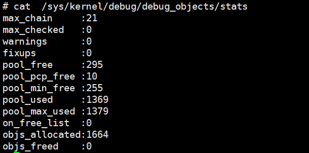

==========
LinuxDFX
==========

gdb
====

前言
------
gdb作为日常问题定位中不可缺少的一个工具，可以说和日常开发息息相关，本节想通过两部分对gdb介绍

 - gdb的工作原理: 理论学习，并不对gdb的代码过多探索
 - gdb常用命令: 根据实际工作场景不断补充

如何工作的
-----------

两种调试界面
^^^^^^^^^^^^^^
我们都知道，内存中的执行程序，都是由二进制的指令和数据构成的，gdb可以把二进制指令翻译成为汇编，这并没有什么难度
但是对于更多开发人员，他们更关注自己的代码，而不是汇编，但是仅仅通过指令得到目标代码，是不现实的，为了完成这个目标，必须要
在编译的时候，通过建立代码和程序的关系，一般通过gcc -g 选项完成该工作

 - 基于目标语言(C)的调试：依赖源文件、依赖目标程序的调试信息(通过编译增加-g选项）
 - 基于汇编的调试：不依赖高级语言

常用调试命令
-------------

显示
^^^^^^^
 - gdb  -tui: 以窗口模式打开gdb ，配合layout 命令使用
 - layout asm/src: 窗口 显示汇编/源文件

运行指令
^^^^^^^^^
 - r ：restart 
 - s : 进入函数

断点命令
^^^^^^^^
 - break/b： 
 - delete

读取寄存器
^^^^^^^^^^^
 - p/x $rax

读取内存
^^^^^^^^
 - x/{n}{f}{u} addr 
 - n 表示要打印的数量
 - f 打印格式，支持d（decimal 十进制） x 十六进制  a 八进制
 - u 每个打印单元长度: b(byte) h(2byte) w(4 byte) g(8 byte)

历史命令查看
^^^^^^^^^^^^^
tui模式下 查看上一条 下一条命令
 - ctrl+p previous
 - ctrl+n next
 - ctrl+b back
 - ctrl+f forward

QEMU GDB调试最新内核
---------------------

环境准备
^^^^^^^^^^^^^
环境准备参考 :ref:`虚拟化环境`

内核代码下载
^^^^^^^^^^^^^
.. code-block:: console
    :linenos:

	$ make -p ~/code/
	$ cd  ~/code/
	$ git clone https://mirrors.tuna.tsinghua.edu.cn/git/linux.git
	$ git remote add linux-next https://mirrors.tuna.tsinghua.edu.cn/git/linux-next.git
	切换到next tree
	$ git fetch  linux-next 
	$ git fetch --tags linux-next
	$ git tag -l "next-*" | tail
	$ git checkout -b {my_local_branch} next-(latest)

如果不想使用next tree ，直接使用主线即可	

内核配置编译
^^^^^^^^^^^^^^
https://www.kernel.org/doc/html/next/dev-tools/gdb-kernel-debugging.html) 
需要关闭 CONFIG_RANDOMIZE_BASE   打开CONFIG_GDB_SCRIPTS 

.. code-block:: console
    :linenos:
	
	$ make ARCH=x86_64 x86_64_defconfig (配置内核)
	$ make ARCH=x86_64 menuconfig 
	$ make -j8

有了内核镜像，可以先简单测试一下: 

.. code-block:: console
    :linenos:
	
	$ qemu-system-x86_64  -kernel arch/x86/boot/bzImage -hda /dev/zero -append "root=/dev/zero console=ttyS0" -serial stdio -display none

由于此时还没有提供根目录，内核在启动 执行到挂载根目录就会panic 

gdb调试
^^^^^^^^^^^^

现在可以尝试gdb 调试内核了

.. code-block:: console
    :linenos:
	
	$ qemu-system-x86_64 -s -S -no-kvm -kernel arch/x86/boot/bzImage -hda /dev/zero -append "root=/dev/zero console=ttyS0 nokaslr" -serial stdio -display none

.. note:: 

	这里我们启动内核增加了一个 nokaslr选项，关于kaslr的介绍请看 https://lwn.net/Articles/569635/, 如果有机会，我们在内核安全章节可能会学习介绍他
	
这里我们增加了 -s -S 选项，该选项会让GDB 卡住，直到gdb client 连接

修改~/.gdbinit 设置自动加载内核提供的gdb 脚本
 
 .. code-block:: console
    :linenos:
	
	add-auto-load-safe-path /home/test/code/linux/scripts/gdb/vmlinux-gdb.py

下面命令是在gdb里面执行的

.. code-block:: console
    :linenos:
	
	$ 在另外一个窗口执行
	$ cd  /home/test/linux/
	$ gdb ./vmlinux
	$ target remote localhost:1234
	$ lx-symbols
	$ break start_kernel 
	$ layout src

现在可以单步调试了 其他命令参考
https://www.kernel.org/doc/html/next/dev-tools/gdb-kernel-debugging.html

根目录制作
^^^^^^^^^^^^
.. code-block:: console
    :linenos:
	
	$ cd  ~/code
    $ git clone git://git.buildroot.net/buildroot
	$ make menuconfig （Target Options -> Target Architecture →x86_64; Filesystem images → ext2/3/4 root file system ）
	$ make -j8
	$ qemu-img convert -f raw -O qcow2 output/images/rootfs.ext2 output/images/rootfs.qcow2

qemu启动
^^^^^^^^
现在已经拥有

  - 内核image: arch/x86/boot/bzImage
  - rootfs： buildroot/output/images/rootfs.ext2

.. code-block:: console
    :linenos:
	
	$ qemu-system-x86_64 -s -kernel arch/x86/boot/bzImage \
		-boot c -m 2049M -hda ../buildroot/output/images/rootfs.ext2 \
		-append "root=/dev/sda rw console=ttyS0,115200 acpi=off nokaslr" \
		-serial stdio -display none

内存
====

valgrind
----------

用户态 *动态* 内存泄漏诊断工具，主要用于监控堆内存，核心实现是对malloc/free wrap，这样程序堆上的内存都在他的监控之下，从而可以判断程序对这些内存的合法使用，可以用来检查

 - 堆内存的非法访问(访问没有申请或者已经释放的内存 uaf)
 - 堆内存的重复释放(double free)
 - 堆内存泄漏(mem leak)

使用方法
^^^^^^^^^

.. code-block:: console

	valgrind [options] process

llvm Sanitizers
----------------
*动态* 内存泄漏诊断工具，运行时检测

 - addressSanitizer: 检测到内存越界、double free、uaf 等问题
 - leakSanitizer: 查找是否存在内存泄漏
 - MemorySanitizer：内存消毒，查找是否使用未初始化的内存
 - UndefinedBehaviorSanitizer： 查找是否存在空指针访问、整型越界
 - ThreadSanitizer： 线程并发相关

使用方法
^^^^^^^^^
主要通过编译阶段打桩实现

.. code-block:: console

	$ clang-12 -g -O0 -fsanitize=address,leak,undefined -Wall -Wextra -std=gnu99
	$ clang-12  -fsanitize=address,leak,undefined 

网络
======

TCP/UDP
-----------
ss
^^^^^^^^^^^^^
用于dump 当前系统的 网络socket 状态

常用选项有:

 - 不解析IP，以数字显示： -n
 - 选择指定协议的sockets: -t(tcp) -u(udp) -d (DCCP)  -w(raw) -x(unix sockets = -f unix) -S(SCTP) --vsock( =-f vsock) 
 - 选择指定协议簇的sockets : -f (unix inet inet6 link netlink vsock xdp)
 - 显示连接的详细信息: -i 
 - 显示timer信息: -o , 会输出 <timer_name: on/keepalive/timewait/persist/unknown> <expire_time>  <retrans>
 - 显示连接内存信息: -m  
 
-i选项输出解析:

 - cubic: 拥塞算法
 - wscale:<snd_wscale>:<rcv_wscale>: 窗口大小缩放因子
 - rto: tcp re-transmission timeout  TCP 重传时间 单位 ms（会根据网络状态动态调整）
 - rtt: 显示为 rtt/rtt_var rtt是平均往返时间，rttvar是rtt的平均偏差，它们的单位是毫秒
 - ato: 下一次等待ACK的超时时间，如果此段时间没有收到ACK，会触发重传
 - mss: Maximum Segment Size 协商的最大分段字节大小 一般为 MTU 减去TCP/IP报头大小
 - pmtu: 当前链路路径上的允许的最小的MTU(数据包不分片的大小)
 - rcvmss: 接收端最大分段字节大小
 - advmss: 向外公布的最大分段字节大小
 - cwnd: Congestion Window 阻塞窗口，管理发送方未受到接收方ACK的情况下可以发送的数据量 
 - ssthresh: 慢启动阈值 当cwnd 到达这个值以后，从指数增长变为慢速增长
 - bytes_send: 以发送的字节
 - bytes_received：接收的字节
 - bytes_acked：得到ACK的响应的字节
 - bytes_retrans: ACK无响应后 重发的包
 - (data)segs_out: 发送的报文段
 - (data)segs_in: 接受的报文段
 - lastsnd(rcv/ack)： 最后一次收到/发送/ack的
 - pacing_rate: 每秒的比特数(bps) 每秒的包数量(pps) 表示发送方以多块的速度在连接上发送数据
 - delivery_rate：交付率 "是指 TCP 数据包成功交付给接收方的速率。它表示 TCP 发送方发送数据包、接收方接收并确认这些数据包而没有任何丢失或重传的速率。
 - delivered： 已送达字段，显示自建立 TCP 连接以来已成功送达接收方的 TCP 数据包总数。这包括数据包和接收方为确认收到数据而发回给发送方的确认包（ACK）。
 - app_limited: app_limited 状态表明发送应用程序是数据传输过程中的瓶颈,这种情况可能发生在应用程序处理数据速度较慢、等待用户输入或执行其他任务时，从而延迟了数据的生成和传输。因此，发送速率可能会低于网络容量或接收器处理接收数据的能力
 - busy: 处理排队RECV-Q/SEND-Q的时间
 - retrans: <retrans_out/retrans_total>
 - dsack_dups: 
 
-m选项输出解析： 

    skmem:(r<rmem_alloc>,rb<rcv_buf>,t<wmem_alloc>,tb<snd_buf>, f<fwd_alloc>,w<wmem_queued>,o<opt_mem>,bl<back_log>,d<sock_drop>)
	
	-rmem_alloc： 接受报文使用的内存
	-rcv_buf： 接受报文可以使用的缓存总大小
	-wmem_alloc： 发送报文占用的内存
	-snd_buf： 发送报文可以使用的缓存总大小
	-fwd_alloc： 内存备份缓冲区，
	-wmem_queued：  发送报文占用的内存 还没有发送到layer3
	-sock_drop： 在包被分流到socket之前丢弃的包

常用组合: 

 - 查看TCP简单状态: ss -nt
 - 查看TCP详细状态: ss -nipoe

ss
^^^^^^^^^^^^^

案例
------

.. _debugobjects:

debugobjects
=============

需要具备以下基本知识: 
 
 - 

模块设计
---------

源码位于: *lib/debugobjects.c*
核心数据结构：debug obj的维护，trace obj 统一从slab 分配，每个CPU 维护一个PERCPU列表(不需要持有pool lock) ，pool lock 负责维护OBJ的整体分配
 

状态机:

如何使用
---------

功能开启关闭
^^^^^^^^^^^^^
 
 - 通过CONFIG_DEBUG_OBJECTS 可以开启对象生命周期监控模块编译 
 - kernel 通过 命令行参数:  *debug_objects* *no_debug_objects* 可以动态选择开启关闭

.. note::

    动态关闭会有一些性能损失，编译关闭，可以通过编译器优化 把空函数直接删除，动态关闭，依然会有一次跳转和判断

状态查看
^^^^^^^^

通过 /sys/kernel/debug/debug_objects/stats 可以查看对象统计状态, 
参考： :ref:`实验debug_objects_stats` 

对外API
^^^^^^^^

:debug_object_init:

在对象初始化函数调用，该函数会见检查对象是否可以初始化

 - 处于活动状态: 会被认为是错误初始化，额外提供了fixup机制，如果提供了fixup_init函数，调用者应该保证fixup_init 应该修正这个错误: 比如把活动对象停用，以防止破坏子系统
 - 处于已经销毁状态: 会被认为是错误初始化, 不提供fixup 仅仅是打印
 - 未被跟踪: 会新分配一个跟踪对象器，并设置状态: ODEBUG_STATE_INIT, 同时检查该对象是否在堆栈上，如果在堆栈，会打印告警，堆栈上的对象，应该使用 debug_object_init_on_stack，见下一节
 
:debug_object_init_on_stack:

堆栈上的对象在初始化之前调用，该函数会见检查对象是否可以初始化

  - 活动状态或者是已销毁: 会被认为是错误初始化，额外提供了fixup机制，如果提供了fixup_init函数，调用者应该保证fixup_init 应该修正这个错误: 比如把活动对象停用，以防止破坏子系统

堆栈上的对象，必须在该对象的生命周期(代码块) 退出之前， 调用debug_object_free() 从跟踪器删除堆栈上的对象，否则会导致跟踪错误

:debug_object_activate:

调用真实对象的激活函数时 需要调用此函数 

 
实验
------

.. _实验debug_objects_stats:

实验1:查看debug_objects_stats
^^^^^^^^^^^^^^^^^^^^^^^^^^^^^^^^^^^^
.. code-block:: console
    :linenos:
	
	$ mount -t debugfs none /sys/kernel/debug (make sure CONFIG_DEBUG_FS is config)
	$ cat /sys/kernel/debug/debug_objects/stats 
	

实验2:动态关闭debug_objects
^^^^^^^^^^^^^^^^^^^^^^^^^^^^^^^^^^^^
.. code-block:: console
    :linenos:
	
	$  virt-install --name my_guest_os --import --disk path=/home/guoweikang/code/buildroot/output/images/rootfs.qcow2,format=qcow2 --memory 2048 --vcpus 1 --boot kernel=./arch/x86/boot/bzImage,kernel_args="root=/dev/sda  rw console=ttyS0,115200 acpi=off nokaslr no_debug_objects"   --graphics none --serial pty --console pty,target_type=serial
	检查： /sys/kernel/debug/debugobjects 消失
	