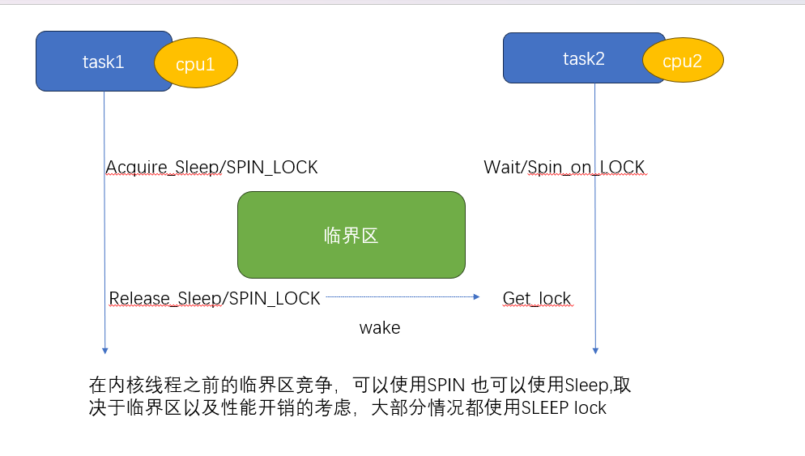
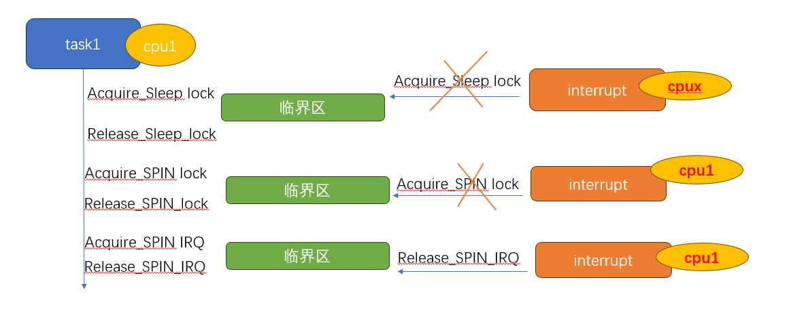
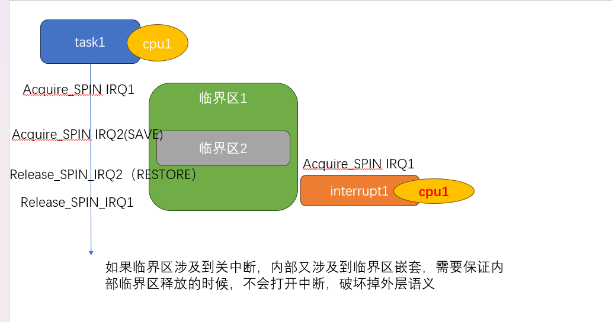
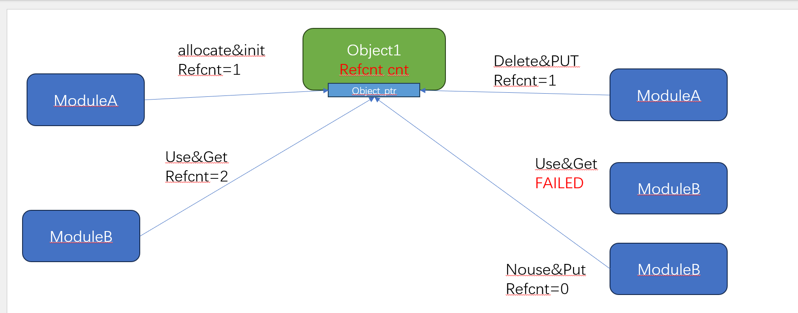
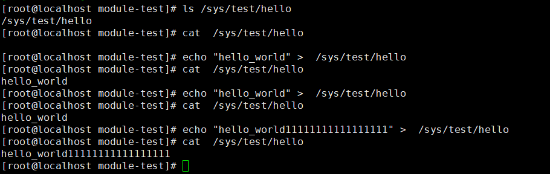

=============
Linux基础机制
=============

本章节不包含子系统介绍，包含linux的基础设施，比如同步原语、打印等

同步原语
=========

READ/WRITE_ONCE
-----------------

READ/WRITE ONCE 不是锁，甚至不是原语，只是用来保证本次内存读写是 *即时* *不被编译器优化的*

  - 即时: 多CPU访问内存，会因为cache 有不同步的可能，READ/WRITE_ONCE 避免了由于cache引入的数据滞后问题
  - 不被编译器优化的: 编译器会保证当前指令不会被优化 折叠 ，并且整字节访问内存, (参考 https://lkml.org/lkml/2015/10/5/400)
  

作为linux最基础的同步原语，主要用来解决共享内存的读写访问，很多同学看到这里，肯定会问 难道不应该是用锁吗? 
锁是用来保护临界区，防止竞争，但是同一个CPU上的同一个线程
这里还有一个例子 https://lkml.org/lkml/2015/10/5/400 ，用来说明为什么需要READ/WRITE_ONCE

更多请参考:https://github.com/google/kernel-sanitizers/blob/master/other/READ_WRITE_ONCE.md

使用场景
^^^^^^^^
 
 - 用于在单个CPU上，进程和中断的通信控制（percpu flag）
 - 用于实现atomic或者锁原语，和内存屏障结合使用，保证编译器不进行优化、折叠，访问是预期行为

锁
----

掌握本节内容，需要提前清楚以下几个概念: 

  - 抢占内核:现在都假设是处于抢占式内核,不在讨论非抢占内核
  - 中断
  - 临界区
  - SMP: 现在都假设我们是在SMP模型下讨论，不在讨论单核场景

无论如何，让我们回到锁的本质，就是为了解决临界区问题 
先从几个大的方面尝试 区分一下睡眠锁、spin锁 本地spin锁

睡眠锁性能讨论
^^^^^^^^^^^^^^^^^
:睡眠锁性能的影响:  如果使用睡眠锁，假设A(CPU1)已经持锁，内核支持抢占的前提下，该任务在访问临界区中间，可以随时被其他任务抢占 
  
  - 如果此时B抢占了A(CPU1)，同时B(CPU1)尝试去拿锁，B会陷入睡眠，让出CPU1，A(CPU1)继续执行
  - 如果此时C抢占了A(CPU1)，同时B(CPU2)尝试去拿锁，B会陷入睡眠, 让出CPU2, A依然处于被抢占的状态，此时AB都得不到执行
  
上面只是列出了睡眠锁常见的几个场景，我们可以看到，睡眠锁其实都是通过调度(sleep/wakeup)解决任务之前临界区的竞争，那么必然就会引入调度的开销
如果我们的临界区非常短,从调度开销角度考虑，在访问这个临界区中间，我们其实并不希望 该任务能够被调度出去,同时等锁的任务，我们也希望他能够珍惜
这次调度机会，不要再次发生调度，综上考虑，只需要在持锁和等锁的实现上，临时关闭调度抢占即可，这就是最初的自旋锁(spin_lock)

实际上，为了最小化调度损失，睡眠锁也提供很多机制去消减调度开销，比如支持任务优先级传递的RT_mutex

:SPIN锁性能的影响: 如果使用SPIN自旋锁，一个前提一定是为了降低由于睡眠锁带来的调度开销，在SPIN锁的临界区内，一定不可以发生调度的动作

临界区只发生在普通内核线程之前，可以使用睡眠锁，也可以使用SPIN锁，取决于临界区内所作的工作，如果不涉及到调度和阻塞，并且临界区很短 可以使用SPIN 

 
 
中断的讨论
^^^^^^^^^^
我们上面从性能的影响讨论了睡眠锁 和 自旋锁，再从上下文场景来考虑竞争的约束

 - 在抢占式内核中，内核线程上下文的任意时机(在不显示关闭抢占)的情况下 都能够被其他任务抢占
 - 在抢占式内核中，内核线程上下文的任意时机(在不显示关闭中断)的情况下 都能够被中断打断抢占
 - 在中断上下文，可以被更高级别的中断打断(中断嵌套 有时候和架构有关，我们这里都考虑允许嵌套)，中断期间不允许发生调度
 
这里主要增加了关于中断的描述， 临界区发生在内核线程以及中断之间,我们看一下会发生什么，由于中断的约束，中断上下文不允许使用睡眠锁，
只是使用SPIN可能导致 第二种情况，如果中断发生在spin锁范围内，那么可能会出现死锁，必须结合SPIN + 关闭本地中断 防止出现情况2

 
下面是一个更加复杂的情况，如果临界区内 持锁IRQ2，在任务释放 IRQ2的状态种，会再次开启中断，如果中断此时进来，会形成死锁
因此又出现了 irqsave/irqrestore，用来在释放锁的时候，不改变之前中断关闭的状态，从而保证临界区访问正常

.. note::

    思考，如果临界区2 总是被临界区1访问，是否需要 IRQsave？如果是这种情况，关中断其实也不需要,只需要使用spin_lock即可
	但是一旦临界区可能被单独访问，我的意思是指，代码在写的时候，自己本身并不清楚之前是否已经关闭中断，那么我就无法判断使用
	spin_lock(如果已经关闭中断了，用这个是最简单的，但是如果中断没有被关闭，无法起到保护作用) 
	或者使用 spin_lock_irq(如果没有关闭中断，用这个也没有问题，如果已经关闭中断，会引入误打开中断)
	所以 只能使用 spin_lock_irqsave 来同时满足 可能是开中断/可能是关中断 的情况
	但是一旦上面两个情况可以确定下来，那么就用最简单的即可，可以减少锁自身引入的性能问题
	

PERCPU&LOCAL_LOCK讨论
^^^^^^^^^^^^^^^^^^^^^^^^
随着SMP架构的流行，服务器场景下，多核(甚至达到128) 已经是一个普遍场景，在对临界区的保护上面，不能单纯依靠原始的锁来保护，因为竞争已经愈发激烈，
顺应潮流，拆锁变成一个趋势，基于SMP架构，通过把变量访问控制在CPU粒度，自然而然把一个临界区(冲突域) 裂变为 多个临界区
PerCPU的变量 并不意味着不需要并发保护，试想一下，如果A 正在访问位CPU1的资源，此时A发生调度，被调度CPU2，再次访问，依然访问CPU1资源，就失去了percpu的语义

PERCPU变量的访问要求: 在访问变量期间，该任务只应该在当前CPU上运行, 期间不应该发生调度，默认PERCPU 不会发生 SMP竞争

让我们对比以下 local_lock 和 SPIN_lock

 - local_lock只需要保证 任务不会被抢占到其他CPU，SMP需要保证多核的竞争访问
 - local_lock 和SPIN一样，也需要增加对于中断访问竞争的支持
 - local_lock 不存在等锁一说，一旦该任务在当前CPU执行，隐含有已经是当前CPU 变量的持有者
 - percpu的临界区访问，如果已经被 SPIN 锁包裹，不需要在关抢占(已经关闭)

锁嵌套规则讨论
^^^^^^^^^^^^^^^
 - 相同类型的锁，只要在满足正确锁序的情况下，可以任意嵌套：这里的相同类型是指 睡眠锁可以嵌套睡眠锁，spin锁可以嵌套spin锁，local_lock 锁可以嵌套local_lock锁，
 - 睡眠所不能被 local lock 和 SPIN锁嵌套: 很好理解，后面两种锁都必须要 关闭调度抢占，期间是不能发生调度的
 - local lock 和 SPIN锁嵌套 可以被睡眠锁嵌套
 - spin锁可以被任何锁嵌套

上面几个规则应该都很好理解,在我们继续下一个小节之前 先总结一下 使用什么锁需要考量的方面，下面考量的都是临界区的行为

+--------+----------+-----------+----------+----------+-------------------+--------------------------------------------------------------+
|中断访问|中断已关闭| 抢占已关闭|临界区调度|访问perCPU|可选择的锁         |场景说明                                                      |
+========+==========+===========+==========+==========+===================+==============================================================+
|  否    |     否   |   否      |  否      | 否       |spinlock/sleep_lock|普通临界区访问                                                |
+--------+----------+-----------+----------+----------+-------------------+--------------------------------------------------------------+
|  否    |     否   |   否      |  否      | 是       |local_lock         |普通percpu访问                                                |
+--------+----------+-----------+----------+----------+-------------------+--------------------------------------------------------------+
|  否    |     否   |   否      |  是      | 否       |sleep_lock         |临界区内嵌套访问sleep锁或者可以调度(reschdule)                |
+--------+----------+-----------+----------+----------+-------------------+--------------------------------------------------------------+
|  否    |     否   |   否      |  是      | 是       | sleep_lock        |临界区阻塞且访问PERCPU,必须先获取sleeplock，在使用local_lock  |
+--------+----------+-----------+----------+----------+-------------------+--------------------------------------------------------------+
|  否    |     否   |   是      |  否      | 否       | NoNEED            |普通临界区访问,已经关闭抢占，可以不需要在上锁                 |
+--------+----------+-----------+----------+----------+-------------------+--------------------------------------------------------------+
|  否    |     否   |   是      |  否      | 是       | NoNEED            |明确访问perCPU之前已经关抢占，可以不需要再次关抢占上锁        |
+--------+----------+-----------+----------+----------+-------------------+--------------------------------------------------------------+
|  否    |     否   |   是      |  是      | 否       | NA                |如果临界区嵌套sleep或者触发调度，外部不能关抢占，必须先释放   |
+--------+----------+-----------+----------+----------+-------------------+--------------------------------------------------------------+
|  否    |     否   |   是      |  是      | 是       | NA                |如果临界区嵌套sleep或者触发调度，外部不能关抢占，必须先释放   |
+--------+----------+-----------+----------+----------+-------------------+--------------------------------------------------------------+
|  否    |     是   |   否      |  否      | 否       | Noneed            |普通临界区访问,已经关中断，可以不需要在上锁                   |
+--------+----------+-----------+----------+----------+-------------------+--------------------------------------------------------------+
|  否    |     是   |   否      |  否      | 是       | Noneed            |明确访问perCPU之前已经关抢占，可以不需要再次关抢占上锁        |
+--------+----------+-----------+----------+----------+-------------------+--------------------------------------------------------------+
|  否    |     是   |   否      |  是      | 否       | NA                |如果临界区嵌套sleep或者触发调度，外部不能关中断，必须先释放   |
+--------+----------+-----------+----------+----------+-------------------+--------------------------------------------------------------+
|  否    |     是   |   否      |  是      | 是       | NA                |如果临界区嵌套sleep或者触发调度，外部不能关中断，必须先释放   |
+--------+----------+-----------+----------+----------+-------------------+--------------------------------------------------------------+
|  否    |     是   |   是      |  否      | 否       | NA                |普通临界区访问,已经关闭抢占，可以不需要在上锁                 |
+--------+----------+-----------+----------+----------+-------------------+--------------------------------------------------------------+
|  否    |     是   |   是      |  否      | 是       | NA                |明确访问perCPU之前已经关抢占，可以不需要再次关抢占上锁        |
+--------+----------+-----------+----------+----------+-------------------+--------------------------------------------------------------+

好吧 上图我只是先整理了一部分，大致想要说明的是，在使用锁之前，一定要考虑清楚临界区内外 可能会有哪些情况，对于明确的使用场景，往往可以省略掉一些锁的使用，以及可以帮助我们发现 不必要的错误:比如关中断 然后又阻塞

PREEMPT_RT讨论
^^^^^^^^^^^^^^^
从之前SPIN_LOCK的性能讨论，我们已经知道，在不考虑中断的情况下， SPIN_LOCK是通过关闭任务调度抢占 换来的性能，
linux很多子系统为了获得这种SMP下的性能，大量使用了spinlock，这就带来了另外一个问题: 系统抢占能力就会变差
Linux 通过改变了各个锁原语的实现，在尽可能保证原有锁的语义下，提高了linux的抢占能力

:区分关闭抢占和禁止迁移:   在之前的介绍，我们一直说，通过关闭抢占不会发生调度，达到任务可以在临界区访问期间独占CPU，事实情况是 我们真的需要吗？比如percpu的访问，我们可能只是希望在当前任务访过程中，不希望改变运行任务所在的CPU,不等于 在当前CPU执行期间，不能被其他任务抢占，可以通过某种实现，让此任务在访问临界区的时候，不会被调度到其他CPU即可，这就是PREEMPT_RT主要实现的能力，尽可能在当前语义下，允许抢占

下面我们简单讨论一下， PREEMPT_RT 是如何在满足不关闭抢占，却依然能够实现之前关闭抢占的预期行为，我们回顾一下，哪些锁的实现之前是关闭抢占的

 - 修改中断响应例程，从中断上下文改为 中断内核线程处理 ： 这样中断就变成了普通的内核调度任务，不在需要区分普通任务和中断的临界区访问，也不需要专门通过关闭中断来保护临界区
 - 修改spinlock 和 local_lock实现，从关抢占锁 变成可抢占式锁

让我们总结一下 

 - local lock 和 spinlock 现在都是可抢占式锁，从自旋锁变成了睡眠锁
 - locallock_irq 和 spinlock_irq 都失去了关中断的能力(确切说，不再需要关中断)

详细内容参考: https://tinylab.org/lwn-146861/

PREEMPT_RT的引入对于在编写使用锁的代码提出了新的挑战,我们的代码能否同时在两个版本的kernel中运行?

举个例子：
 - 在NON-PREEMPT_RT的kernel中，保护中断上下文需要使用 spin_lock_irq，但是在PREEMPT_RT的kernel中，
中断一旦成为中断例程，spin_lock_irq行为就变成了普通的spin_lock 那么到底应该怎么写？这种情况 使用spin_lock_irq
就可以了，默认在 NON-PREEMPT_RT 中， spin_lock_irq 会映射为普通的 spin_lock 

关于这部分代码依然还有很多需要考量的地方，如果涉及到 spin 以及local lock，一定要同时考虑在两种kernel下，你的代码是否
都能够胜任

kobject&sysfs
==============

引用计数
---------
首先必须要先解释一下引用计数：refcnt， 这是编程模型常用的一个概念，引用计数主要使用在这个场景之下: 

A模块管理着一个内部对象(object), 该对象的申请肯定是A模块去管理的，更加具体一点，比如创建一个线程，
同时会创建出一个 线程对象(thread_object), 那么 线程退出销毁 通常我们会认为 该线程对象应该被释放；
但是往往线程退出的时候，线程不一定能够被释放，比如当线程退出的时候，用户正在更新线程的name，也就是说线程
退出的时候，可能同步并发还有其他人在使用，很多人到这个时候，就会说，同步应该用锁啊。我们在思考一下，
这个场景并不是说我有竞争，只是说我还在使用这个资源，其他人不能释放，否则会访问非法，用锁的代价是不是太大了一些？

总结一下，引用计数是用来表示 资源(对象) 是否有人在使用，保证资源不会被在有人使用的情况下被释放，保证资源是*可访问的*(不等于是有效的)， 资源释放的动作需要当引用计数减为0之后，才能释放

引用计数的使用一般需要配合一个外部锁来使用(资源释放的时候，需要保证不能够在申请到)

上图是引用计数的常规使用方法: 
 
  - 当资源申请，引用计数第一次初始化为1
  - 如果有人使用该资源(资源指针的有效由模块内部保证), 对引用计数加1
  - 不使用该资源的时候，通过减少引用计数，如果引用计数为0触发释放动作

这里仍然需要强调一下：引用计数不对资源的有效性负责，必须由外部模块通过其他机制保证

kref
^^^^^
kref 是 linux kernel的引用计数的封装结构，实际上非常简单， 

.. code-block:: c
    :linenos:

    struct kref {
		refcount_t refcount;
	};

仅仅是一个原子变量的封装 kref 提供的API有

.. code-block:: c
    :linenos:

    kref_get(struct kref *kref);
	kref_put(struct kref *kref, void (*release)(struct kref *kref))
	kref_put_mutex(struct kref *kref,void (*release)(struct kref *kref),struct mutex *lock）
	kref_put_lock(struct kref *kref,void (*release)(struct kref *kref),spinlock_t *lock))
	
 - kref_get API很简单，只是对引用计数+1；
 - kref_put API很简单，只是对引用计数-1,同时判断引用计数 决定是否释放资源
 - kref_put_mutex/lock 和上面一样，只是释放资源的之前会先持锁

kobject
----------
让我们回到本节主题sysfs,sysfs 是内核提供的一个内存文件系统, 每个文件节点都在内核以一个内存中的结构体存在;
这个结构体就是 kobject 

struct kobject 
^^^^^^^^^^^^^^^^
sysfs的节点都以kobject的形式存在，让我们继续深入探讨实现机制之前，先简单看一下kobject的定义

.. code-block:: c
    :linenos:

	struct kobject {
		const char		   *name; #文件名
		struct list_head	entry;
		struct kobject		*parent; #上级目录
		struct kset		*kset; #暂时先不关注
		struct kobj_type	*ktype; #重点关注一下
		struct kernfs_node	*sd; /* sysfs directory entry */
		struct kref		kref;  # kobject 引用计数
	#ifdef CONFIG_DEBUG_KOBJECT_RELEASE
		struct delayed_work	release;
	#endif
		unsigned int state_initialized:1;   # 初始化状态标记位
		unsigned int state_in_sysfs:1;      # 状态标记位
		unsigned int state_add_uevent_sent:1; # 状态标记位
		unsigned int state_remove_uevent_sent:1; # 状态标记位
		unsigned int uevent_suppress:1; # 状态标记位
	};
	
在一切开始之前，我们需要先关注一下 kobj_type，还记得我们在引用计数讲的，当引用计数减为0的时候，才能够释放资源？kobject 的引用计数是kref，他的释放函数呢？
这里有一个背景知识先需要了解一下，因为一般情况下，几乎不会单独使用的kobject，毕竟他是没有什么实际含义的，他是一个高层的抽象，我们真正使用 往往需要配合内核子系统使用，比如 fs 内存等
所以 kobject 一般都是伴随着其他子系统一起使用，因此他的释放 是通过初始化方式实现的 

.. code-block:: c
    :linenos:
	
	void kobject_init(struct kobject *kobj, struct kobj_type *ktype)

kobject_init 会明确要求需要传入一个kobj_type对象，这个结构如下

.. code-block:: c
    :linenos:
	
	struct kobj_type {
	void (*release)(struct kobject *kobj);
	const struct sysfs_ops *sysfs_ops;
	struct attribute **default_attrs;	/* use default_groups instead */
	const struct attribute_group **default_groups;
	const struct kobj_ns_type_operations *(*child_ns_type)(struct kobject *kobj);
	const void *(*namespace)(struct kobject *kobj);
	void (*get_ownership)(struct kobject *kobj, kuid_t *uid, kgid_t *gid);
};

我们这里先只关注 release，该函数就是当 引用计数减为0的 资源释放回调

目录
^^^^^^^^^
.. code-block:: c
    :linenos:
	
	void kobject_init(struct kobject *kobj, struct kobj_type *ktype)；
	struct kobject *kobject_create(void)；
	int kobject_add(struct kobject *kobj, struct kobject *parent,const char *fmt, ...);
	struct kobject *kobject_create_and_add(const char *name, struct kobject *parent);
	void kobject_put(struct kobject *kobj)；

简单说明一下：
  - kobject_init：初始化kobject 的基本字段和状态，设置 state_initialized标志位， 初始化ktype以及kref引用计数
  - kobject_create：kobject_init的封装版本，会通过kzalloc动态申请内存，并且使用默认的 kobj_type 初始化kobject
  - kobject_add: 把kobject 加入到sysfs
  - kobject_create_and_add： 上面两个函数的封装
  - kobject_put: kobject 减少引用计数，如果引用计数减为0，会清理kobject 

注意区分 init 、create、add 的区别，只有通过kobject_add 才可以加入到sysfs，否则知识对kobject的初始化，完成下面这个实验以后，我们会简单在剖析一下
内部实现

下面代码可以简单的创建一个 /sys/test目录

.. code-block:: c
    :linenos:
	
	#include <linux/init.h>   /* for __init and __exit */
	#include <linux/module.h> /* for module_init and module_exit */
	#include <linux/printk.h> /* for printk call */
	#include <linux/kobject.h> /* for printk call */
	#include <linux/sysfs.h> /* for printk call */
	
	MODULE_AUTHOR("Syntastic");
	MODULE_LICENSE("GPL");
	MODULE_DESCRIPTION("Test module");
	
	struct kobject *test_kobj;
	
	static int __init my_init(void)
	{
		test_kobj = kobject_create_and_add("test", NULL);
		if (!test_kobj)
			printk(KERN_ERR "create koject failed!\n");  
	
			printk(KERN_DEBUG "It works!\n");    /* missing semicolon */
			return 0;
	}
	
	static void __exit my_exit(void)
	{
		if (test_kobj) {
			kobject_put(test_kobj);
		}
		printk(KERN_DEBUG "Goodbye!\n");
	}
	
	module_init(my_init);
	module_exit(my_exit);

通过上面代码 我们可以看到sys在根目录下生成了 test 目录 下面是创建目录的核心代码逻辑

.. code-block:: c
    :linenos:

    - kobject_create_and_add
	 - kobject_create
	  - kzalloc(动态分配kobject)
	  - kobject_init(kobj, &dynamic_kobj_ktype) //利用dynamic_kobj_ktype 作为ktype初始化，release就是kfree释放内存
		- kobject_init_internal： //初始化引用计数 初始化状态标志位 初始化 entry
		- kobj->ktype = ktype; // 初始化keype 
	 - kobject_add
      - kobject_add_varg
	   - kobj->parent = parent;//设置父目录
       - kobject_add_internal	  
	    - 判断kobj是否有parent，如果没有使用kobj ->kset 作为parent 
		- kobj 加入kset 
		- create_dir(创建目录 和 目录下的文件)
        - state_in_sysfs =1 // 初始化状态标志位
		
下面是目录删除的核心逻辑

.. code-block:: c
    :linenos:
	
	 - kobject-put
	   - kref_put
	    - kobject_release
		 - kobject_cleanup
		  - state_in_sysfs 
		    - __kobject_del
			 - sysfs_remove_groups
			 - sysfs_remove_dir
			 - sysfs_put
			 - kobj->state_in_sysfs = 0
			 - kobj_kset_leave(kobj); // kobject 离开kset
			 - kobj->parent = NULL;

文件
^^^^^
如何在目录下生成文件呢？ sysfs 定义下面结构： 

.. code-block:: c
    :linenos:
	
	struct attribute {
		const char		*name; //指定文件名称
		umode_t			mode;  // 文件的访问权限
	};
	
	struct attribute_group {
		const char		*name; //子目录名称
		umode_t			(*is_visible)(struct kobject *,
							struct attribute *, int);  // 自定义函数，根据特定条件设置整个组的可见性
		umode_t			(*is_bin_visible)(struct kobject *,
							struct bin_attribute *, int); 
		struct attribute	**attrs; // 子目录下的文件
		struct bin_attribute	**bin_attrs;
	};
	
	struct sysfs_ops {
		ssize_t	(*show)(struct kobject *, struct attribute *, char *);
		ssize_t	(*store)(struct kobject *, struct attribute *, const char *, size_t);
	};
	
	int sysfs_create_file(struct kobject *kobj, struct attribute *attr); //创建文件
    int sysfs_remove_file(struct kobject *kobj, struct attribute *attr); //移除文件
	int sysfs_create_group(struct kobject *kobj, const struct attribute_group *grp)； // 创建group
	

这两个属性分别以 单个文件/组文件的形式定义了 sysfs下的文件，以及文件读写操作函数的定义

在让我们回顾一下 ktype

.. code-block:: c
    :linenos:
	
	struct kobj_type {
		void (*release)(struct kobject *kobj);  // 定义kobject 释放函数
		const struct sysfs_ops *sysfs_ops;  // 指向 write read 操作函数
		struct attribute **default_attrs;	// 在kobject目录创建  默认包含的文件
		const struct attribute_group **default_groups; // 在kobject目录创建  默认包含的组文件
		const struct kobj_ns_type_operations *(*child_ns_type)(struct kobject *kobj);
		const void *(*namespace)(struct kobject *kobj);
		void (*get_ownership)(struct kobject *kobj, kuid_t *uid, kgid_t *gid);
	};

那么 sysfs_ops 是在哪里初始化的？ 回到kobject_create_and_add 的逻辑里面， kobject 默认使用 dynamic_kobj_ktype 初始化ktype 默认的ktype 的ops定义如下

.. code-block:: c
    :linenos:
	
	const struct sysfs_ops kobj_sysfs_ops = {
		.show   = kobj_attr_show,  // ktype 默认的show 和 store 使用统一的接口 
		.store  = kobj_attr_store,
	}
	
	/* default kobject attribute operations */
	static ssize_t kobj_attr_show(struct kobject *kobj, struct attribute *attr,
					char *buf)
	{
		struct kobj_attribute *kattr;
		ssize_t ret = -EIO;
	
		kattr = container_of(attr, struct kobj_attribute, attr); // 通过不同的attr 在得到各自的 show 和 store 实现针对不同文件的ops的定义
		if (kattr->show)
			ret = kattr->show(kobj, kattr, buf);
		return ret;
	}
	
	static ssize_t kobj_attr_store(struct kobject *kobj, struct attribute *attr,
					const char *buf, size_t count)
	{
		struct kobj_attribute *kattr;
		ssize_t ret = -EIO;
	
		kattr = container_of(attr, struct kobj_attribute, attr);
		if (kattr->store)
			ret = kattr->store(kobj, kattr, buf, count);
		return ret;
	}

这里面有一个核心关注点：kobj_attribute 对 attribute 进行了封装，从而实现不同attr 拥有不同的ops

下面代码可以简单的在 /sys/test目录下创建一个hello_world，可以向hello_world 写入字符串，以及回显他刚才写入的字符串

.. code-block:: c
    :linenos:
	
	#include <linux/init.h>   /* for __init and __exit */
	#include <linux/module.h> /* for module_init and module_exit */
	#include <linux/printk.h> /* for printk call */
	#include <linux/kobject.h> /* for printk call */
	#include <linux/sysfs.h> /* for printk call */
	
	MODULE_AUTHOR("Syntastic");
	MODULE_LICENSE("GPL");
	MODULE_DESCRIPTION("Test module");
	
	static struct kobject *test_kobj;
	static char hello_str[1024];

	ssize_t  hello_show (struct kobject *kobj, struct kobj_attribute *attr,char *buf) 
	{
		return sprintf(buf, "%s\n", hello_str);
	}
	
	ssize_t  hello_store(struct kobject *kobj, struct kobj_attribute *attr, const char *buf, size_t count)
	{
		return snprintf(hello_str, count, "%s\n", buf);
	}	
	
	static struct kobj_attribute hello_attr = __ATTR_RW(hello);
	
	
	static int __init my_init(void)
	{
		test_kobj = kobject_create_and_add("test", NULL);
		if (test_kobj == NULL)
			printk(KERN_ERR "create koject failed!\n");  
	
		sysfs_create_file(test_kobj, &hello_attr.attr);
	
			printk(KERN_DEBUG "It works!\n");    /* missing semicolon */
			return 0;
	}
	
	static void __exit my_exit(void)
	{
		if (test_kobj != NULL) {
			sysfs_remove_file(test_kobj, &hello_attr.attr);
			kobject_put(test_kobj);
				printk(KERN_DEBUG "Goodbye!\n");
		}
			printk(KERN_DEBUG "Goodbye!\n");
	}
	
	module_init(my_init);
	module_exit(my_exit);

下面是演示效果

kset
^^^^^
通过前面几个小节，我们基本上清楚了如何通过 kobject在sysfs创建目录以及文件，以及如何和用户态实现交互
内核还提供了一个上层抽象 kset，他的主要作用就是允许把多个kobject 以集合的形式 进行归类，他的定义很简单

.. code-block:: c
    :linenos:
	
	struct kset {
        struct list_head list;  // 集合中的kobject 通过entry 以链表串起来
        spinlock_t list_lock;  // 保护链表
        struct kobject kobj;  // kset自身也是一个kobj
        const struct kset_uevent_ops *uevent_ops; // 事件机制 当kset有kobj 加入和移除 可以触发事件
	} __randomize_layout;

	int kset_register(struct kset *k);
	void kset_unregister(struct kset *k);
    static struct kset *kset_create_and_add(const char *name,const struct kset_uevent_ops *uevent_ops,
				struct kobject *parent_kobj);
				
	
其实kset大部分接口 还是直接使用了kobject的接口

内核使用实例
-------------
本节，我们以分析xfs 对于kobject &sysfs 的使用，作为收尾

.. code-block:: c
    :linenos:
	
	#代码位置: fs/namespace.c：mnt_init
	#fs_kobj 会作为全局变量声明， fs是/sys/下面的顶级目录之一
	fs_kobj = kobject_create_and_add("fs", NULL);

上面代码完成了FS子系统在sysfs顶级目录下的创建 并通过 fs_kobj 宣告出去

.. code-block:: c
    :linenos:
	
	#代码位置: xfs/xfs_super.c：init_xfs_fs
	xfs_kset = kset_create_and_add("xfs", NULL, fs_kobj);

上面代码完成了/sys/fs/xfs目录的创建(以kset方式存在，父节点是fs_kobj)

接下来，我们仅以 xfs 目录下的extra作为举例

.. code-block:: c
    :linenos:
	
	#代码位置: xfs/xfs_super.c：init_xfs_fs
	xfs_extra_kobj.kobject.kset = xfs_kset; //设置了kobject的kset
	// 完成 extra kobj的初始化
	error = xfs_sysfs_init(&xfs_extra_kobj, &xfs_extra_ktype, NULL, "extra"); 
	// xfs_sysfs_init 就是掉了  kobject_init_and_add 
	xfs_sysfs_init
	 - kobject_init_and_add

OK,EXTRA 目录是这样创建的，那么目录下面的文件是在哪里定义和创建的呢？
如果还记得之前内容，文件是通过attr attr_group创建的，有两种创建方法

 - 通过ktype的defatult_attr 创建 
 - 通过sysfs_create_file 创建
 

.. code-block:: c
    :linenos:
	
	.release = xfs_sysfs_release,
	.sysfs_ops = &xfs_sysfs_ops,
	.default_attrs = xfs_extra_attrs,

	STATIC ssize_t
	atomic_write_show(struct kobject *kobject, char *buf)
	{
		return snprintf(buf, PAGE_SIZE, "%d\n", xfs_globals.atomic_write);
	}
	XFS_SYSFS_ATTR_RO(atomic_write); // xfs 类似kobj_attribute 封装了attr 实现 ops重定向
	
	static struct attribute *xfs_extra_attrs[] = {
		ATTR_LIST(atomic_write),
		NULL,
	};
	
	struct kobj_type xfs_extra_ktype = {
		.release = xfs_sysfs_release,
		.sysfs_ops = &xfs_sysfs_ops,
		.default_attrs = xfs_extra_attrs,
	};

 

