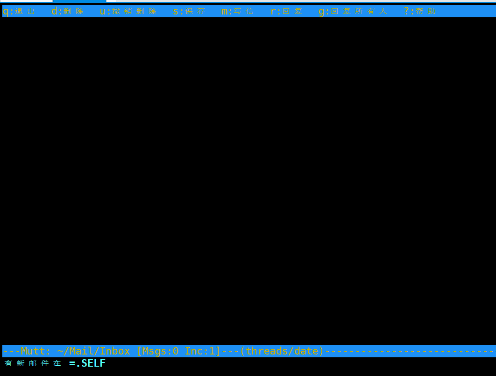
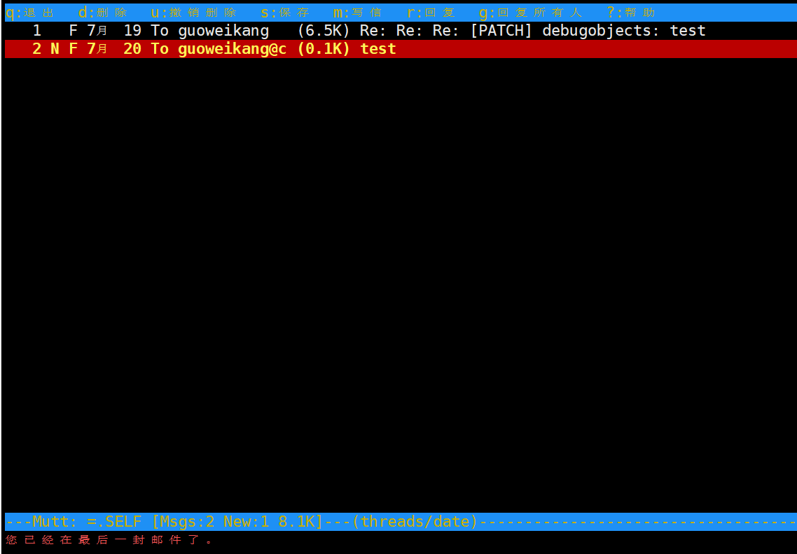
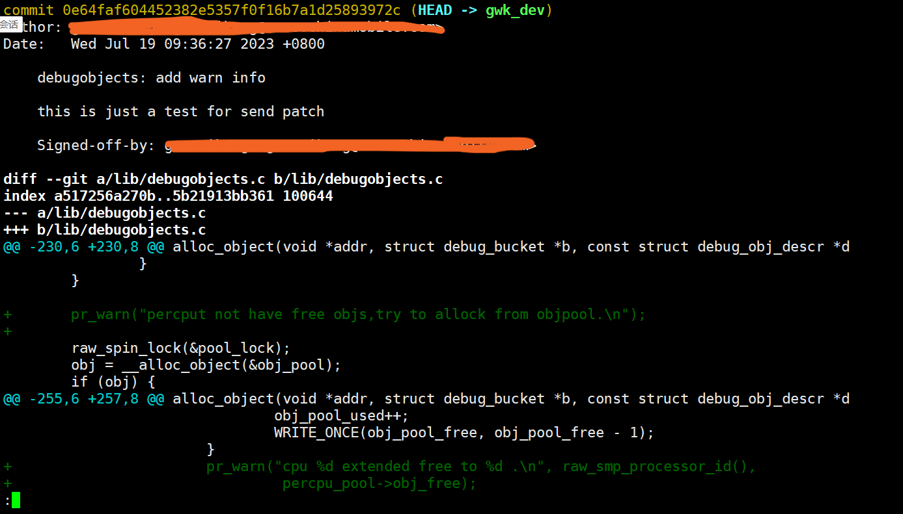
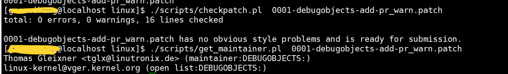
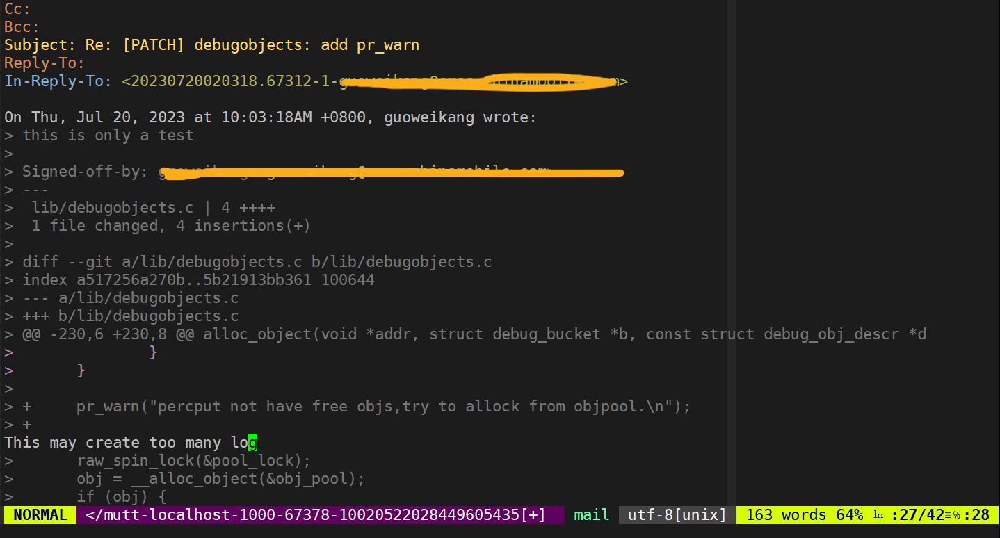

=====================
Linux各类环境安装指导
=====================

.. _内核运行环境:

内核运行环境
==============

.. note::
	建议，自己可以准备一个开发板或者是虚拟机这种实际可以把内核跑起来的环境，我们的实验环节，可能会涉及到对代码的修改验证
	- ARM64:我使用的是一个树莓派4B的开发板+ openeuler的操作系统 用于测试ARM
 	- X86: 我使用的是openeuler的VMware虚拟机环境 用于追踪社区代码
	- QEMU：我是用的是最新的linux next代码 用于追踪主线最新的代码
	当然，如果你有自己的环境，可以不参考我以下环境准备步骤

安装内核开发必要工具
--------------------

.. code-block:: console
    :linenos:

    $ sudo dnf install -y rpm-build openssl-devel bc rsync gcc gcc-c++ flex bison m4 elfutils-libelf-devel

	
	
树莓派编译环境准备
--------------------
我的环境参考openeuler社区版本 22.03 SP1  基于内核版本 5.10

 - 操作系统安装: https://docs.openeuler.org/zh/docs/22.03_LTS_SP1/docs/Installation/%E5%AE%89%E8%A3%85%E5%87%86%E5%A4%87-1.html
 - 树莓派使用指南: https://gitee.com/openeuler/raspberrypi/blob/master/documents/%E6%A0%91%E8%8E%93%E6%B4%BE%E4%BD%BF%E7%94%A8.md
 - 内核交叉编译指南： https://gitee.com/openeuler/raspberrypi/blob/master/documents/%E4%BA%A4%E5%8F%89%E7%BC%96%E8%AF%91%E5%86%85%E6%A0%B8.md

发行版开发环境准备
--------------------
 使用虚拟机的好处在于：不需要考虑交叉编译，内核可以直接安装在虚拟机， 开发环境可以直接作为测试验证环境

  - 操作系统安装: https://ken.io/note/openeuler-virtualmachine-install-by-vmware 

*下载编译内核源码*: 提供了多种内核源码的下载方法：
	
	- 通过rpm下载安装: 好处是内核版本和本机发行版一致，可以直接编译安装，缺点是没有git 信息，参考：https://forum.openeuler.org/t/topic/615
	- 通过开发社区开发: https://ost.51cto.com/posts/15844 
	- 本地基于make安装: https://openanolis.cn/sig/Cloud-Kernel/doc/607587039726485317?preview=

.. _QEMU开发环境准备:

QEMU开发环境准备
--------------------

:QEMU环境准备:

	我是在虚拟机嵌套虚拟机，需要开启vmware 支持VT，在虚拟机设置->处理器->虚拟化引擎
	遇到问题参考: https://blog.csdn.net/qq_46499134/article/details/124231658

.. code-block:: console
    :linenos:
	
	$ sudo dnf groupinstall "Virtualization Host"
    $ sudo dnf intall qemu-kvm
	$ sudo dnf install virt-install
	$ sudo dnf install virt-viewer
	
:代码下载: 

.. code-block:: console
    :linenos:

	$ git clone git://git.kernel.org/pub/scm/linux/kernel/git/torvalds/linux.git
	或者使用国内源
	$ git clone https://mirrors.tuna.tsinghua.edu.cn/git/linux.git
	$ git remote add linux-next https://mirrors.tuna.tsinghua.edu.cn/git/linux-next.git
	切换到next tree
	$ git fetch  linux-next 
	$ git fetch --tags linux-next
	$ git tag -l "next-*" | tail
	$ git checkout -b {my_local_branch} next-(latest)
	关于next tree 在后面会有介绍，如果不想使用next tree ，直接使用主线即可
	
:配置内核是能GDB: 

.. code-block:: console
    :linenos:
	
	$ make ARCH=x86_64 x86_64_defconfig (配置内核)
	$ make ARCH=x86_64 menuconfig (参考 https://www.kernel.org/doc/html/next/dev-tools/gdb-kernel-debugging.html) 

:编译内核:

.. code-block:: console
    :linenos:
	
    $ make -j8
	
	
:制作根目录:
	
.. code-block:: console
    :linenos:
	
    $ git clone git://git.buildroot.net/buildroot
	$ make menuconfig （Target Options -> Target Architecture →x86_64 Filesystem images → ext2/3/4 root file system ）
	$ make -j8
	$ qemu-img convert -f raw -O qcow2 output/images/rootfs.ext2 rootfs.qcow2

:现在已经拥有:

  - 内核image : arch/x86/boot/bzImage
  - rootfs： buildroot/output/images/rootfs.ext2
  
:启动虚拟机:

.. code-block:: console
    :linenos:
	
	$ virt-install --name my_guest_os --import --disk path=/home/guoweikang/code/buildroot/output/images/rootfs.qcow2,format=qcow2 --memory 2048 --vcpus 1 --boot kernel=./arch/x86/boot/bzImage,kernel_args="root=/dev/sda  rw console=ttyS0,115200 acpi=off nokaslr"   --graphics none --serial pty --console pty,target_type=serial

参数解析： 

   - import: 表示跳过虚拟机安装，需要跟上 disk参数，从磁盘启动
   - disk: path 指定虚拟机启动磁盘
   - memory： 指定虚拟机内存(Mib)
   - vcpus： 指定cpu数量
   - boot: 指定引导参数 
   - graphics: 不分配图形控制 
   - serial: 指定虚拟机的串行设备 使用pty 
   - console: 在虚拟机和主机之间建立文本控制台

常用构建命令和含义
--------------------

- make mrproper : 清理配置文件、过程中间件等一切中间产物，只保留干净的源码
- make clean/distclean ： 一般项目构建不在使用了 使用mrproper 重新构建
- make dtbs：构建平台DTS
- make xxx_defconfig : 生成.config 
- make menuconfig : 配置defconfig 
- make defconfg: 最小化defconfig 可以用来保存为平台defconfig

内核阅读/开发代码环境
======================

专门准备一节介绍linux的代码阅读准备，是因为: 

 - Linux 不同于普通的C项目，他的代码非常庞大，我们需要只引用我们关心的代码
 - Linux 主干代码支持多个架构，我们只需要关心一个特定架构
 - Linux 有自己编码风格 我们需要使用内核编码风格
 - Linux 不使用标准C库，有自己的库，我们不应该索引libc 的头文件
 - 其他种种
 
为了提升开发效率，一般VIM对于不同语言的项目支持需要以下几个功能完成: 
  
  - 语法高亮等支持: VIM 自带
  - 函数间的跳转 (基于ctags/cscope) 
  - 函数的调用点 (基于cscope)
  - 代码补全 
 
 本小节会指导完成阅读Linux需要的工具安装，以及索引的使用，无论如何，我假设你已经熟悉这些工具的使用，或者请自己搜索一下这些工具的使用方法 

代码索引工具安装
------------------

推荐使用 *cscope* 和 *ctags*，安装命令: 

.. code-block:: console
    :linenos:

    $ sudo dnf install -y cscope exuberant-ctags

:扩展:
   
   - *cscope*：主要用于导航代码，例如在函数之间完成切换，能够找到符号的定义以及所有调用
   - *ctags*：Tagbar 插件需要，也可以用来导航，但是没有cscope 好用，只能跳转到函数定义，不能找到所有调用点
   
cscope 常用命令（vim 指令界面使用）： cs find c|d|e|f|g|i|s|t name

+----------+---------------------------------------+
| 命令     | 说明                                  |
+==========+=======================================+
|s         |  查找符号(变量)                       |
+----------+---------------------------------------+
| g        | 查找定义                              |
+----------+---------------------------------------+
|  d       |  查找本函数调用函数                   |
+----------+---------------------------------------+
|  c       |  查找调用者                           |
+----------+---------------------------------------+
|  t       |  查找字符串                           |
+----------+---------------------------------------+
|  f       | 查找文件                              |
+----------+---------------------------------------+
|  i       | 查找包含本文件的文件                  |
+----------+---------------------------------------+

内核脚本生成代码索引
---------------------
:使用内核脚本创建索引文件: 内核提供了 scripts/tags.sh 脚本用于生成索引文件，但是应该通过make cscope  和 make tags 规则去运行该脚本，下面是一个示例

.. note::

    Please参考内核编译指导，建议先自己编译一遍内核,可以加快后续索引文件生成

.. code-block:: console
    :linenos:

    $ $ make O=. ARCH=x86_64(arm)  COMPILED_SOURCE=1 cscope tags

参数含义: 
  - *O=.* : 很明显了 输出索引文件的存放位置，如果你不希望他在当前目录下，请使用一个绝对路径，如果在kernel 目录下开发，请忽略
  - *ARCH=...*: 选择作为索引的CPU 架构， 会决定选择索引 arch/xxx 目录
  - *SUBARCH=...*： 选择作为索引的子架构，比如board, 如果ARCH=arm SUBARCH=omap2 会选择 arch/arm/mach-omap2/ arch/arm/plat-omap/ 索引
  - *COMPILED_SOURCE=1*： 只索引编译的文件 如果希望索引没有编译的文件 请忽略  
  - *cscope&tags*: rule to make cscope/ctags index 

手动创建索引文件
-----------------
有些时候，也许 *tags.sh* 工作无法达到你的预期，这个时候 可以通过手动索引，下面的步骤参考来自: https://cscope.sourceforge.net/large_projects.html

首先，需要创建一个 *cscope.files* 文件列出你想要索引的文件

比如可以通过以下命令，列出索引文件 以及只列出 arch/arm 以及 OMAP platform 的文件 

.. code-block:: console
    :linenos:

    $find    $dir                                          \
        -path "$dir/arch*"               -prune -o    \
        -path "$dir/tmp*"                -prune -o    \
        -path "$dir/Documentation*"      -prune -o    \
        -path "$dir/scripts*"            -prune -o    \
        -path "$dir/tools*"              -prune -o    \
        -path "$dir/include/config*"     -prune -o    \
        -path "$dir/usr/include*"        -prune -o    \
        -type f                                       \
        -not -name '*.mod.c'                          \
        -name "*.[chsS]" -print > cscope.files
    $find    $dir/arch/arm                                 \
        -path "$dir/arch/arm/mach-*"     -prune -o    \
        -path "$dir/arch/arm/plat-*"     -prune -o    \
        -path "$dir/arch/arm/configs"    -prune -o    \
        -path "$dir/arch/arm/kvm"        -prune -o    \
        -path "$dir/arch/arm/xen"        -prune -o    \
        -type f                                       \
        -not -name '*.mod.c'                          \
        -name "*.[chsS]" -print >> cscope.files
    $find    $dir/arch/arm/mach-omap2/                     \
        $dir/arch/arm/plat-omap/                      \
        -type f                                       \
        -not -name '*.mod.c'                          \
        -name "*.[chsS]" -print >> cscope.files

以下是一个X86架构的示例 

.. code-block:: console
    :linenos:

    $find    $dir                                          \
        -path "$dir/arch*"               -prune -o    \
        -path "$dir/tmp*"                -prune -o    \
        -path "$dir/Documentation*"      -prune -o    \
        -path "$dir/scripts*"            -prune -o    \
        -path "$dir/tools*"              -prune -o    \
        -path "$dir/include/config*"     -prune -o    \
        -path "$dir/usr/include*"        -prune -o    \
        -type f                                       \
        -not -name '*.mod.c'                          \
        -name "*.[chsS]" -print > cscope.files
    $find    $dir/arch/x86                                 \
        -path "$dir/arch/x86/configs"    -prune -o    \
        -path "$dir/arch/x86/kvm"        -prune -o    \
        -path "$dir/arch/x86/lguest"     -prune -o    \
        -path "$dir/arch/x86/xen"        -prune -o    \
        -type f                                       \
        -not -name '*.mod.c'                          \
        -name "*.[chsS]" -print >> cscope.files

和脚本类似，如果你只在kernel下开发，替换 *dir=.*, 如果你在其他目录开发，替换为绝对路径 

接下来根据cscope.files 生成索引 

.. code-block:: console
    :linenos:
	
	$ cscope -b -q -k

接下来根据cscope.files 生成ctag索引数据库

.. code-block:: console
    :linenos:
	
	$ ctags -L cscope.files

现在应该拥有以下文件: 

- cscope.in.out
- cscope.out
- cscope.po.out
- tags

VIM配置
--------

基本配置
^^^^^^^^^^
首先配置80个字符长度限制 因为内核编码要求每行不应该超过80个字符
修改~/.vimrc 增加： 

.. code-block:: console
    :linenos:
	
	" 80 characters line
	set colorcolumn=81
	"execute "set colorcolumn=" . join(range(81,335), ',')
	highlight ColorColumn ctermbg=Black ctermfg=DarkRed

内核编码风格要求 行尾不应该有空白字符 请添加: 

.. code-block:: console
    :linenos:
	
	" Highlight trailing spaces
	" http://vim.wikia.com/wiki/Highlight_unwanted_spaces
	highlight ExtraWhitespace ctermbg=red guibg=red
	match ExtraWhitespace /\s\+$/
	autocmd BufWinEnter * match ExtraWhitespace /\s\+$/
	autocmd InsertEnter * match ExtraWhitespace /\s\+\%#\@<!$/
	autocmd InsertLeave * match ExtraWhitespace /\s\+$/
	autocmd BufWinLeave * call clearmatches()

配置完成之后，下面是一个显示测试

.. image:: ./images/tools/1.png
 :width: 400px
 
vim插件管理
^^^^^^^^^^^^^
推荐使用pathogen作为插件管理: https://github.com/tpope/vim-pathogen  安装参考: 

.. code-block:: console
    :linenos:

	$ mkdir -p ~/.vim/autoload ~/.vim/bundle && \
	$ curl -LSso ~/.vim/autoload/pathogen.vim https://tpo.pe/pathogen.vim
	
修改~/.vimrc 增加： 

.. code-block:: console
    :linenos:
	
	execute pathogen#infect()
	syntax on
	filetype plugin indent on
	
安装kernelsty插件
^^^^^^^^^^^^^^^^^^
后面章节会介绍linux 编码风格，在这里我们先安装遵循内核编码风格的vim 插件

.. code-block:: console
    :linenos:
	
	$cd ~/.vim/bundle &&  git clone git@github.com:vivien/vim-linux-coding-style.git
	
如果只希望对某些目录下代码应用kernel 风格，请在vimrc 中增加: 

.. code-block:: console
    :linenos:
	
	let g:linuxsty_patterns = [ "/usr/src/", "/linux" ]
	
安装NERDTree插件
^^^^^^^^^^^^^^^^^
NERDTree时VIM的文件系统浏览器 使用该插件，用户可以直观地浏览复杂的目录层次结构，快速打开文件进行读取或编辑，并执行基本的文件系统操作。

.. code-block:: console
    :linenos:
	
	$ git clone https://github.com/preservim/nerdtree.git ~/.vim/bundle/nerdtree

配置vimrc：

 - 配置自动开启和自动退出
 - 配置F3 启动和隐藏目录树
 
.. code-block:: console
    :linenos:
	
	" Exit Vim if NERDTree is the only window remaining in the only tab.
	autocmd BufEnter * if tabpagenr('$') == 1 && winnr('$') == 1 && exists('b:NERDTree') && b:NERDTree.isTabTree() | quit | endif
	" Start NERDTree and put the cursor back in the other window.
	autocmd VimEnter * NERDTree | wincmd p
	nnoremap <F3> :NERDTreeMirror<CR>
	nnoremap <F3> :NERDTreeMirror<CR>

基本操作：以下命令都是在NEERDTREE页面操作

+----------+---------------------------------------+
| 命令     | 说明                                  |
+==========+=======================================+
|  ?       |  打开或者隐藏帮助面板                 |
+----------+---------------------------------------+
| 上下左右 | 选择文件或者目录                      |
+----------+---------------------------------------+
|  回车 |  展开目录/打开文件(退出上个文件)         |
+----------+---------------------------------------+
|  ctrl+w  |  两次 在目录树和文件之前切换          |
+----------+---------------------------------------+
|  t       |  以标签形式打开一个文件               |
+----------+---------------------------------------+
|  gt      | 标签之前切换                          |
+----------+---------------------------------------+
|  i/s     | 分割窗口打开                          |
+----------+---------------------------------------+

安装tagbar插件
^^^^^^^^^^^^^^^^^
Tagbar 是一个 Vim 插件，它提供了一种简单的方法来浏览当前文件的标签并概述其结构。它通过创建一个侧边栏来显示当前文件的 ctags 生成的标签（按其范围排序）来实现此目的。这意味着，例如 C++ 中的方法显示在定义它们的类下。

.. code-block:: console
    :linenos:
	
	$ git clone git@github.com:preservim/tagbar.git ~/.vim/bundle/tagbar

配置vimrc：

 - 配置F8 启动和隐藏tagbar
 
.. code-block:: console
    :linenos:
	
	nmap <F8> :TagbarToggle<CR>

安装vim airline插件
^^^^^^^^^^^^^^^^^^^^

.. code-block:: console
    :linenos:
	
	$ git clone git@github.com:vim-airline/vim-airline ~/.vim/bundle/vim-airline

补全插件：YCM
^^^^^^^^^^^^^^^^^^^^^
YCM 需要更高版本vim和python 支持 从源码升级： 

.. code-block:: console
    :linenos:
	
	$ git clone https://github.com/vim/vim.git
	$ cd vim/src
	$ ./configure --with-features=huge --enable-python3interp
	$ make
	$ sudo make install

:安装插件:

.. code-block:: console
    :linenos:
	
	$ git clone git@github.com:ycm-core/YouCompleteMe.git ~/.vim/bundle/YouCompleteMe
	$ cd  ~/.vim/bundle/YouCompleteMe 
    $ ./install.py --clangd-completer --verbose

:生成补全:

.. code-block:: console
    :linenos:
	
	$ git clone https://github.com/rdnetto/YCM-Generator.git
	$ cd YCM-Generator
	$ ./config_gen.py kernel_dir

配置vimrc:关闭自动加载提示

.. code-block:: console
    :linenos:
	
	let g:ycm_confirm_extra_conf = 1

VIM风格
^^^^^^^^^
配置vimrc：

.. code-block:: console
    :linenos:
	
	$ set t_Co=256

支持hybrid 风格: https://github.com/w0ng/vim-hybrid

到目前，kernel开发环境我们算是准备完成了

邮件客户端
============
大量的 Linux 内核开发工作是通过邮件列表完成的。如果不加入至少一个列表，就很难成为社区的一名功能齐全的成员。但 Linux 邮件列表也对开发人员构成了潜在危险，他们面临着被大量电子邮件淹没、违反 Linux 列表上使用的约定或两者兼而有之的风险。

.. note::

	  大多数内核邮件列表都在 vger.kernel.org 上运行；主列表可在以下位置找到： http://vger.kernel.org/vger-lists.html
	  不过，其他地方也有一些列表；其中一些位于 redhat.com/mailman/listinfo

邮件客户端配置
----------------

参考来自: 
 - https://docs.kernel.org/translations/zh_CN/process/email-clients.html
 - https://kofno.wordpress.com/2009/08/09/how-fetchmail-and-mutt-saved-me-from-email-mediocrity/

我们使用 MUTT作为邮件客户端需要搭配其他软件一起使用

 - 收件: 使用 fetchmail
 - 发件: 使用msmtp
 - 分类: 使用maildrop
 - 邮件编辑: vim

安装工具

.. code-block:: console
    :linenos:
	
	$ sudo dnf install -y mutt fetchmail msmtp maildrop -y

配置发件箱
----------

.. code-block:: console
    :linenos:
	
	$ mkdir mail -- 稍后发件箱归档需要
	$ touch ~/.msmtprc
	$ touch ~/log/msmtp/msmtp.log
	$ vim ~/.msmtprc
	$ sudo chmod 600 .msmtprc --设置配置文件权限
	$ msmtp -S --debug msmtp测试

~/.msmtprc 参考配置: 

.. code-block:: console
    :linenos:
	
	defaults
	logfile ~/log/msmtp/msmtp.log
	account default
	auth on
	tls on
	tls_starttls off
	host smtp.xxxxx.com
	port 465
	from xxxx@xxxxx.com
	user xxxxx@xxxx.com
	password @Dan1314521

配置收件箱
----------
Fetchmail是一个非常简单的收件程序，而且是前台运行、一次性运行的，意思是：你每次手动执行fetchmail命令，都是在前台一次收取完，程序就自动退出了，不是像一般邮件客户端一直在后台运行。

.. note::

    fetchmail只负责收件，而不负责存储！所以它是要调用另一个程序如procmail来进行存储的。
    fetchmail的配置文件为~/.fetchmailrc。然后文件权限最少要设置chmod 600 ~/.fetchmailrc

配置fetchmailrc收件:

.. code-block:: console
    :linenos:
	
	$ vim ~/.fetchmailrc
	$ chmod 600 ~/.fetchmailrc
	$ fetchmail  -v  --- 测试收取命令

参考配置: 

.. code-block:: console
    :linenos:
	
	poll imap.xxxx.com
        with proto IMAP
        user "user@zoho.com"
        there with password "pass"
        is "localuser" here
        mda "/usr/bin/maildrop " 
        options
        ssl
		
fetchmail只负责收取，不负责“下载”部分，你找不到邮件存在哪了。, 需要配置MDA分类器，如procmail，才能看到下载后的邮件。

.. note::
    
	Fetch其实不是在Mutt“里”使用的，而是脱离mutt之外的！也就是说，Mutt只负责读取本地存储邮件的文件夹更新，而不会自动帮你去执行fetchmail命令。

设置Mutt快捷键收取邮件的方法是在~/.muttrc中加入macro：

.. code-block:: console
    :linenos:
	
	macro index,pager I '<shell-escape> fetchmail -vk<enter>'

	
这样的话，可以在index邮件列表中按I执行外部shell命令收取邮件了。

配置收件存储分类
--------------------
maildrop是单纯负责邮件的存储、过滤和分类的，一般配合fetchmail收件使用。

在Pipline中，fetchmail把收到的邮件全部传送到maildrop进行过滤筛选处理，然后maildrop就会把邮件存到本地形成文件，然后给邮件分类为工作、生活、重要、垃圾等。

maildrop 的配置文件是 ~/.mailfilter ，记得改权限：chmod 600 ~/.mailfilter。

配置procmailrc收件:

.. code-block:: console
    :linenos:
	
	$ vim ~/.mailfilter
	$ chmod 600 ~/.mailfilter

参考配置: 

.. code-block:: console
    :linenos:
	
	DEFAULT="/home/xxx/Mail/Inbox/"
	logfile "/home/xxx/.maillog"
	IMPORTANT "/home/xxx/Mail/Inbox/.IMPORTANT"
	SELF "/home/xxx/Mail/Inbox/.SELF"

	#Move emails from a specific sender to the "Important" folder
	if (/^From:.*important_sender@example\.com/)
	{
	    to $IMPORTANT
	}
	
	if (/^From: slef@xxx\.com/)
	{
	    to $IMPORTANT
	}	
	
	# Discard emails from a specific domain
	#if (/^From:.*@spamdomain\.com/)
	#{
	#    exception
	#}
	
.. code-block:: console
    :linenos:
	
	$ mkdir  ~/Mail
	$ maildirmake ~/Mail/Index
	$ maildirmake ~/Mail/Index/.IMPORTANT
	$ maildirmake ~/Mail/Index/.SELF

配置MUTT主界面
---------------

.. code-block:: console
    :linenos:
	
	$ mkdir ~/.mutt
	$ vim ~/.mutt/.muttrc 
	$ chmod 600 ~/.mutt/.muttrc

muttrc 参考配置: 

.. code-block:: console
    :linenos:
	
	# .muttrc
	auto_view text/html
	# ================  IMAP ====================
	set mbox_type=Maildir
	set folder = "$HOME/Mail/Inbox"
	mailboxes "/home/guoweikang/Mail/Inbox/.IMPORTANT"  "~/Mail/Inbox/.SELF"
	#set mask="^!\\.[^.]"  # 屏蔽掉.开头的邮箱
	set spoolfile = "$HOME/Mail/Inbox" #INBOX
	set mbox="$HOME/Mail/Inbox"   #Seen box
	set record="+Sent"  #Sent box
	set postponed="+Drafts"  #Draft box
	set sort=threads
	
	# ================  SEND  ====================
	set sendmail="/usr/bin/msmtp"           # 用 msmtp 发邮件
	set realname = "xxxx"
	set from = "xxxxxxxxx@xxxxxxxxx.com"
	set use_from = yes
	
	# ================  Composition  ====================
	set realname = "xxxxxxxxx"
	set use_from = yes
	set editor = vim
	set edit_headers = yes  # See the headers when editing
	set charset = UTF-8     # value of $LANG; also fallback for send_charset
	# Sender, email address, and sign-off line must match
	unset use_domain        # because joe@localhost is just embarrassing
	set envelope_from=yes
	set move=yes    #移动已读邮件
	set include #回复的时候调用原文
	macro index,pager I '<shell-escape> fetchmail -vk<enter>'

测试基本功能
--------------------

发送邮件
^^^^^^^^

.. code-block:: console
    :linenos:

	$   echo "hello world" | mutt -s "test" -- xxxx@xxxxx -- 测试发送邮件 

接收邮件
^^^^^^^^
.. code-block:: console
    :linenos:

	$ mutt 

进入界面后 输入 "I" 触发fetchmail 

输入 "c" 切换邮箱

测试一个补丁
------------
本小节，通过制作补丁 发送补丁 回复补丁 这三个步骤演示

制作补丁
^^^^^^^^

在next分支修改代码，并本地提交,属于基本的GIT操作，不在这里介绍了。格式如下

.. code-block:: console
    :linenos:

	$ git commit -s 

内容格式如下:

制作检查本地补丁:

.. code-block:: console
    :linenos:

	$ git  format-patch  --subject-prefix='PATCH'   -1 
	$ 本地目录生成  0001-debugobjects-add-pr_warn.patch
	$ ./scripts/checkpatch.pl  0001-debugobjects-add-pr_warn.patch  --检查补丁

发送补丁
^^^^^^^^

获取补丁接收人

.. code-block:: console
    :linenos:

	$./scripts/get_maintainer.pl  0001-debugobjects-add-pr_warn.patch  --获取邮件接收人

 
前面的是需要主送的，open是需要抄送的，

因为是测试，我们只发送给自己:

.. code-block:: console
    :linenos:

	$ git  send-email --to  xxxx@xxxx.com --cc xxxx@xxx.com  0001-debugobjects-add-pr_warn.patch 

回复补丁
^^^^^^^^
mutt 应该可以收到邮件，我们假设我们是 maintainer， 对邮件进行回复，提出意见

关于补丁的其他说明
-------------------

关于补丁验证
^^^^^^^^^^^^^

本地编译检查：

 - 使用适用或修改的 CONFIG 选项 =y、=m 和 =n 。没有GCC 警告/错误，没有链接器警告/错误。
 - 通过allnoconfig、allmodconfig编译成功
 - 使用 O=builddir 时可以成功编译
 - 本地交叉编译 可以在多个CPU体系构建(PPC64是一种很好的交叉编译检查体系结构，因为它倾向于对64位的数使用无符号 长整型)
 -  make headers_check 检查头文件包含的正确 如果涉及
 - 通过了  make EXTRA-CFLAGS=-W 开启告警编译
 
 
代码风格检查：

 - 参考 coding-style.rst
 - ./scripts/checkpatch.pl  脚本检查

Kconfig 

 - 所有新的 kconfig 选项都有帮助文本
 - 已仔细审查了相关的 Kconfig 组合。这很难用测试来纠正——脑力在这里是有 回报的。

bug检查 

 - 通过 make C=1 : 使用sparse  检查 
 - 通过make checkstack 检查可能的堆栈溢出
 - 通过make namespacecheck  检查可能出现的明明空间冲突
 - 通过注入slab和page分配失败检查 参考Documentation/fault-injection/ 
 
 
关于文档： 如果提供了API 文档描述，还需要测试

 - make htmldocs 或 make pdfdocs 检查 kernel-doc 
 - 所有新的/proc条目都需要记录在 Documentation/
 - 所有新的内核引导参数都记录在 Documentation/admin-guide/kernel-parameters.rst 中。
 - 所有内存屏障例如 barrier(), rmb(), wmb() 都需要源代码中的注 释来解释它们正在执行的操作及其原因的逻辑。
 - 如果补丁添加了任何ioctl，那么也要更新 Documentation/ioctl/ioctl-number.rst

运行时验证:

 - CONFIG_PREEMPT, CONFIG_DEBUG_PREEMPT, CONFIG_DEBUG_SLAB, CONFIG_DEBUG_PAGEALLOC, CONFIG_DEBUG_MUTEXES, CONFIG_DEBUG_SPINLOCK, CONFIG_DEBUG_ATOMIC_SLEEP, CONFIG_PROVE_RCU and CONFIG_DEBUG_OBJECTS_RCU_HEAD 同时打开
 - 开启和关闭 CONFIG_SMP, CONFIG_PREEMPT的运行时测试
 - 保证在 所有代码路径都已在启用所有lockdep功能的情况下运行 
 

关于琐碎的补丁
^^^^^^^^^^^^^^^
一开始 我们可能都是从文档修正、告警修正、编译修正这些很小的点开始进入内核 这些补丁应该被 trivial@kernel.org 专门收集 包括: 

 -文档的拼写修正。
 -修正会影响到 grep(1) 的拼写。
 -警告信息修正(频繁的打印无用的警告是不好的。)
 -编译错误修正（代码逻辑的确是对的，只是编译有问题。）
 -运行时修正（只要真的修正了错误。）
 -移除使用了被废弃的函数/宏的代码例如 check_region
 -联系方式和文档修正。
 -用可移植的代码替换不可移植的代码（即使在体系结构相关的代码中，既然有人拷贝，只要它是琐碎的
 -任何文件的作者/维护者对该文件的改动（例如 patch monkey 在重传模式下）

.. note:: 

    关于“琐碎补丁”的一些说明：”trivial”这个英文单词的本意是“琐碎的，不重要的。”但是在这里 有稍微有一些变化，例如对一些明显的NULL指针的修正，属于运行时修正，会被归类 到琐碎补丁里。虽然NULL指针的修正很重要，但是这样的修正往往很小而且很容易得到 检验，所以也被归入琐碎补丁。琐碎补丁更精确的归类应该是 “simple, localized & easy to verify”，也就是说简单的，局部的和易于检验的。 trivial@kernel.org邮件列表的目的是针对这样的补丁，为提交者提供一个可能，来降低提交的门槛。)

关于补丁格式
^^^^^^^^^^^^^
 - 不要一次返送超过15个补丁
 - 要有主题，比如 PATCH 需要加上 [PATCH] 前缀
 - 必须要要有签名: Signed-off-by:
 - Acked-by： 表明谁参与过该补丁讨论
 - Co-developed-by: 补丁共同开发着
 - Reported-by: bug 发现人
 - Tested-by：补丁而是人
 - Reviewed-by： 补丁review 者
 

 