===========
内存管理
===========

前言
=====
前提至少学习过 X86/ARM/RISC-V 一门体系架构

什么是内存
----------
我的个人看法: 在计算机体系架构中，ALU计算单元必须需要存储参与工作，用来作为 数据输入、输出 保存(简单点就是数据需要存放)
正常来说，能够直接被CPU *寻址* 访问到的存储单元，都可以叫做内存，而其物理、电子形态、大小则是会随着基础科学发展而不断演进

下面是 DDRAM 工作方式的一个小科普，DDRAM 目前应该是主流 内存形态的一种
https://www.youtube.com/watch?v=fpnE6UAfbtU&list=PL8dPuuaLjXtNlUrzyH5r6jN9ulIgZBpdo&index=7

什么是内存管理
---------------
下图是一个非常简单的场景, CPU指令执行，需要加载指令代码，在执行函数，需要用到栈, 因此需要根据某种规定，对内存进行功能划分，比如哪段内存是用来存放代码的，
哪段内存又是用来作为程序的栈等

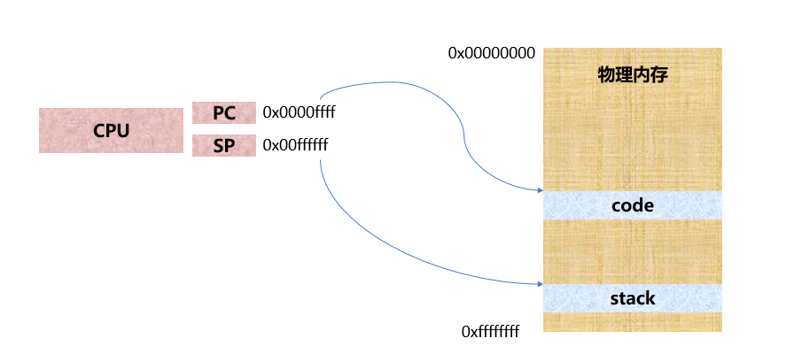

上面我们只是描述了一个非常简单的场景，只是想表达，内存管理功能之一是保证内存被合理的分配使用，当然还有许多其他工作需要完成，接下来会一一展开

基础知识背景
=============
本章主要是对内存管理的基础概念和技术做一个介绍，为后面更深入的讨论做好基础

什么是虚拟内存
----------------
我们先假设一下，如果没有虚拟内存，应用是如何工作的

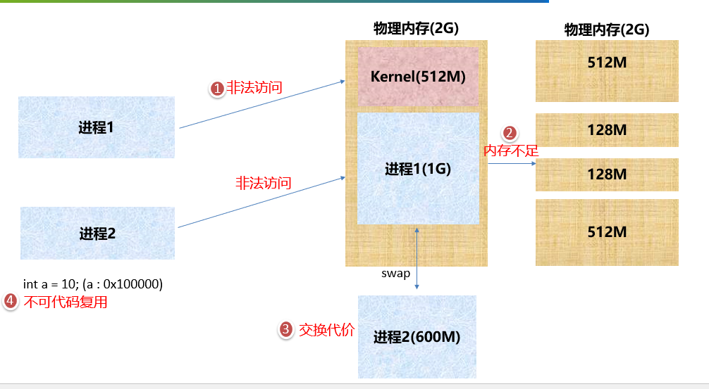

上图是假设有两个应用同时运行的情况，我标注了一些可能发生的情况 

1. 如果进程都是直接访问物理内存，意味着进程可以访问任意的物理内存，则可能发生内存踩踏， 当然这种情况可以通过一些约束限制
2. 物理内存可能是不连续的，如果一个进程分配比较多的连续内存，内存不足，则该进程无法被加载，当然也可以通过交换进程(把没有在调度的进程放到磁盘)
3. 假设我们在给每个进程分配物理内存，是按照连续内存分配(难道不应该吗)，则交换进程的代价过于庞大
4. 编译器在编译用户态应用，应该怎么给变量、函数分配地址。

总之，出于用户态进程对于*空间隔离*的需求，虚拟内存技术孕育而生

空间隔离
^^^^^^^^^

 - 屏蔽掉物理内存的存在, 让不同进程 以为是自己在独享一段内存
 - 屏蔽掉物理内存的大小、分布；让不通进程以为自己有很大的内存，并且内存是连续的

虚拟内存地址翻译
------------------
这里简单介绍一下目前主流的虚拟内存翻译技术:MMU 

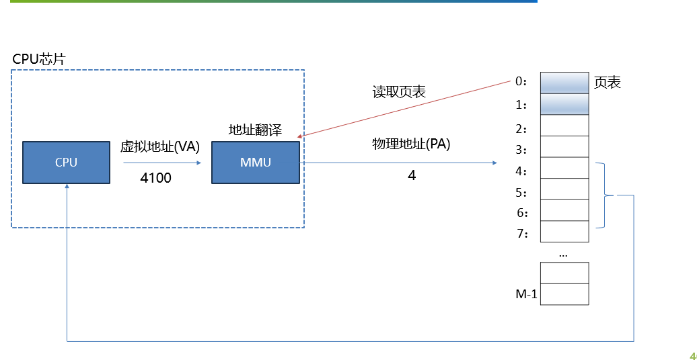

知识点: 

 - CPU在执行指令，指令访问的地址是虚拟地址，但是实际上，该虚拟地址会经过MMU硬件+映射表查找，最终访问物理内存地址
 - MMU的配置以及页表的维护 是内存管理模块完成的

什么是页表
^^^^^^^^^^^
页表就是一个用于存放物理内存信息的 数组结构

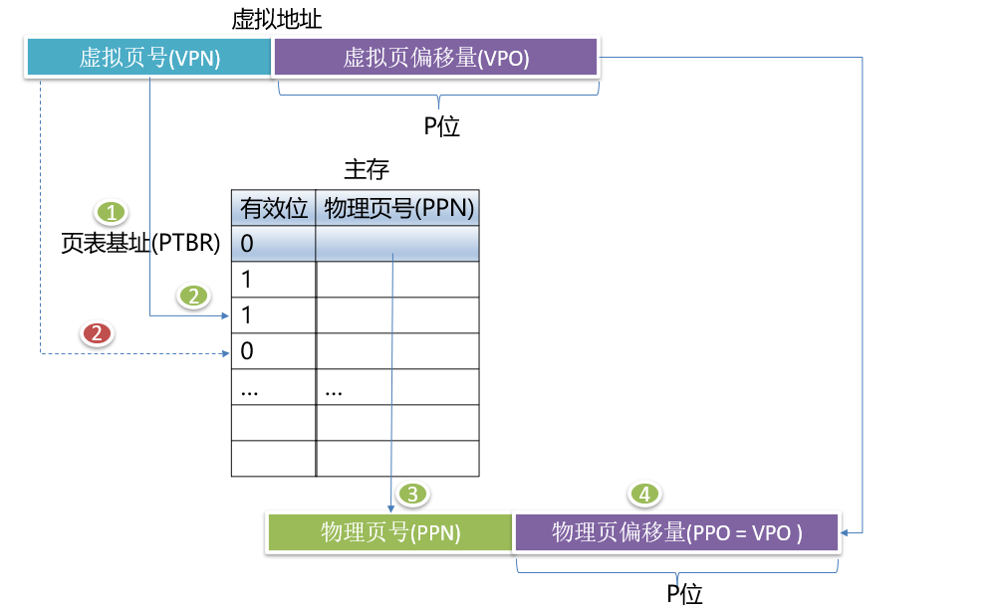

 - 页表存放在物理内存中，MMU使用指定的寄存器存储 页表基址
 - 利用要访问的虚拟内存的信息，获得页表中索引 
 - 利用索引得到的 页表条目(entry) 获得实际的物理内存
 - 访问实际的物理内存 

什么是页表大小
^^^^^^^^^^^^^^^
页表大小一般指每一个 页表条目所能代表的 物理内存范围 

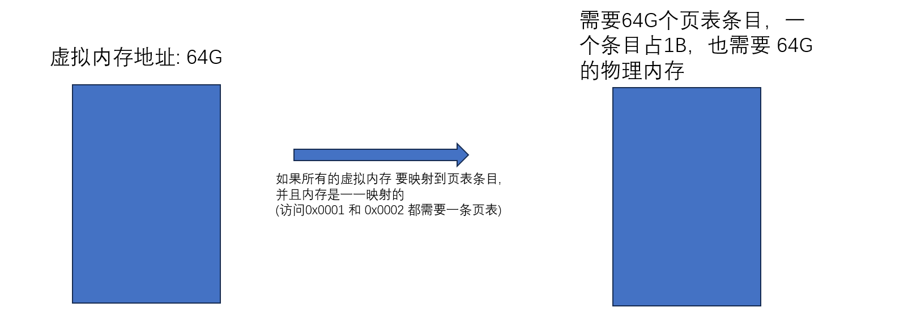

上图很好的解释了为什么需要页表大小 

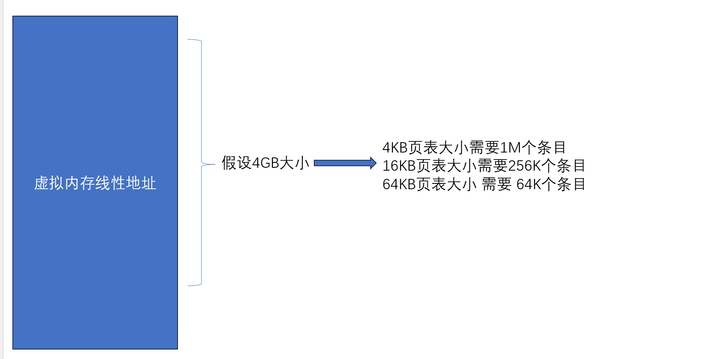

什么是多级页表
^^^^^^^^^^^^^^^

- 如果页表条目太大，内存会浪费
- 但是如果页表条目太小，会占用过多内存 

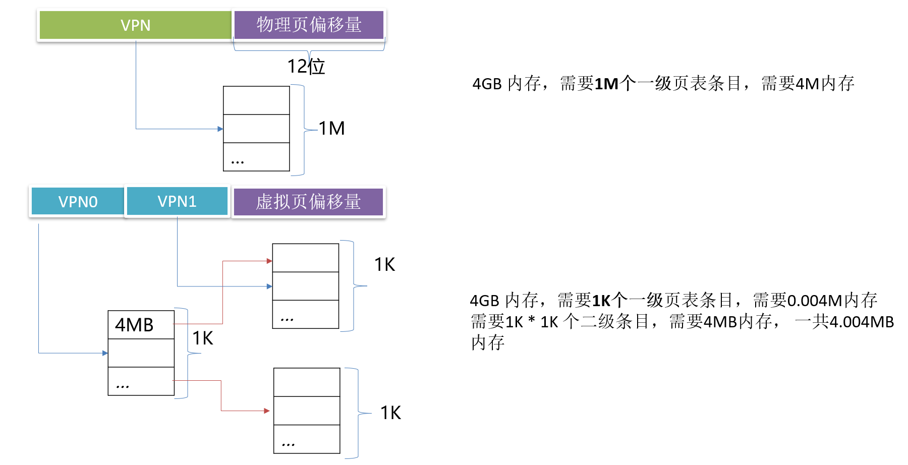

多级页表，第一级页表表示范围更大

ARM64架构下的MMU
^^^^^^^^^^^^^^^^^^^
MMU对内存的处理，一般都会和架构相关，我们选择ARM64架构下MMU作为一个介绍

下图是一个MMU寻址的流水线图

.. image:: ./images/mem/8.png
 :width: 400px

下图是一个MMU实际寻址的过程 

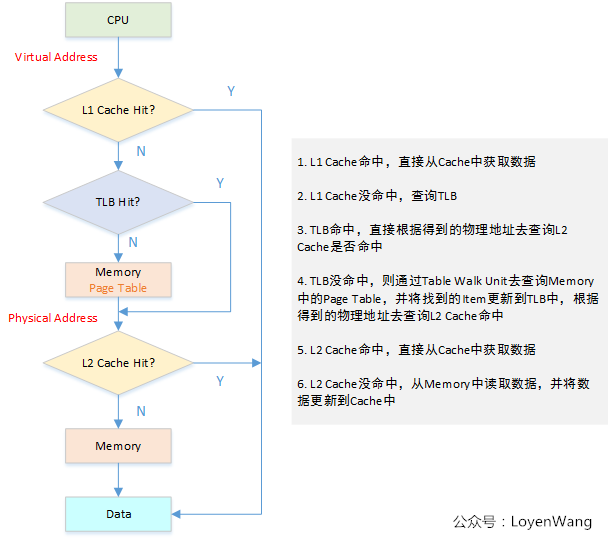
 

上面我们大致介绍了寻址流程，命中的情况暂且不考虑，我们主要看一下，虚拟内存是如何访问物理内存的

ARM64支持
^^^^^^^^^^^^^
虚拟地址到物理地址的映射通过查表的机制来实现，ARMv8中，Kernel Space的页表基地址存放在TTBR1_EL1寄存器中，
User Space页表基地址存放在TTBR0_EL0寄存器中，其中内核地址空间的高位为全1，(0xFFFF0000_00000000 ~ 0xFFFFFFFF_FFFFFFFF)，
用户地址空间的高位为全0，(0x00000000_00000000 ~ 0x0000FFFF_FFFFFFFF)

.. image:: ./images/mem/11.png
 :width: 400px
 

64位虚拟地址中，并不是所有位都用上，除了高16位用于区分内核空间和用户空间外，有效位的配置可以是：36, 39, 42, 47。

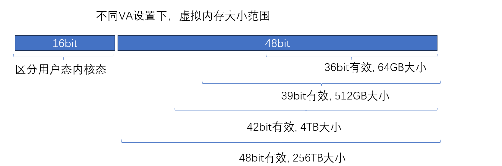
 
页面大小支持3种页面大小：4KB, 16KB, 64KB

页表支持至少两级页表，至多四级页表，Level 0 ~ Level 3

ARM会根据实际使用的VA大小，以及选择的页面大小，来决定应该使用几级页表 
页表映射层级: 支持2-4级，

 - 16K页表，36VA 2级页表
 - 64K页表，42VA 2级页表
 - 64K页表，48/52VA 3级页表
 - 4K页表，39VA 3级页表
 - 不是64K页表，也不是48VA，默认都是4级页表

寻址介绍
^^^^^^^^^^^^^

第一种情况: 虚拟内存范围39BIT，也就是512GB的内存范围，并且使用4KB页表，默认使用3级页表 

.. image:: ./images/mem/18.png
 :width: 400px

下图我们是我们自己的一个分解 

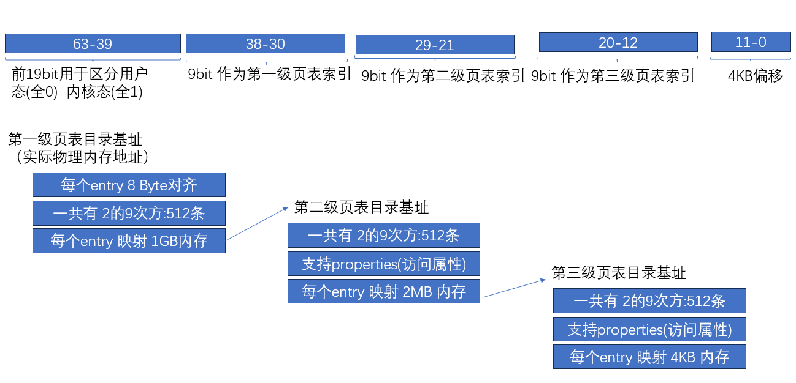

下图是页表内容的描述

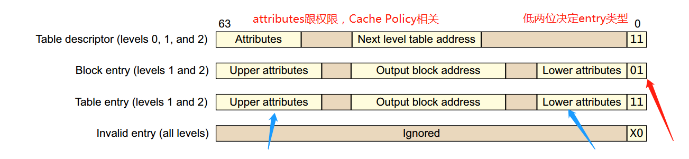

Linux对页表的定义
^^^^^^^^^^^^^^^^^^
由于不同页表的描述 在ARM下有规定，因此，linux把各级页表分别命名: PGD PUD(3级页表没有)  PMD PTE

.. image:: ./images/mem/21.png
 :width: 400px

Linux源码分析
^^^^^^^^^^^^^^
代码路径：

 - arch/arm64/include/asm/pgtable-types.h：定义pgd_t, pud_t, pmd_t, pte_t等类型；
 - arch/arm64/include/asm/pgtable-prot.h：针对页表中entry中的权限内容设置；
 - arch/arm64/include/asm/pgtable-hwdef.h：主要包括虚拟地址中PGD/PMD/PUD等的划分，这个与虚拟地址的有效位及分页大小有关，
   此外还包括硬件页表的定义， TCR寄存器中的设置等；
 - arch/arm64/include/asm/pgtable.h：页表设置相关；

在ARM中，与页表相关的寄存器有：TCR_EL1, TTBRx_EL1

关键代码：

.. code-block:: c
    :linenos:

	/* 
	 * 计算不同 页表映射的entry表示的大小位移，比如:
     * 假设当前是4级页表 ( 0<=n <= 3)
     * PTE SHIFT：4K = (12 - 3) * 1 + 3 = 12    	 
	 * PMD SHIFT: 2M = (12 - 3) * 2 + 3 = 21   
	 * PUD SHIFT: 1G = (12 - 3) * 3 + 3 = 30 
	 * PGD SHIFT：512G = (12 - 3) * 4 + 3 = 39 
	 * 假设当前是3级页表 ( 0<=n <= 3)
     * PTE SHIFT：4K = (12 - 3) * 1 + 3 = 12    	 
	 * PMD SHIFT: 2M = (12 - 3) * 2 + 3 = 21   
	 * PGD SHIFT：1G = (12 - 3) * 3 + 3 = 30 
	*/
	#define ARM64_HW_PGTABLE_LEVEL_SHIFT(n) ((PAGE_SHIFT - 3) * (4 - (n)) + 3)

	#define PMD_SHIFT               ARM64_HW_PGTABLE_LEVEL_SHIFT(2)  //如上21
	#define PMD_SIZE                (_AC(1, UL) << PMD_SHIFT) // 2M
	
	// 注意: 三级页表 没有PUD 
	#define PUD_SHIFT               ARM64_HW_PGTABLE_LEVEL_SHIFT(1) //如上30
	#define PUD_SIZE                (_AC(1, UL) << PUD_SHIFT) // 1G
	
	// 注意: 三四级页表下 PGD 含义不同，三级页表，PGD = PUD 
	#define PGDIR_SHIFT             ARM64_HW_PGTABLE_LEVEL_SHIFT(4 - CONFIG_PGTABLE_LEVELS)
	#define PGDIR_SIZE              (_AC(1, UL) << PGDIR_SHIFT)
	
	
	
虚拟内存空间整体分布
---------------------

空间布局整体介绍
^^^^^^^^^^^^^^^^

虽然不同进程的虚拟内存是隔离的，但是实际上隔离的主要是用户态，内核态依然是共享的
下图分别是32位 64位下用户态和内核态的内存分布

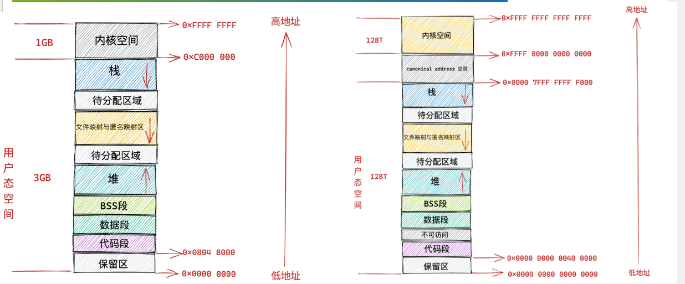
 
arm64的内存布局在linux文档中有比较详细的描述  
https://www.kernel.org/doc/Documentation/arm64/memory.rst

文档中基本上可以知道 arm64架构下: 
 - 内核态地址范围从 0xffff000000000000 到0xffffffffffffffff (前16bit都是1)
 - 用户态地址范围从 0x0000000000000000 到0x0000ffffffffffff (前16bit都是0)
 - 有一段空洞范围地址不使用(前16bit) 也就是一共只使用了2个48bit的地址范围(256TB)，一共是512TB
 - 内核态256TB的内存又根据功能划分了不同的地址范围

虚拟内存的访问
--------------
不通用户态访问进程访问各自的用户态虚拟内存

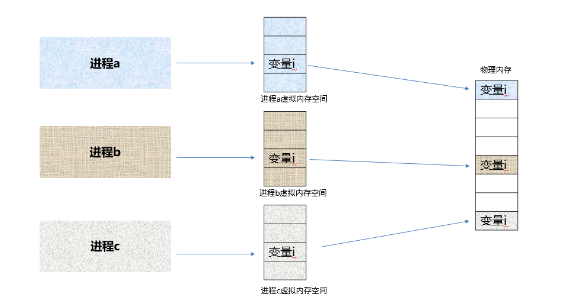
 
知识点:
   - 不通进程的虚拟内存，就算虚拟内存是相同的，但是实际上访问的不通的物理内存
   - 内存管理模块会管理这种关系，硬件会通过某种机制自动完成地址翻译(后面讲)

下图是不同用户态访问内核地址空间

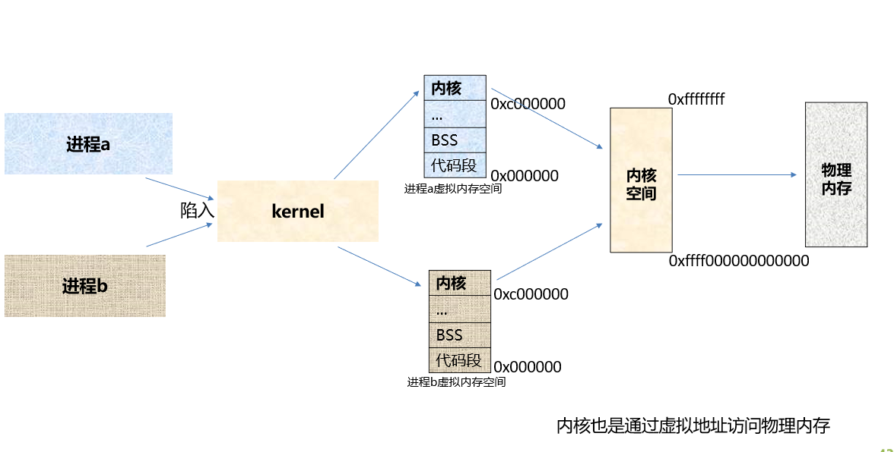

知识点: 
 - 只有在内核态才能访问内核的地址
 - 用户态程序进入内核态之后，访问的是同一套内核地址

内核内存管理
=============

前置基础
--------------------

用到的掌握的汇编指令
^^^^^^^^^^^^^^^^^^^^^^

adrp 指令: ADRP  Xd, label; 利用当前PC 和label的相对地址，计算label 内存地址的4KB基址 

.. code-block:: c
    :linenos:
	
	//如果PC 当前指令地址为 0x1000 0000 ; data 相对 0x1000 0000 的偏移是 0x1234，
	//可以得到data的地址为0x1000 1234，他的内存基址就是 0x1000 1000
	// X0的值就为  0x1000 1000
	ADRP  X0, data；

内核内存分布
-------------

整体布局描述
^^^^^^^^^^^^^

内核的地址分布描述定义在:  arch/arm64/include/asm/memory.h 
假设当前配置: 4K页(CONFIG_PAGE_SHIFT=12) VA地址是48BIT(256TB)

.. code-block:: c
    :linenos:
	
	/* 
	 * STRUCT_PAGE_MAX_SHIFT 定义了一个 管理页表结构(struct page)的大小
	 * PAGE_SHIT 是页表大小位移(比如 4K是12 16K是14 64K是16)
	 * VMEMMAP_SHIFT 是用于计算线性地址大小的除数
	 * 举例: 为了管理4GB大小的线性地址，需要使用 4GB/4KB = 1024 个页表, 每个页表大小如果占1B, 需要 1024 * 1B 的内存 
	 * 因此页表所占内存计算公式为 : 需要映射的内存大小/页大小*页表内存 =   需要映射的内存大小/ (页大小 - 页表内存) 
	*/
	
	#define VMEMMAP_SHIFT   (PAGE_SHIFT - STRUCT_PAGE_MAX_SHIFT) // 目前是: 12（4KB） - 6(64B) = 6
	// 计算管理128TB(0xffff800000000000 - 0xffff000000000000) 的线性内存 页表条目需要使用的内存大小	
	#define VMEMMAP_SIZE    ((_PAGE_END(VA_BITS_MIN) - PAGE_OFFSET) >> VMEMMAP_SHIFT) // 目前是 128TB/4KB*64B=2TB  
	
	#define VA_BITS                 (CONFIG_ARM64_VA_BITS)                           
	#define _PAGE_OFFSET(va)        (-(UL(1) << (va)))      //内核地址起始地址  0xffff000000000000                        
	#define PAGE_OFFSET             (_PAGE_OFFSET(VA_BITS)) //内核地址起始地址  0xffff 0000 0000 0000                            
	#define KIMAGE_VADDR            (MODULES_END)   //kernel image的VA地址 位于modules 结束 0xffff800007ffffff                                     
	#define MODULES_END             (MODULES_VADDR + MODULES_VSIZE)   //modules结束地址 0xffff800007ffffff                   
	#define MODULES_VADDR           (_PAGE_END(VA_BITS_MIN))  //modules起始地址 0xffff800000000000                                 
	#define MODULES_VSIZE           (SZ_128M)  //modules大小 128M                                       
	#define VMEMMAP_START           (-(UL(1) << (VA_BITS - VMEMMAP_SHIFT))) // fffffc0000000000        
	#define VMEMMAP_END             (VMEMMAP_START + VMEMMAP_SIZE) // 2TB大小: fffffdffffffffff                 
	#define PCI_IO_END              (VMEMMAP_START - SZ_8M)                          
	#define PCI_IO_START            (PCI_IO_END - PCI_IO_SIZE)                       
	#define FIXADDR_TOP             (VMEMMAP_START - SZ_32M) 
	
	#define _PAGE_END(va)           (-(UL(1) << ((va) - 1)))

下图以VA 39BIT 和 4K页做演示

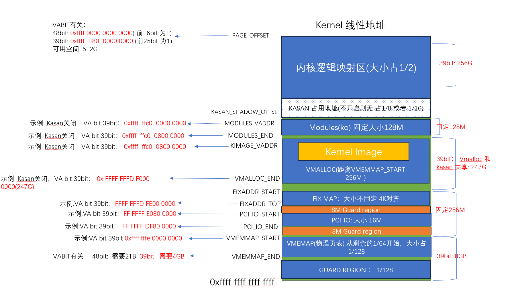
 
 
 
下图以VA48 BIT 和 4K页做演示

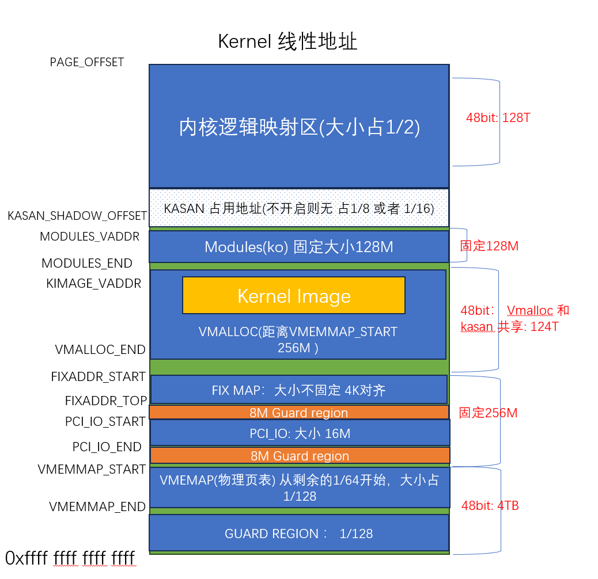
 
内核内存管理的一部分工作，就是负责管理不同区域的内存的分配、释放

接下来我们将先按照 内核启动顺序 剖析内核内存初始化过程  

内核启动的内存初始化
--------------------

内核镜像
^^^^^^^^^^

内核镜像我们简单也可以理解为是一个二进制的文件，主要定义了代码段的布局情况,用于指导内核镜像分段的文件位于: 
arch/arm64/kernel/vmlinux.lds.S, SECTIONS 描述了段的定义

也可以直接通过 *readelf -d  vmlinux* 获取内核链接后的文件 查看布局情况

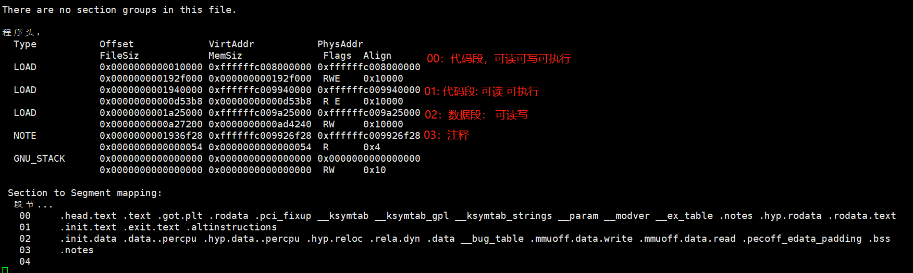
 
 
一阶段:镜像1:l映射
^^^^^^^^^^^^^^^^^^^^^

当uboot 加载完成内核，并且跳转到内核起始位置的时候，此时MMU处于未打开的状态，因此此时CPU在执行内核代码是直接访问的物理内存;
这段代码执行期间，严格意义上来说不能够访问类似于全局变量、函数等会涉及到 虚拟内存地址的代码

内存初始化会分几个阶段，第一阶段，使能mmu，为了MMU使能后能够正常工作，需要先把 内核的镜像代码建立 VA 到PA的映射

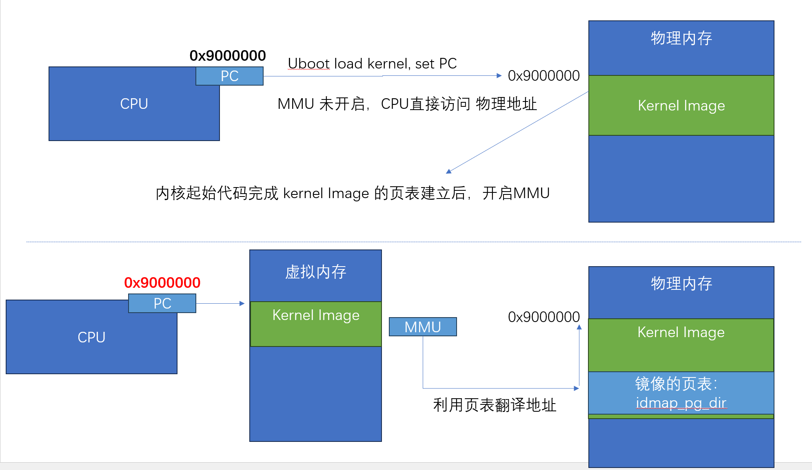

为什么是线性映射？因为PC在刚开启MMU的时候 PC的地址依然是物理内存地址 因此需要先建立1:1的映射

线性映射的页表准备
^^^^^^^^^^^^^^^^^^^^

映射表位置及大小: arch/arm64/kernel/vmlinux.lds.S 

.. code-block:: c
    :linenos:
	
	init_idmap_pg_dir = .;
    . += INIT_IDMAP_DIR_SIZE;
    init_idmap_pg_end = .;
	
	// 下面代码用于计算 虚拟内存需要多少的内存
	
	#define EARLY_ENTRIES(vstart, vend, shift, add) \
        ((((vend) - 1) >> (shift)) - ((vstart) >> (shift)) + 1 + add)

	#define EARLY_PGDS(vstart, vend, add) (EARLY_ENTRIES(vstart, vend, PGDIR_SHIFT, add))

	#define EARLY_PAGES(vstart, vend, add) ( 1                      /* PGDIR page */                                \
                        + EARLY_PGDS((vstart), (vend), add)     /* each PGDIR needs a next level page table */  \
                        + EARLY_PUDS((vstart), (vend), add)     /* each PUD needs a next level page table */    \
                        + EARLY_PMDS((vstart), (vend), add))    /* each PMD needs a next level page table */
						
	#define INIT_DIR_SIZE (PAGE_SIZE * EARLY_PAGES(KIMAGE_VADDR, _end, EARLY_KASLR))
     
	/* the initial ID map may need two extra pages if it needs to be extended */
	#if VA_BITS < 48
	#define INIT_IDMAP_DIR_SIZE     ((INIT_IDMAP_DIR_PAGES + 2) * PAGE_SIZE)
	#else   
	#define INIT_IDMAP_DIR_SIZE     (INIT_IDMAP_DIR_PAGES * PAGE_SIZE)
	#endif  
	#define INIT_IDMAP_DIR_PAGES    EARLY_PAGES(KIMAGE_VADDR, _end + MAX_FDT_SIZE + SWAPPER_BLOCK_SIZE, 1)
	
下图演示了 EARLY_PAGES 的计算公式 

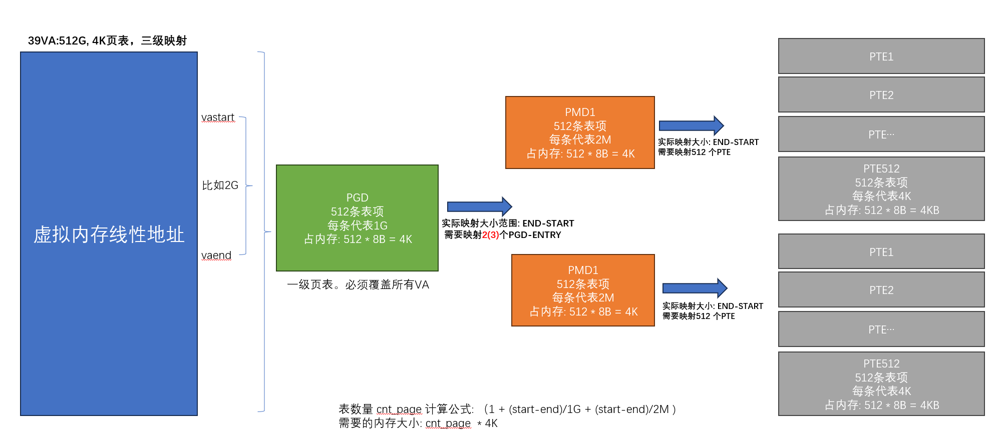
 
如果映射1M，需要考虑0的情况，因此代码中都做了+1处理 

线性映射建立
^^^^^^^^^^^^^^

内核关键代码: arch/arm64/kernel/head.S是内核一开始启动的代码

此外，宏的实现也考虑了一些额外的级别和特定的位移量（extra_shift），以根据不同的条件填充页表。

.. code-block:: c
    :linenos:
          
	__HEAD                                                                   
	/*                                                                       
	* DO NOT MODIFY. Image header expected by Linux boot-loaders.           
	*/                                                                      
	efi_signature_nop                       // special NOP to identity as PE/COFF executable
	b       primary_entry                   // 跳转到内核入口
	.quad   0                               // Image load offset from start of RAM, little-endian
	le64sym _kernel_size_le                 // Effective size of kernel image, little-endian
	le64sym _kernel_flags_le                // Informative flags, little-endian
	.quad   0                               // reserved                      
	.quad   0                               // reserved                      
	.quad   0                               // reserved                      
	.ascii  ARM64_IMAGE_MAGIC               // Magic number                  
	.long   .Lpe_header_offset              // Offset to the PE header.      
	
	
	SYM_CODE_START(primary_entry)
     bl      preserve_boot_args
     bl      init_kernel_el                  // w0=cpu_boot_mode
     mov     x20, x0
     bl      create_idmap                    //建立内核代码内存映射 

.. code-block:: c
    :linenos:
          
    adrp    x0, init_idmap_pg_dir  // x0 = init_idmap_pg_dir 物理内存基址                                         
    adrp    x3, _text             // x3 =  内核镜像的起始地址的物理内存基址                                       
    adrp    x6, _end + MAX_FDT_SIZE + SWAPPER_BLOCK_SIZE  // x6 = 内核镜像结束的物理内存地址                
    mov     x7, SWAPPER_RX_MMUFLAGS  

    map_memory x0, x1, x3, x6, x7, x3, IDMAP_PGD_ORDER, x10, x11, x12, x13, x14, EXTRA_SHIFT

关键函数说明: .macro map_memory, tbl, rtbl, vstart, vend, flags, phys, order, istart, iend, tmp, count, sv, extra_shift
参数列表：
- tbl：页表的位置。
- rtbl：第一个级别的页表项应使用的虚拟地址。
- vstart：映射范围的起始虚拟地址。
- vend：映射范围的结束虚拟地址（实际映射的范围是vstart到vend - 1）。
- flags：用于映射最后级别页表项的标志。
- phys：与vstart对应的物理地址，假定物理内存是连续的。
- order：一个值，表示页表的级别，即#imm（立即数）的2的对数，它表示PGD表中的条目数。
- istart, iend, tmp, count, sv, extra_shift：这些是临时寄存器和标志，用于在宏内部进行计算和存储中间值。

map_memory 给定的参数映射虚拟地址到物理地址，计算页表级别，并填充页表的不同级别。根据宏的调用情况，它可能涉及多个级别的页表。

MMU开启
^^^^^^^

映射建立完成后就要准备开启MMU，代码依然位于 head.S 

.. code-block:: c
    :linenos:
	
	SYM_FUNC_START_LOCAL(__primary_switch)
        adrp    x1, reserved_pg_dir
        adrp    x2, init_idmap_pg_dir  //加载tTBR 基址为 init_idmap_pg_dir
        bl      __enable_mmu
	#ifdef CONFIG_RELOCATABLE
        adrp    x23, KERNEL_START
        and     x23, x23, MIN_KIMG_ALIGN - 1
	#ifdef CONFIG_RANDOMIZE_BASE
        mov     x0, x22
        adrp    x1, init_pg_end
        mov     sp, x1
        mov     x29, xzr
        bl      __pi_kaslr_early_init
        and     x24, x0, #SZ_2M - 1             // capture memstart offset seed
        bic     x0, x0, #SZ_2M - 1
        orr     x23, x23, x0                    // record kernel offset
	#endif
	#endif
        bl      clear_page_tables
        bl      create_kernel_mapping   

非线性二次映射 
^^^^^^^^^^^^^^^

下图演示了 二次映射的主要工作

.. image:: ./images/mem/27.png
 :width: 800px

.. code-block:: c
    :linenos:
	
	
	SYM_FUNC_START_LOCAL(create_kernel_mapping)
			adrp    x0, init_pg_dir
			mov_q   x5, KIMAGE_VADDR                // compile time __va(_text)
	#ifdef CONFIG_RELOCATABLE
			add     x5, x5, x23                     // add KASLR displacement
	#endif  
			adrp    x6, _end                        // runtime __pa(_end)
			adrp    x3, _text                       // runtime __pa(_text)
			sub     x6, x6, x3                      // _end - _text
			add     x6, x6, x5                      // runtime __va(_end)
			mov     x7, SWAPPER_RW_MMUFLAGS
			
			map_memory x0, x1, x5, x6, x7, x3, (VA_BITS - PGDIR_SHIFT), x10, x11, x12, x13, x14

上述动作 完成了第二阶段的映射  紧接着又通过绝对跳转 跳转到了 __primary_switched 

.. code-block:: c
    :linenos:
	
	ldr     x8, =__primary_switched 
    adrp    x0, KERNEL_START                // __pa(KERNEL_START)           
    br      x8             
	SYM_FUNC_END(__primary_switch) 

    bl      finalise_el2                    // Prefer VHE if possible
    ldp     x29, x30, [sp], #16
    bl      start_kernel                    // 正式进入内核
    ASM_BUG()
 

初级内存管理
----------------
回顾上一节，我们讲过了 内核的镜像是如何被加载到内存，以及内核镜像自己又是如何建立页表，开启MMU，然后又重新建立映射的，
上述过程会涉及到两个页表: idmap_pg_dir 以及 init_pg_dir
本节我们继续探讨物理内存是怎么管理的

设备树内存映射
^^^^^^^^^^^^^^^
为了管理物理内存，首先要知道有多大的物理内存，以及物理内存在CPU的物理地址范围，换言之，我们需要知道真实硬件的信息，
那就不得不先把设备树解析出来，关于更多设备树的内容，请阅读 驱动章节 

这里先让我们回顾一下 内核线性地址的划分: 

 
可以找到一个FIXMAP 的虚拟内存空间，内核会使用这段虚拟内存 做一些前期初始化工作，关于fixmap的地址描述在 :/arch/arm64/include/asm/fixmap.h

内核对于该地址空间的描述: 这段注释解释了在内核中定义的一组特殊虚拟地址，这些地址在编译时是常量，
但在启动过程中才会与物理地址关联。这些特殊虚拟地址通常用于处理内核启动和底层硬件初始化等任务。

我们通过图示展示一下 fixmap 内存区域主要功能 

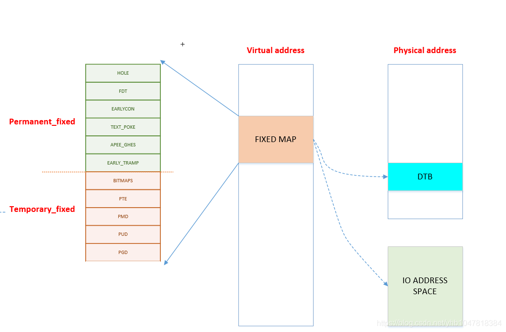
 
 
关键代码: 定义了FIXMAP的大小  以及常用函数

.. code-block:: c
    :linenos:
	
	__end_of_permanent_fixed_addresses // 是 enum fixed_addresses 的结束索引
	//fixed_addresses 每增加一个功能，FIXMAP占用的虚拟内存就增加4K
	#define FIXADDR_SIZE    (__end_of_permanent_fixed_addresses << PAGE_SHIFT) 
	#define FIXADDR_START   (FIXADDR_TOP - FIXADDR_SIZE)
	
	#define __fix_to_virt(x)        (FIXADDR_TOP - ((x) << PAGE_SHIFT))  // 从FIX功能区 ENMU 得到该 内容所在 VA地址 
	#define __virt_to_fix(x)        ((FIXADDR_TOP - ((x)&PAGE_MASK)) >> PAGE_SHIFT) // 从VA地址，得到该地址 的FIX功能区 ENUM
	

FDT其实一共占了4M的内存，实际上FDT的大小不能超过2M，这样作的目的是处于对齐的考虑

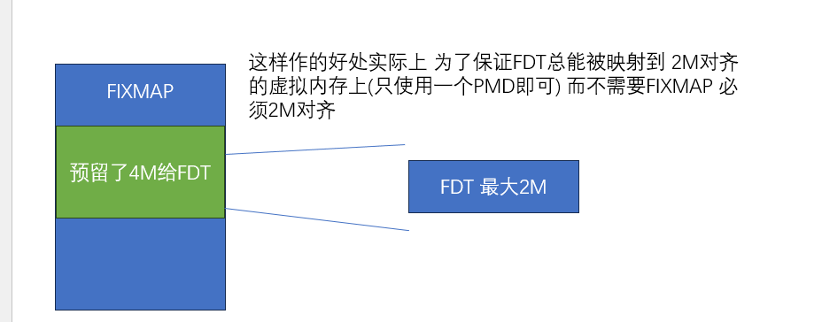

接下来让我们具体看一下 FDT设备树的内存映射过程

.. code-block:: c
    :linenos:
	
	__primary_switched
	   - early_fdt_map(fdt_phys) 
	     - early_fixmap_init()  // 初始化 init_pg_dir -> bm_pud -> bm_pmd->bm_pte 的页表
		 - fixmap_remap_fdt(dt_phys, &fdt_size, PAGE_KERNEL) // 页表填充 FDT，是段映射，只填充到 bm_pmd这一层 

这里我们在复习和学习一下 页表建立和内存映射: 
 - 首先，要先准备好 页表的物理内存 (PGD 1页 PMD(按需 至少1页) PTE(按需 至少一页) ) 
 - 然后，要知道要映射的 VA地址, 知道VA以后，可以知道要填充 哪条 PGD/PUD/PMD ENTRY
 - 最后，需要知道给VA 分配对应的物理地址，就可以填充PTE

我们用一个图示说明这个过程:

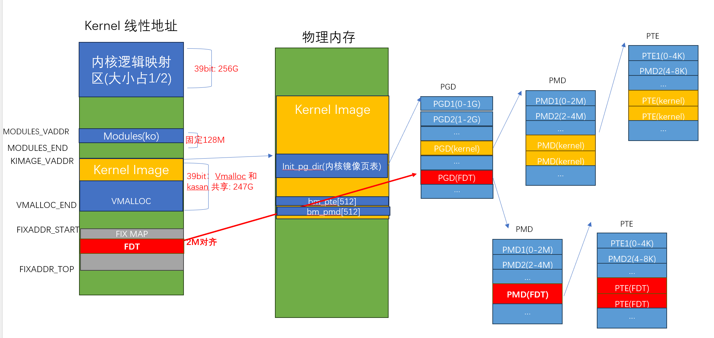

那么FDT的页表物理内存 是如何得到的， 页表初始化代码位置在early_fdt_map  

 - PGD: 会存在 init_mm.pgd 指针 
 - PMD PUD PTE 放在三个静态数组中,bm_pud,bm_pmd,bm_pte 这里回顾一下之前FDT的对齐，因为FDT是2M对齐并且占用物理内存也是2M，因此是通过段映射的方式 映射的 
 - 利用  __pxd_populate 填充 pgd entry -> pmd,   pmd entry -> pte 
 

设备树认证完以后，fdt此时就可以正常访问了,arm其实对设备树进行了两次映射 

.. code-block:: c
    :linenos:
	
	//第一次
	__primary_switched
	   - early_fdt_map(fdt_phys) 
	     - early_fixmap_init()  // 页表准备
		 - fixmap_remap_fdt(dt_phys, &fdt_size, PAGE_KERNEL) // 页表填充
	
	//第二次 
	start_kernel 
	 - setup_arch
	   - early_fixmap_init 
	   - setup_machine_fdt
	    - fixmap_remap_fdt
	

经过调查 两次映射 是由于 kasan的某个问题:  commit id  1191b6256e50a07e7d8ce36eb970708e42a4be1a

fdt的第一次访问: 在完成fdt的内存映射以及校验和检查， 可以在 setup_machine_fdt 中打印fdt 的 model 

.. code-block:: c
    :linenos:
	
	[    0.000000] Machine model: BST A1000B FAD-B //黑芝麻
	[    0.000000] Machine model: Machine model: linux,dummy-virt // qemu 

注意: 这里纠正一下，后面发现，其实FDT再映射的时候，是按照section mapping 映射的，并不会
使用到PTE页表，bm_pte 是为后面的其他虚拟内存映射准备的

.. code-block:: c
    :linenos:
	
	//再 alloc_init_pud(pmd) 都会看到下面类似的代码 
	//会根据映射的物理地址和大小，判断是否能够 huge map
	//如果可以 就不会进入下一级映射
	
     /*                                                               
      * For 4K granule only, attempt to put down a 1GB block          
     */                                                              
      if (pud_sect_supported() &&                                      
         ((addr | next | phys) & ~PUD_MASK) == 0 &&                    
          (flags & NO_BLOCK_MAPPINGS) == 0) {                          
              pud_set_huge(pudp, phys, prot);                          
                                                                       
              /*                                                       
               * After the PUD entry has been populated once, we       
               * only allow updates to the permission attributes.      
               */                                                      
              BUG_ON(!pgattr_change_is_safe(pud_val(old_pud),          
                                            READ_ONCE(pud_val(*pudp))));
      } else {                                                         
              alloc_init_cont_pmd(pudp, addr, next, phys, prot,        
                                  pgtable_alloc, flags);               
                                                                       
              BUG_ON(pud_val(old_pud) != 0 &&                          
                     pud_val(old_pud) != READ_ONCE(pud_val(*pudp)));   
      }        

因为DTB再VA上 是要求2MB对齐的，所以只映射到了PMD这一级

总结: 
 - setup_machine_fdt： 完成FDT的映射，以及扫描FDT设备树节点(内存、串口等信息) 
 - 关于内存: 会把FDT物理内存放在 memblock的保留区，会扫描设备树的可用内存信息 以及 reserver 内存信息

memblock管理器
^^^^^^^^^^^^^^
官方文档: https://docs.kernel.org/core-api/boot-time-mm.html

这是一个鸡生蛋 蛋生鸡的问题，在系统boot启动阶段，由于此时 内核更高级的内存管理功能还没有初始化，这个阶段如果想要分配内存，并不能使用类似vmalloc，alloc_pages
这种接口，但是又因为本身内存管理器的初始化也依赖内存分配(那是当然的),因此此时，内核需要一个简单的内存管理器(不依赖内存分配)，然后前期基于这个简单的
内存管理器管理内存，等内核 真正意义上的内存管理器初始化之后 再去切换掉

回顾我们之前 镜像映射、fdt 映射的过程，页表的物理内存都是镜像内的段、或者通过静态变量直接指定的，就是因为物理内存此时根本没有被管理起来

memblock的核心结构如下图:

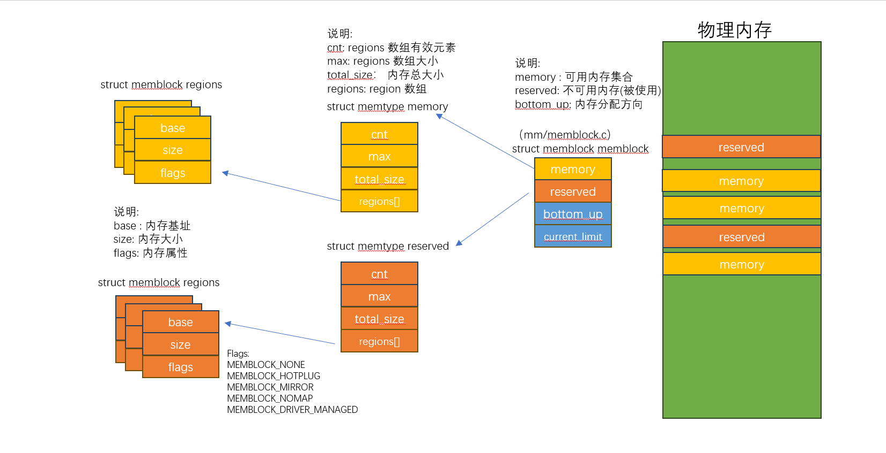

memblock的初始化 会默认是给一个控的静态数据结构(memblock.c)

核心API: 

- memblock_add(base,size) : 在memory区域增加 一段内存，该内存段表示内核可见
- memblock_remove(base,size) :从在memory区域 移动走一段内存，该内存段对内核不再可见
- memblock_reserve(base,size) : 在reserver 区域增加一段内存，表示该内存已经被使用
- memblock_free(base,size) : 在reserver区域释放一段内存，表示该内存不再被使用
- memblock_mark_(hotplug/mirror/nomap(base, size);: 标记 mem中的内存
- memblock_phys_alloc(size,align): 申请固定大小size  align对齐的物理内存
- memblock_phys_alloc_range(size, align, start, end): 申请固定大小size  align对齐的物理内存

物理内存第一阶段管理
^^^^^^^^^^^^^^^^^^^^^^
现在已经具有了 memblock 和 fdt，物理内存的初始化 始于 fdt扫描可用内存 : 

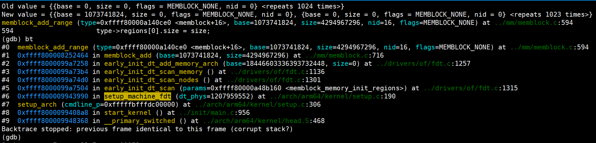
 
以及 arm64_memblock_init

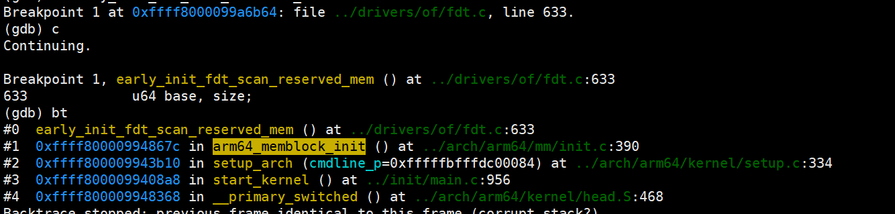

setup_machine_fdt 会扫描 memory节点，并把内存插入到 memory中，可以通过给内核传入 
memblock=debug开关打开相关日志 

.. code-block:: console
	:linenos:
	
	[    0.000000] Booting Linux on physical CPU 0x0000000000 [0x411fd050]
	[    0.000000] Linux version 6.1.54-rt15-00057-g9af25a0cf1e8-dirty (guoweikang@ubuntu-virtual-machine) (aarch64-none-linux-gnu-gcc (Arm GNU Toolchain 12.3.Rel1 (Build arm-12.35)) 12.3.1 23
	[    0.000000] Machine model: BST A1000B FAD-B
	[    0.000000] earlycon: uart8250 at MMIO32 0x0000000020008000 (options '')
	[    0.000000] printk: bootconsole [uart8250] enabled
	[    0.000000] memblock_remove: [0x0001000000000000-0x0000fffffffffffe] arm64_memblock_init+0x30/0x258
	[    0.000000] memblock_remove: [0x00000040 0000 0000-0x0000003ffffffffe] arm64_memblock_init+0x94/0x258
	[    0.000000] memblock_reserve: [0x0000000081010000-0x0000000082bdffff] arm64_memblock_init+0x1e8/0x258
	[    0.000000] memblock_reserve: [0x0000000018000000-0x00000000180fffff] early_init_fdt_scan_reserved_mem+0x70/0x3c0
	[    0.000000] memblock_reserve: [0x00000001ce7ed000-0x00000001ce7fcfff] early_init_fdt_scan_reserved_mem+0x70/0x3c0
	[    0.000000] memblock_reserve: [0x00000000b2000000-0x00000000e7ffffff] early_init_fdt_scan_reserved_mem+0x2b8/0x3c0
	[    0.000000] memblock_reserve: [0x00000000e8000000-0x00000000e87fffff] early_init_fdt_scan_reserved_mem+0x2b8/0x3c0
	[    0.000000] memblock_reserve: [0x00000000e8800000-0x00000000e8ffffff] early_init_fdt_scan_reserved_mem+0x2b8/0x3c0
	[    0.000000] Reserved memory: created DMA memory pool at 0x000000008b000000, size 32 MiB
	[    0.000000] OF: reserved mem: initialized node bst_atf@8b000000, compatible id shared-dma-pool
	[    0.000000] Reserved memory: created DMA memory pool at 0x000000008fec0000, size 0 MiB
	[    0.000000] OF: reserved mem: initialized node bst_tee@8fec0000, compatible id shared-dma-pool
	[    0.000000] Reserved memory: created DMA memory pool at 0x000000008ff00000, size 1 MiB
	[    0.000000] OF: reserved mem: initialized node bstn_cma@8ff00000, compatible id shared-dma-pool
	[    0.000000] Reserved memory: created DMA memory pool at 0x000000009a000000, size 32 MiB
	[    0.000000] OF: reserved mem: initialized node bst_cv_cma@9a000000, compatible id shared-dma-pool
	[    0.000000] Reserved memory: created DMA memory pool at 0x000000009c000000, size 16 MiB
	[    0.000000] OF: reserved mem: initialized node vsp@0x9c000000, compatible id shared-dma-pool
	[    0.000000] Reserved memory: created DMA memory pool at 0x00000000a1000000, size 16 MiB
	[    0.000000] OF: reserved mem: initialized node bst_isp@0xa1000000, compatible id shared-dma-pool
	[    0.000000] Reserved memory: created CMA memory pool at 0x00000000b2000000, size 864 MiB
	[    0.000000] OF: reserved mem: initialized node coreip_pub_cma@0xb2000000, compatible id shared-dma-pool
	[    0.000000] Reserved memory: created CMA memory pool at 0x00000000e8000000, size 8 MiB
	[    0.000000] OF: reserved mem: initialized node noc_pmu@0xe8000000, compatible id shared-dma-pool
	[    0.000000] Reserved memory: created CMA memory pool at 0x00000000e8800000, size 8 MiB
	[    0.000000] OF: reserved mem: initialized node canfd@0xe8800000, compatible id shared-dma-pool
	[    0.000000] memblock_phys_alloc_range: 4096 bytes align=0x1000 from=0x0000000000000000 max_addr=0x0000000000000001 early_pgtable_alloc+0x24/0xa8
	[    0.000000] memblock_reserve: [0x00000001effff000-0x00000001efffffff] memblock_alloc_range_nid+0xd8/0x16c
	[    0.000000] memblock_phys_alloc_range: 4096 bytes align=0x1000 from=0x0000000000000000 max_addr=0x0000000000000001 early_pgtable_alloc+0x24/0xa8
	[    0.000000] memblock_reserve: [0x00000001efffe000-0x00000001efffefff] memblock_alloc_range_nid+0xd8/0x16c
	[    0.000000] memblock_phys_alloc_range: 4096 bytes align=0x1000 from=0x0000000000000000 max_addr=0x0000000000000001 early_pgtable_alloc+0x24/0xa
	
	[    0.000000] MEMBLOCK configuration:
	[    0.000000]  memory size = 0x00000000c8100000 reserved size = 0x0000000044670ba8
	[    0.000000]  memory.cnt  = 0x9
	[    0.000000]  memory[0x0]     [0x0000000018000000-0x00000000180fffff], 0x0000000000100000 bytes flags: 0x0  
	[    0.000000]  memory[0x1]     [0x0000000080000000-0x000000008affffff], 0x000000000b000000 bytes flags: 0x0
	[    0.000000]  memory[0x2]     [0x000000008b000000-0x000000008cffffff], 0x0000000002000000 bytes flags: 0x4
	[    0.000000]  memory[0x3]     [0x000000008d000000-0x000000008fcfffff], 0x0000000002d00000 bytes flags: 0x0
	[    0.000000]  memory[0x4]     [0x000000008fd00000-0x000000008fdfffff], 0x0000000000100000 bytes flags: 0x4
	[    0.000000]  memory[0x5]     [0x000000008fe00000-0x000000008febffff], 0x00000000000c0000 bytes flags: 0x0
	[    0.000000]  memory[0x6]     [0x000000008fec0000-0x00000000b1ffffff], 0x0000000022140000 bytes flags: 0x4
	[    0.000000]  memory[0x7]     [0x00000000b2000000-0x00000000efffffff], 0x000000003e000000 bytes flags: 0x0
	[    0.000000]  memory[0x8]     [0x0000000198000000-0x00000001efffffff], 0x0000000058000000 bytes flags: 0x0
	[    0.000000]  reserved.cnt  = 0xb
	[    0.000000]  reserved[0x0]   [0x0000000018000000-0x00000000180fffff], 0x0000000000100000 bytes flags: 0x0 fdt
	[    0.000000]  reserved[0x1]   [0x0000000081010000-0x0000000082bdafff], 0x0000000001bcb000 bytes flags: 0x0 kernel 
	[    0.000000]  reserved[0x2]   [0x0000000082bde000-0x0000000082bdffff], 0x0000000000002000 bytes flags: 0x0
	[    0.000000]  reserved[0x3]   [0x0000000083000000-0x000000008affffff], 0x0000000008000000 bytes flags: 0x0 CMA 128M 
	[    0.000000]  reserved[0x4]   [0x00000000b2000000-0x00000000e8ffffff], 0x0000000037000000 bytes flags: 0x0 CMA 880M  
	[    0.000000]  reserved[0x5]   [0x00000001ce7ed000-0x00000001ce7fcfff], 0x0000000000010000 bytes flags: 0x0 fdt
	[    0.000000]  reserved[0x6]   [0x00000001ec600000-0x00000001ef9fffff], 0x0000000003400000 bytes flags: 0x0 //页表
	[    0.000000]  reserved[0x7]   [0x00000001efa6c000-0x00000001efa6cfff], 0x0000000000001000 bytes flags: 0x0 //页表
	[    0.000000]  reserved[0x8]   [0x00000001efa6d400-0x00000001efa6d80f], 0x0000000000000410 bytes flags: 0x0 //页表
	[    0.000000]  reserved[0x9]   [0x00000001efa6d840-0x00000001efa7e83f], 0x0000000000011000 bytes flags: 0x0 //page 
	[    0.000000]  reserved[0xa]   [0x00000001efa7e868-0x00000001efffffff], 0x0000000000581798 bytes flags: 0x0 //page 
	[    0.000000] psci: probing for conduit method from DT.

可以看到内核会连续扫面fdt，把在设备树配置的可用内存和保留内存分别加入到memblock中

这里还需要注意，从日志可以看到 arm64_memblock_init 会remove掉一些内存，这些内存一旦被remove
则表示内核不可见，我们接下来对这几个remove 的操作尝试分析一下: 

.. code-block:: c
	
	/* Remove memory above our supported physical address size */
	/ 这个比较好理解，是把大于CONFIG_PA_BITS(芯片无法访问的内存) 移除掉	
	memblock_remove(1ULL << PHYS_MASK_SHIFT, ULLONG_MAX);  
	*                                                                       
	* Select a suitable value for the base of physical memory.
	* 这段代码需要知道一个前提，那就是物理内存一开始会以线性映射的方式
	* 映射到虚拟内存, 所以对于物理内存无法线性映射的内存进行了移除，稍后
	* 等我们讲完 线性映射之后再回头看这段代码
	/                                          
	//真实物理地址需要向下取整
	memstart_addr = round_down(memblock_start_of_DRAM(),                     
								ARM64_MEMSTART_ALIGN);                        
	//如果物理地址范围大于线性映射大小 告警																		
	if ((memblock_end_of_DRAM() - memstart_addr) > linear_region_size)       
			pr_warn("Memory doesn't fit in the linear mapping, VA_BITS too small\n");
																			
	/*                                                                       
	* Remove the memory that we will not be able to cover with the          
	* linear mapping. Take care not to clip the kernel which may be         
	* high in memory.                                                       
	*/   
	//把超出线性映射地址范围的物理内存移除
	memblock_remove(max_t(u64, memstart_addr + linear_region_size,           
					__pa_symbol(_end)), ULLONG_MAX);   
	if (memstart_addr + linear_region_size < memblock_end_of_DRAM()) {       
			/* ensure that memstart_addr remains sufficiently aligned */     
			memstart_addr = round_up(memblock_end_of_DRAM() - linear_region_size,
									ARM64_MEMSTART_ALIGN);                  
			memblock_remove(0, memstart_addr);                               
	}

物理内存访问建立
^^^^^^^^^^^^^^^^^^^^^^
上一小节 我们知道了memblock 暂时管理当前物理内存，当然也支持从memblock中分配物理内存
但是，分配出来物理内存，我们能够直接访问吗？当然不行，必须要建立完 物理内存和虚拟内存的映射
才可以访问，这样也就来到了本节内容： paging_init ,这段代码有必要了解一下 

.. code-block:: console
	:linenos:
	
	void __init paging_init(void)
	{
        pgd_t *pgdp = pgd_set_fixmap(__pa_symbol(swapper_pg_dir)); // 1 为了访问swapper_pg_dir，映射到 FIX_PGD 的VA地址
        extern pgd_t init_idmap_pg_dir[];

        idmap_t0sz = 63UL - __fls(__pa_symbol(_end) | GENMASK(VA_BITS_MIN - 1, 0));

        map_kernel(pgdp); // 重新在 swapper_pg_dir 映射 内核的各个段 以及 重新映射 FDT
        map_mem(pgdp); // 映射所有memblock管理的内存(除了被NOMAP标记的)到 内核线性地址 

        pgd_clear_fixmap(); // 使用完毕， 解除 FIX_PGD 到 swapper_pg_dir映射，释放 FIX_PGD资源 
                
        cpu_replace_ttbr1(lm_alias(swapper_pg_dir), init_idmap_pg_dir); // 替换 页表基址为 swapper_pg_dir
        init_mm.pgd = swapper_pg_dir; // 替换 数据结构的页表基址为 swapper_pg_dir
        
        memblock_phys_free(__pa_symbol(init_pg_dir),
                           __pa_symbol(init_pg_end) - __pa_symbol(init_pg_dir)); // 释放 init_pg_dir 占用物理资源

        memblock_allow_resize();
                              
        create_idmap();       
	}  

下图基本解释了上述代码的执行过程

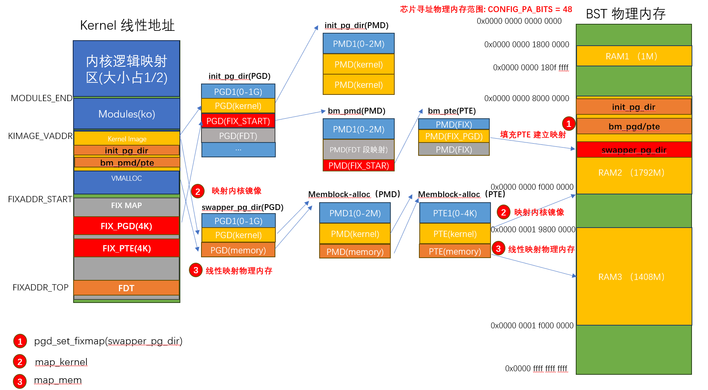
 

考虑到BST环境 大概是这样 

.. image:: ./images/mem/40.png
 :width: 800px
 

无论如何，目前我们基本完成了内核的初级内存管理。下面是总结
 
 - init_pg_dir不再使用  内核全局页表PGD 都存储再swapper_pg_dir 
 - 依然保留了 idmap映射 (TTBR1的替换依赖TTBR0的访问)
 - 系统内存目前都可以通过虚拟内存访问 物理内存 到内核的虚拟地址，是线性映射的关系 
 - 常用的两个地址转换函数: virt_to_phys/phys_to_virt 

内核物理内存管理进阶
--------------------
之前 我们已经学习过了，内核启动阶段，通过memblock 以及线性映射，管理起来了系统的物理内存，
memblock，对于物理内存的管理都是大颗粒的，并且实现比较简单，其实为了应对更高级别的内存管理，为了满足物理内存管理更加灵活
我们将继续探讨，在之前，有几个关键的概念要介绍一下

概念:PFN
^^^^^^^^^^^^
物理页帧号，内核根据选择的页大小，按照页帧的方式 给每个物理内存作了编号

举例说明: ARM32位下，CPU 可以访问的物理内存范围 0x00000000 - 0xffff ffff，如果按照4K页大小，可以得知，有效物理内存范围内，
一共需要(0xf ffff)个页帧，编号从(0-1048575)

内核提供的关于页帧的转换公式有: 

.. code-block:: c

	// 根据当前物理地址 获取下一个页帧的起始地址
	#define PFN_ALIGN(x)    (((unsigned long)(x) + (PAGE_SIZE - 1)) & PAGE_MASK)
    //根据当前物理地址  获取下一个页帧号
	#define PFN_UP(x)       (((x) + PAGE_SIZE-1) >> PAGE_SHIFT)
    //根据当前物理地址  获取上一个页帧号
	#define PFN_DOWN(x)     ((x) >> PAGE_SHIFT)
    //给定页帧，获取他的页帧起始物理地址
	#define PFN_PHYS(x)     ((phys_addr_t)(x) << PAGE_SHIFT)
    //给定物理地址，获取他的页帧号
	#define PHYS_PFN(x)     ((unsigned long)((x) >> PAGE_SHIFT))    

下图展示了上述过程：

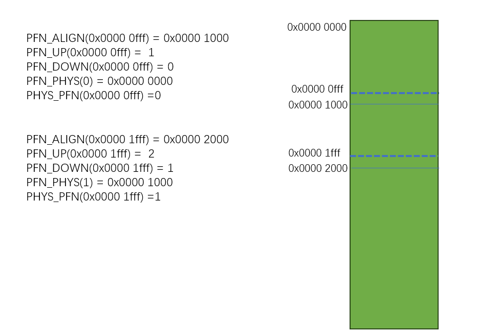

概念:页帧
^^^^^^^^^^^^
物理内存都有了PFN，则struct page 则是对应每个PFN 有一个结构体，用以记录该物理内存的: 状态(是否被使用、是否被锁) 以及其他信息

这里只是先简单引入struct page的概念 

概念:物理内存模型
^^^^^^^^^^^^^^^^^^^^^^
物理内存模型描决定了内存管理的复杂度，为了管理物理内存，内核在不同时期引入了几种模型，到今天为止，只剩下两个模型在使用

第一种： 早期和嵌入式环境下的平坦内存模型

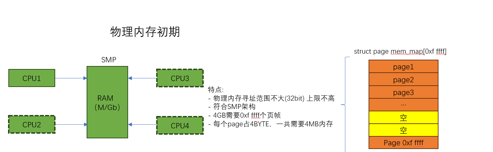

从 PFN 到 对应struct page 数组的转换就非常简单: 

.. code-block:: console
	:linenos:
	
	#define __pfn_to_page(pfn)      (mem_map + ((pfn) - ARCH_PFN_OFFSET))
	#define __page_to_pfn(page)     ((unsigned long)((page) - mem_map) +  ARCH_PFN_OFFSET)

mem_map数组的index 和PFN是对应的 

上面这种存在很明显的问题: 
 
 - 虽然RAM 一定不会 把物理内存都占用，但是mem_map数组依然要占用空间，这在64位下是无法忍受的
 - 另外由于NUMA的架构出现，对平坦内存模型也提出了挑战 

第二种： 当前主流内存模型 稀疏内存模型

在继续稀疏内存模型之前，先介绍一下 NUMA 和 UMP的内存访问模型

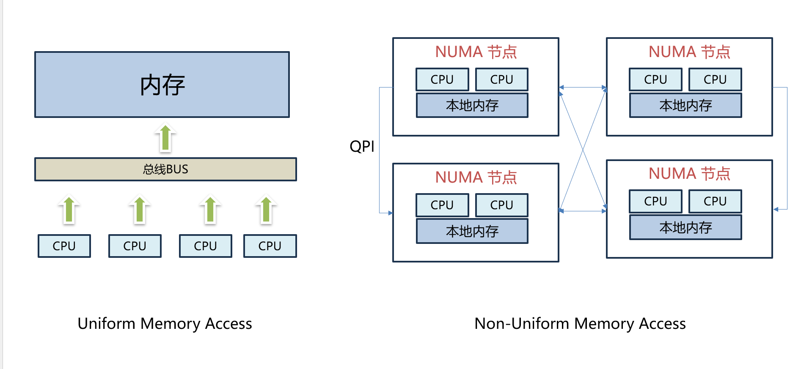

NUMA对不同numa 节点，提出了内存单独管理的诉求，在加上 内存热插拔的出现，平坦模型已经无法在胜任了 

注意root是第一级分配的空间，第二级根据实际物理内存按需分配

从 PFN 到 对应struct page 的转换就稍微复杂: 

.. code-block:: c
	:linenos:
	
	/*
	* Note: section's mem_map is encoded to reflect its start_pfn.
	* section[i].section_mem_map == mem_map's address - start_pfn;
	*/
	#define __page_to_pfn(pg)                                       \
	({      const struct page *__pg = (pg);                         \
			int __sec = page_to_section(__pg);                      \
			(unsigned long)(__pg - __section_mem_map_addr(__nr_to_section(__sec))); \
	})
	
	#define __pfn_to_page(pfn)                              \
	({      unsigned long __pfn = (pfn);                    \
			struct mem_section *__sec = __pfn_to_section(__pfn);    \
			__section_mem_map_addr(__sec) + __pfn;          \
	})

详细追踪一下:  pfn_to_page： 假设 物理地址为: 0x00000000ffff ffff,  per_root section =2  4k页表

-  已知pfn在4K页表下，是物理地址右移12bit的结果 则该地址的PFN =0xf ffff  
-  每个section在4K页表下， 包含 128M空间，也就是包含 32768(2^15)  个page   
-  pfn_to_section_nr：从pfn 到  section index的 转换就是 pfn >> 2^15（除以32768）：0x7f
- __nr_to_section:  section index 得到  root_index = section_index / per_root_section = 0x3f
   section_ptr = mem_section[ root_index  ][section_index & SECTION_ROOT_MASK ]  
                       = mem_section[ 3f ][ 1 ] 
- 得到page = section_ptr-> sectiom_mem_map [pfn & MAP_MASK] 但是我们会发现 实际并不是这样 

上面最后一个步骤，我们看到在计算page_ptr 的时候，是直接使用 sectiom_mem_map+pfn,其实注释也说明了，
在sectiom_mem_map初始化的时候，为了减少计算，sectiom_mem_map 实际在分配初始化的时候，做了偏移，
这样做的的原因是因为 sectiom_mem_map初始化是一次性的，从性能角度考虑，这样作是有好处的 

概念: 内存分区(ZONE)
^^^^^^^^^^^^^^^^^^^^
理想情况下，内存中的所有页面从功能上讲都是等价的，都可以用于任何目的，但现实却并非如此，例如一些DMA处理器只能访问固定范围内的地址空间
（https://en.wikipedia.org/wiki/Direct_memory_access）。
因此内核将整个内存地址空间划分成了不同的区，每个区叫着一个 Zone, 每个 Zone 都有自己的用途。

理解DMA的概念: 参考一些资料即可，介绍一下DMA解决什么问题，以及为什么DMA有内存访问的约束

内核关于DMA 的介绍
https://docs.kernel.org/core-api/dma-api-howto.html

vmemmap
^^^^^^^^^
由于在稀疏模型下 PFN 和  page的互相索引 性能还是不够好，引入了VMEMAP的概念

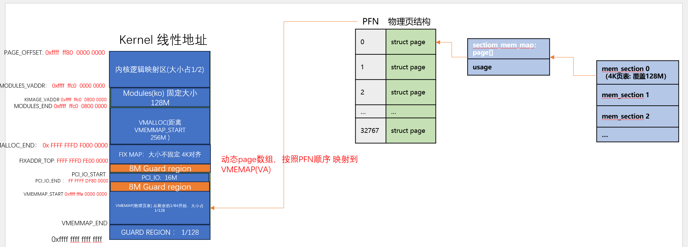

section通过分段+按需动态申请内存的方式，解决了 如果要映射全部物理内存范围，page数组占用过大物理内存的问题  
但是通过把page数组 重新映射到 VMEMMAP虚拟内存上，则解决了 PFN 到 page 的索引效率问题 

.. code-block:: c
	:linenos:
	
	/* memmap is virtually contiguous.  */
	#define __pfn_to_page(pfn)      (vmemmap + (pfn))
	#define __page_to_pfn(page)     (unsigned long)((page) - vmemmap)

 
代码浅谈
^^^^^^^^^^^^
稀疏内存结构模型初始化路径为; 

.. code-block:: c

	- start_kerenl 
	 - setup_arch
      - bootmem_init 
	   - sparse_init
        - memblocks_present() 利用memblock信息, 初始化 mem_section 数组，先把需要用到的section内存分配出来
		- sparse_init_nid 循环遍历所有numa节点，申请和初始化 section内部结构，比如 section_mem_map 的申请 
		 - __populate_section_memmap 建立 section_mem_map 到 vmemmap的内存映射

稀疏内存核心结构体: 

参考：
https://www.kernel.org/doc/gorman/html/understand/understand005.html

struct pglist_data 记录了每个 NUMA节点的内存布局，需要专门看一下这个结构体 

内存分区和布局初始化路径为: 

.. code-block:: c

	- start_kerenl 
	 - setup_arch
      - bootmem_init 
	   - zone_sizes_init // 根据系统的DMA限制范围(ACPI 设备树信息等) 得到系统的DMA 最大访问范围 
	    - free_area_init // free_area_init: 初始化numa节点的内存布局结构 pglist_data 以及 zone data
		   -  start_pfn = PHYS_PFN(memblock_start_of_DRAM()); // 系统真实物理地址的的起始PFN(去掉开头空洞) 
		   -  end_pfn = max(max_zone_pfn[zone], start_pfn); // 获取每个zone的 PFN下限
		   - free_area_init_node //初始化单个numa节点的 pg_data_t 和 zone data
			 - calculate_node_totalpages  // 计算zone的实际大小 初始化numa 和 zone的 pfn范围 和 以及pages数量
			 - free_area_init_core // 标记所有reserved 页帧 设置当前内存队列为空 清空所有内存标志位
			   - pgdat_init_internals 
			     - pgdat_init_split_queue // 初始化 pgdat 的 透明大页相关结构				 
				 - pgdat_init_kcompactd //  初始化内存压缩列表
			   -  pgdat->per_cpu_nodestats = &boot_nodestats; //初始化内存启动阶段的 内存使用情况统计
			   -  memmap_pages = calc_memmap_size(size, freesize); 计算 页帧管理(PAGE)占用的内存 
			   
	  - memmap_init
        -  memmap_init_zone_range
			   - memmap_init_range //初始化 物理页帧

黑芝麻的 DMA range : 

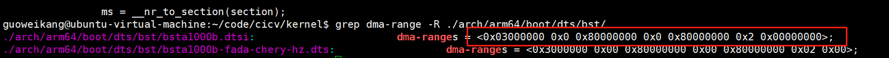

zone的初始化日志 

.. code-block:: console
	:linenos:
	
	[    0.000000] Zone ranges:
	[    0.000000]   DMA      [mem 0x00000000 1800 0000 - 0x0000 0000 ffff ffff]
	[    0.000000]   DMA32    empty
	[    0.000000]   Normal   [mem 0x00000001 0000 0000 - 0x0000 0001 efff ffff]
	[    0.000000] Movable zone start for each node
	[    0.000000] Early memory node ranges
	[    0.000000]   node   0: [mem 0x0000000018000000-0x00000000180fffff]
	[    0.000000]   node   0: [mem 0x0000000080000000-0x000000008affffff]
	[    0.000000]   node   0: [mem 0x000000008b000000-0x000000008cffffff]
	[    0.000000]   node   0: [mem 0x000000008d000000-0x000000008fcfffff]
	[    0.000000]   node   0: [mem 0x000000008fd00000-0x000000008fdfffff]
	[    0.000000]   node   0: [mem 0x000000008fe00000-0x000000008febffff]
	[    0.000000]   node   0: [mem 0x000000008fec0000-0x00000000b1ffffff]
	[    0.000000]   node   0: [mem 0x00000000b2000000-0x00000000efffffff]
	[    0.000000]   node   0: [mem 0x0000000198000000-0x00000001efffffff]
	[    0.000000] mminit::memmap_init Initialising map node 0 zone 0 pfns 98304（18000000 >> 12） -> 1048576（ffff ffff >> 12） //对应DMA ZONE 
	[    0.000000] mminit::memmap_init Initialising map node 0 zone 2 pfns 1048576(100000000 >> 12) -> 2031616（1 efff ffff >> 12） //对应NORMAL ZONE 
	[    0.000000] On node 0 totalpages: 819456(3201M  对应所有memblock的mem)

实验
-----

实验1
^^^^^^^^
在linux代码中找到关于页表的配置项 

在linux代码中找到关于VA的配置项 

用户态内存管理
===============

实验
======

NVME虚拟机环境
----------------

