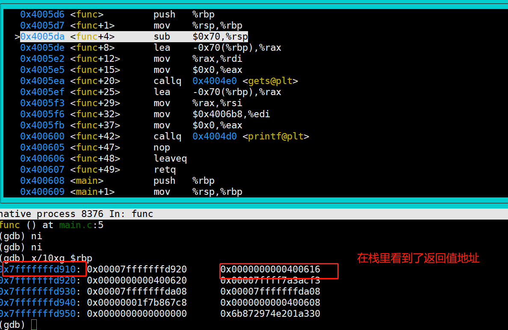

==============
编程安全&RUST
==============
学习要求: 
 - 熟练使用掌握C语言
 - 已经学习过计算原理
 
学习时间: 7 days

前言
======

参考
--------
这门课程真的很好: https://reberhardt.com/cs110l/spring-2021/

官方基本入门书籍: 
 原版英文: https://doc.rust-lang.org/stable/book/title-page.html
 中文: https://rustwiki.org/zh-CN/book/

补充: 
  - CS234 Program Analysis and Optimizations
  
说明
-----
主要围绕讨论C语言得编程安全，然后看如何解决这些问题，最后在看RUST是如何解决这些问题

编程安全
=========

bug和安全
==========

栈覆盖
--------
看一下下面得代码，看看有什么问题

.. code-block:: C

	#include <stdlib.h>
	#include <stdio.h>
	
	void func()
	{
		char str[100];
		gets(str);
	
		printf("get str = %s \n",str);
	}
	
	int main()
	{
		func();
		return 0;
	}

我们尝试调试一下:

.. image:: ./image/1.png
 :width: 400px

在进入函数 实际查看一下栈内容:

从这个图，我们也可以得知新的函数得栈大小为 0x70,并且变量str 也指向了栈得新地址；我们知道栈是向上增长得；
设想一下，如果我们写入字符串超过0x70(102bytes) 会发生什么

.. image:: ./image/3.png
 :width: 800px

程序最后报错了，原因你也一定清楚了，PC指向了非代码段
.. image:: ./image/3.png
 :width: 800px

让我们在回顾一下，上面错误是引起了系统异常，如果我们把内容覆盖成为一个恶意代码得地址？好吧，那你电脑可能就会被攻陷了；让我们尝试修复一下这个代码：

.. code-block:: C

	struct Packet {
		int len;
		char *data;
	};

	void writePacket(struct Packet *p)
	{
		printf("packet:%s len is %d\n",p->data,p->len);
		char str[100];
		if (p->len < 100) {
			snprintf(str, p->len, "%s", p->data);
		}
		printf("get str is %s\n",str);
	}
	
	int main()
	{	
		struct Packet p = {10, "123456789"};
		writePacket(&p);
		p.len = -1;
		p.data = "00000000000000000000000000000000000000000000000000000000000000000000000000000000000000000000000000000000000000000000000000000000000000000000";
		writePacket(&p);
		return 0;
	}

你会发现，明明做了检查了 为什么还是会失败? 好吧，snprintf第二个参数是size_t，是unsigned int; 这里发生了类型转换，就算检查成功，负数会变成一个很大的无符号数 

OK，我们可以把上面的问题怪程序员吗？
 - 我们无法保证每一个编程人员都是优秀的程序员(基础理论很扎实，具备安全意识)
 - 无法保证优秀的程序员不会犯错：是的，常在河边走 哪有不湿鞋 

总结
^^^^^
本小节，我们尝试向你展示bug很多时候是无法避免的，而且bug带来的问题以及影响是非常大的

发现bug的技术
-------------
为了发现代码中的bug，自从程序诞生以后，就一直在发展了，到今天主要使用的是两个策略:

动态分析:
  - 把程序在一个环境运行起来
  - 程序加一个监控器，用于观察程序运行期间是否存在不正确的行为

静态分析: 
  - 模拟人们阅读检查代码，需要特定检查规则，通过语法和词义分析，查找代码是否存在问题

动态分析工具：valgrind
^^^^^^^^^^^^^^^^^^^^^^^^
valgrind 主要用于监控堆内存，核心实现是对malloc/free wrap，这样程序堆上的内存都在他的监控之下，从而可以判断程序对这些内存的合法使用，可以用来检查

 - 堆内存的非法访问(访问没有申请或者已经释放的内存 uaf)
 - 堆内存的重复释放(double free)
 - 堆内存泄漏(mem leak)

下面是一个示例:可以看到 valgrind 可以监控到堆内存的越界以及泄漏，但是无法识别栈上的内存越界
 
.. code-block:: c
	
	#include <stdio.h>
	#include <stdlib.h>
	
	void stack_access(int stack_size, int access_size)
	{
		char str[stack_size];
		str[access_size] = 'a';
	}
	
	void heap_access(int alloc_size, int access_size) 
	{
		// allocate a heap mem
		char *str = (char *)malloc(alloc_size);
		// access heap mem overflow
		str[access_size] = 'a'; // maybe happend  stack  overflow
		free(str);
	}
	
	void user_after_free() 
	{
		// allocate a heap mem
		char *str = (char *)malloc(8);
		free(str);
		str[1] = 'a'; // happend  uaf
	}
	
	void double_free() 
	{
		// allocate a heap mem
		char *str = (char *)malloc(8);
		free(str);
		free(str);
	}
	
	int main()
	{
		//stack_access(10,9); // ok 
		//stack_access(10,10); // stack overflow 
		//heap_access(10,9); // ok 
		//heap_access(10,10); // heap overflow
		//user_after_free(); // heap overflow
		double_free(); // heap overflow
		return 0;
	}

缺点:  
  - 由于只有程序对于堆的使用分析。比如统计出来有内存泄漏,但是无法明确知道内存泄漏原因，缺少程序信息
  - 无法监控栈上内存: 栈上的内存溢出、访问越界等问题无法发现(栈上的内存无法从程序推导，如果你看过汇编，栈上内存使用都是利用rbp + offset 使用，并没有人告诉我们这个内存是谁在使用，这个内存有效范围是多少)

动态分析工具：llvm Sanitizers
^^^^^^^^^^^^^^^^^^^^^^^^^^^^^^
valgrind由于缺少源码信息，sanitizer 我们知道，他是LLVM 的一个工具，这个工具可以在编译阶段利用分析源码，获得更多的信息，相比较valgrind 功能更加强大，可以用来发现栈上的内存问题 

 - addressSanitizer: 检测到内存越界、double free、uaf 等问题
 - leakSanitizer: 查找是否存在内存泄漏
 - MemorySanitizer：内存消毒，查找是否使用未初始化的内存
 - UndefinedBehaviorSanitizer： 查找是否存在空指针访问、整型越界
 - ThreadSanitizer： 线程并发相关

动态分析的痛点
^^^^^^^^^^^^^^^^
动态分析最根本的问题在于: 
 - 只能够发现已经发生的问题
 - 如果程序依赖外部输入，并且外部输入的可能性非常多(常常是这样的 而且几乎等于无限种可能,我们预期的输入可能只是一个很小的范围，非预期的输入可能是无限的)，

一般我们需要利用FUZZ 和 动态分析工具一起使用；FUzz通过随机输入，用以测试程序，FUZZ在生产环境是一个非常有效的工具，但是还是有可能无法进入异常代码；随机并不等于一定会触发异常  

静态分析工具： clang-tidy
^^^^^^^^^^^^^^^^^^^^^^^^^^
静态扫描工具，原理就是分析源码，其中使用最为广泛的技术就是数据流分析

存在的缺陷是: 
 - 某段代码非常复杂(比如 存在while循环)，静态分析就会失效，为甚么? 如果静态分析把循环测试一遍 那不就等于是在运行程序了吗？开销太大
 - 会又可能产生误报，一些根本永远不可能存在的分支经常也会被统计进来

实验
^^^^^
通过实验学习这些工具并加深理解 
https://reberhardt.com/cs110l/spring-2021/assignments/week-1-exercises/

总结
^^^^
本节我们学习了 动态bug检查工具: valgrin  santizer fuzz ; 以及静态分析工具 clang-tidy；他们都有各自适用的场景，也都有各自无法解决的问题，那么到底有没有更好的方案? 

回归到本质；检测bug 是因为代码有bug，但是是否思考过 为什么代码会有bug？

因为任何一个程序员(包括我)，我们的关注点在于 如何写出功能正常的代码；但是黑客们的关注点是如何能找到这个代码的漏洞；

两者不同的关注点，决定了精力分配的不同；所以核心点在于，是不是改变程序员的行为习惯？或者是让编程语言自身就具备解决这些问题的能力？ 确实是，比如JAVA，他的GC以及类型系统，可以说解决了内存泄漏以及内存访问越界的问题；但是由于java性能可能还是没有那么好，因此我们又有了RUST

RUST
=====

介绍
-----
RUST 是一门聚焦 安全、性能 的语言 

思考: 我们都知道，所有的程序本身最终都是指令，指令是没有意义的；C语言基本上算是最接近汇编的语言，C语言自己本身
是不负责 更高级的特性(比如访问某个数组越界 爆栈、内存泄漏)，一般都需要编写对应的代码、或者依赖编译器去完成这些工作，不可避免的，这些检查会带来性能的下降(为了安全检查，需要更多的指令) 

当然，也有高级语言 比如JAVA PYTHON等等，在java里面编程，写代码的人不需要关心内存的申请和释放，这些工作java垃圾回收机制负责解决；

事实上，很多高级语言内部提供了并发、内存、安全机制，RUST就是这样一门语言,专注于安全和性能;

基本工具
------------
RUST提供了一些工具负责用于提升开发效率和标准:
 
 - Cargo，内置的依赖管理器和构建工具，它能轻松增加、编译和管理依赖，并使其在 Rust 生态系统中保持一致。
 - Rustfmt 确保开发者遵循一致的代码风格。熟悉clang-format/python-format的人对这个一定不陌生
 - Rust Language Server 为集成开发环境（IDE）提供了强大的代码补全和内联错误信息功能。

安装
-----
参考书中的install 章节: https://rustwiki.org/zh-CN/book/ch01-01-installation.html

cargo
------------
总结
^^^^^ 
 - 新建空项目: cargo build 
 - 项目文件 Cargo.toml :版本 依赖 说明
 - 项目文件 Cargo.lock: 记录依赖详细版本
 - 项目文件 src: 项目源码
 - 构建项目: cargo build {--release}
 - 构建文件 target/debug{release}/ : 构建产出
 - 构建并运行项目: cargo run 
 - 清理项目： cargo clean
 - 检查项目： cargo check

核心理念
---------

所有权
^^^^^^^
所有权(这里指内存)是RUST的一个核心设计理念，但是我想说，所有权的概念并不是只在RUST里面存在，实际上在任何一个语言都存在； 设想一下，C语言里面，任何一个对象， 如果是通过malloc(堆上)分配出来的,必然也需要有人去释放他,一般如果你曾经有过类似的开发经验，相信看到过类似 xxx_create() xxxx_destroy()的成对出现的函数，但是C语言里面虽然有所有权的概念，但是并不清楚，可能API只是简单告诉你，你从我这里分配了内存，使用完以后，你需要自己释放他，随着代码规模以及并发的出现，到底应该是谁去释放，可能就说不清楚了，因此会出现类似于 double free,UAF的问题；RUST 通过加强所有权的概念,明确编程人员必须要有这个意识，否则代码就会编译不通过 让我们看下面这个例子： 

.. code-block:: c

	fn main() {
		let john = "bear jony".to_string()
		let kent = john 
		println!("{}", john)
	}

试试看，会发生什么，rustc 会提示我们 john是无效的变量，why? 

所有权的原则: 
 - RUST中，每一个堆上的内存，都有一个变量对应，这个变量是这个内存的所有者
 - 在同一时间，变量只允许有一个所有者
 - 当拥有所有权的变量从作用域退出后，该内存被释放

实现这个机制的方法是RUST的默认行为

如果变量不是在堆上申请的(基本类型)，则需要实现copy(如果实现了copy 就不应该在实现drop)

.. code-block:: c

	fn main() {
		let john = 10;
		let kent = john; 
		println!("{}", john);
	}

上面代码是没有错误的，这个时候，在栈上会存在 john 和 kent 两个变量

堆上内存的复制 可以通过类型的clone 实现，下面这段代码是正常的，会在函数结束后，销毁两份内存

.. code-block:: c

	fn main() {
		let john = "bear jony".to_string();
		let kent = john.clone(); 
		println!("{}", john)'
	}

堆上内存的销毁会在离开作用域之后，自动通过调用类型的 drop 实现，类似于C++里面的析构函数

借用
^^^^^
借用基本概念，为什么需要借用? 看下面代码：

.. code-block:: c

	fn show_vec(kent: Vec<i32>) {
		println!("{}", kent[0]);
	}
	fn main() {
		let john = vec![1,2,3];
		show_vec(john); 
		println!("{}", john);
	}

上述代码执行rustc 编译也会报错，原因是因为函数传参，也会把所有权从john传递给函数,这样导致的结果就是主函数失去了变量所有权(虽然我们可以通过函数返回值再把所有权交接回来)

RUST中提出了借用的概念,借用的核心概念类似C里面的引用(只是类似),他的理念是这样的：

 - 所有者可以把内存临时借用给其他人，借用内存的那个人，临时拥有内存，用完要归还给所有者
 
讲到这里，就必须要提 可变变量,我的内存借给别人，他能不能修改？如果我内存借用给了好几个人，这些人都对内存
修改会出现什么情况？

可变变量
^^^^^^^^^^
RUST 默认变量都是不可变的 先参考下面代码

.. code-block:: c

	struct Vector {
		int len;
		int capacity;
		int *data;
	}
	
	struct Vector *vec_new(int capacity) {
		struct Vector *new = (struct Vector *) malloc(sizeof(struct Vector));
		new->capacity =  capacity;
		new->len =0;
		new->data = (struct int *)malloc(sizeof(int) * capacity);
		return new;
	}
	
	void vec_push(struct Vector *vec, int a) {
		if (vec->len == capacity) {
			free(vec->data);
			int *old = vec->data;
			vec->data = (struct int *)malloc(sizeof(int) * 2*vec->capacity);
			vec->capacity = 2*vec->capacity;
			memcpy(vec->data,old,sizeof(int)*len);
		}
		vec->data[len] = a; 
		vec->len++;
	}
	
	int main() {
		struct Vector *vec = vec_new(1);
		vec_push(vec,1);
		int *n = &vec->data[0];
		vec_push(vec,2);
		printf("n = %d\n",*n);
	}

看一下上面代码有什么问题？*n引用了vec的某个内存，但是经过vec_push 执行扩容以后，该内存失效了
出现这个问题的原因是：当有人在使用(这里是read)，但是同时有人可以修改内存

可变变量的核心问题就是 : 解决内存异常修改的

首先，RUST默认变量都是不能够修改的(类似于C里面,默认给每个变量加了const修饰);

.. code-block:: c

	fn main(){
		let john = vec![1,2,3];
		vec.push(4);
	}

上面代码会报错，如果希望某个变量是可以修改，可以通过增加mut 修饰 

.. code-block:: c

	fn main(){
		let mut john = vec![1,2,3];
		vec.push(4);
		println!("{}", john[3]);
	}

我们已经知道变量可以借用，并且变量也有可变变量一说，那么他们俩碰撞会有什么样的火花？

定义一个不可变变量，传入一个不可变的引用：

.. code-block:: c

	fn int_add(kent: &i32) {
		*kent+=1; //尝试修改引用内存，因为是一个不可变引用 因此会报错
	}
	
	fn int_show(kent: &i32) {
		println!("{}", *kent); //访问一个不可变引用 可以工作
	}
	
	fn main(){
		let john = 1;
		int_add(&john); //不可以工作
		int_show(&john);//可以工作
		println!("{}", john);
	}

看到，因为传入函数的是一个不可变的引用，因此函数内部不允许修改变量

不可变变量 + 可变引用：

.. code-block:: c

	fn int_add(kent: &mut i32) {
		*kent+=1; 
	}
	
	fn main(){
		let john = 1;
		let mut_refer = &mut john;//不可以工作 不可变变量不能有可变引用
		int_add(mut_refer); 
		println!("{}", john);
	}

可变变量 + 可变引用：

.. code-block:: c

	fn int_add(kent: &mut i32) {
		*kent+=1; //尝试修改引用内存
	}
	
	fn main(){
		let mut john = 1;
		let mut_refer = &mut john;//可以工作，可变变量可以有可变引用
		int_add(mut_refer);
		println!("{}", *mut_refer);
	}

这里我们使用了一个新的语法，引入了可变变量引用的变量 mut_refer,这样，该引用生命周期会延长

因此：
 - 如果原始变量是可变的，可以使用可变引用；也可以使用不可变引用
 - 如果原始变量是不可变的，不可以使用可变引用;

可变变量:同时拥有可变引用和不可变引用：

.. code-block:: c

	fn int_add(kent: &mut i32) {
		*kent+=1; 
	}
	
	fn int_show(kent: &i32) {
		println!("{}", kent);
	}
	
	fn main(){
		let mut john = 1;
		int_show(&john); //可以工作
		int_add(&mut john); //可以工作
		println!("{}", john);
	}

让我们在升级一个版本

.. code-block:: c

	fn int_add(kent: &mut i32) {
		*kent+=1; 
	}
	
	fn int_show(kent: &i32) {
		println!("{}", kent);
	}
	
	fn main(){
		let mut john = 1;
		let imu_refer = &john;
		let mut_refer = &mut john;
		int_show(imu_refer); //可以工作
		int_add(mut_refer); //可以工作
		println!("{}", john);
	}

我们看到报错了？为什么？

这里在同一个生命周期范围内，出现了两个引用，一个可变引用 一个不可变引用；RUST不允许这种情况出现

 - 可变变量，允许作为不可变的引用借给多个人
 - 可变变量，只允许作为可变引用同一时间借给一个人，此时不允许在作为可变或者不可变引用借给其他人
 
上面两条原则核心目的在于解决内存在同一时间只允许被一个人修改(此时不允许任何人访问);允许多个人同时访问；
有点类似于读写锁的概念；但是他是在编程上就做了这个限制

让我们看最后一个例子：

.. code-block:: c
	
	fn main()
	{
		let mut s = String::from("hello"); //可以通过s修改字符串
		let s1 = &mut s; // 可以通过s1修改字符串
		
		//版本1
		println!("{}",s1); //Rust 可以检查s1引用生命周期在这里结束 并且在借给S1使用期间 没有再次使用变量
		println!("{}",s); // 完成S1借用 这里已经归还给了变量s 之后只有s自己使用
		
		//版本2
		println!("{}",s);  // 此时S已经借给了s1，并且s1还没有使用完，这个时候使用变量，是不正确的(借给别人怎么还能使用呢)
		println!("{}",s1); 	
 	}

总结
^^^^^
所有权、借用、(不)可变变量、(不)可变引用 这些概念以及使用规则是RUST 关于内存最重要的理念，正是因为有了这些规则对代码的约束; 极大程度的减少了内存bug

入门语法
---------
是时候简单介绍一些基本类型和语法 以便于继续下面的学习

请先尝试自己通过google 或者chatgpt 完成一个小程序实现如下功能：终端接收购物清单，结束输入done 然后打印

.. code-block:: c

	🍓  cargo run
		Finished dev [unoptimized + debuginfo] target(s) in 0.03s
		Running `target/debug/part-2-shopping-list`
	Enter an item to add to the list: apples
	Enter an item to add to the list: bananas
	Enter an item to add to the list: cucumbers
	Enter an item to add to the list: done
	Remember to buy:
	* apples
	* bananas
	* cucumbers

基本类型
^^^^^^^^^^
和C类似，RUST的基本数据类型有：

 - 符号整数：  i8 i16 i32 i64 i128 以及 isize(平台相关 指针宽度)
 - 无符号整数: u8 u16 u32 u64 u128 以及 usize
 - 浮点数： f32 f64 
 - char: 单个unicode字符,4byte 
 - bool: 只能是true 和 false 
 - 单元类型 unit：() 只能为空 
 
String 
^^^^^^^^^^

错误处理
---------
错误处理机制，在任何一门语言都是常见并且必要的，目前常见的错误处理有两种模式: 

  - C/C++ 里面，常见的都是通过返回值返回错误(0 success  !0 error)
  - python/java 经常使用的异常机制

不得不说，其实C里面的错误处理是最简单、也是最不好使用的; 必须要求每个函数*最好*都有自己的文档说明，用以解释自己的返回值，并且调用者必须要处理，让我们看一下以下这段代码，看看有什么问题： 

.. code-block:: c

	/*
	 * 成功返回0 失败返回-1
	*/
	int func(chat *str)
	{
		int errno = 0;
		errno = recive_packet(str); // return recive packet size
		if (errno < 0) {
			printf("recive_packet is errno\n");
		}
		
		return errno; // this is wrong; errno maybe any num
		return errno < 0 ? -1 : 0;
	}
	
	int main()
	{
		char str[20];
		int ret = func(str);
	}

看一下上面代码；应该是C里面经常会犯的错误；由于每个函数对错误可能都有不同的理解,因此C对于错误的处理有这些痛点: 
  
  - 不同函数对于返回值有不同的解释we(一般通常是<0是错误 0是成功 >0有其他含义) 
  - 错误在逐层向上传递的时候,每一级都处理正确，如果哪里处理不正确，就可能会产生bug
  

------------------
我们主要通过对比 RUST 和 C的变量使用以及约束上 来帮助理解RUST的变量使用

我们都知道C语言的变量只是一个内存label，基本格式为:
  限定符(const static voiliate ....) + 数据类型(int/struct...) + 变量名

限定符主要用于描述内存位置(bss/stack)以及一些其他约束(const 常量,编译阶段会检查不允许修改)等
数据类型就很简单了，主要用来描述变量内存大小 变量名用于在编写代码作为注记符，经过编译后，变量的使用只是引用其内存地址

C语言(主要是编译器)也提供了一些基本的变量类型检查,比如如果使用const 修饰的变量，不能再代码中修改他

如果比较 RUST的和C的区别，这个我想说，各有利弊把 
 - 使用习惯C语言的人，似乎总是认为C是好的，因为他 更加贴近计算机，我们基本上可以通过C语言判断出他的汇编行为(需要一些计算机原理知识);
 - 任何更加上层语言，总是对代码增加了一些高级机制，RUST也不例外，RUST 为了安全和更加高级的功能，变量不在是简单的内存label，类似于python java，加了一层抽象封装:类型
 - RUST的优点在于 拥有强大的类型系统，在编程层面就实现了变量的并发、错误引用等检查
 
.. node:: 
	由于RUST的类型系统的强大，因此不可避免在类型以及变量使用上，相比较C在使用上要更加复杂一点，但是这种复杂，在原有C语言里面也是存在的(这个意思是，如果C要实现RUST 提供的加强能力，也必须要额外编写代码)

静态类型
^^^^^^^^^
可喜可贺，RUST 是一种静态类型语言，和C一样，所有变量的类型在编译阶段就确定下来了，但是比C稍微强的是，RUST
编译器支持编译期间的类型推导

变量的类型
^^^^^^^^^^^^
和C类似，RUST的基本数据类型有：

 - 符号整数：  i8 i16 i32 i64 i128 以及 isize(平台相关 指针宽度)
 - 无符号整数: u8 u16 u32 u64 u128 以及 usize
 - 浮点数： f32 f64 
 - char: 单个unicode字符,4byte 
 - bool: 只能是true 和 false 
 - 单元类型 unit：() 只能为空 
 
复合类型：
 - 数组类型：如 [1,2,3]
 - 元组类型：如(1,true) 

注意区别和C的不同：
 - char 是4byte 
 - bool 只有两个值 更加明确
 - 多了一个unit类型
 - 元组可以类比为 C里面的结构体

变量声明
^^^^^^^^
RUST的变量声明格式为 :  let  + {mut} + 变量名 + {: 类型}   

 - mut 是可选的，用来声明可变变量，可变变量下一小节说明
 - :类型: 类型说明是可选的，关于默认类型推导后面专门说明
 
.. code-block:: c

	#声明变量
	let int32: i32 = 123;
	let mut int32: i32 = 123;

变量类型推导
^^^^^^^^^^^^^^
上一小节，我们说变量声明的类型可能是可选的，RUST 提供以下几种机制，在编译阶段，自动推导出类型

 - 显示给出类型：  let a : i32 显示声明a 的类型为i32 
 - 通过后缀:  let a = 12i32， 利用初始值的后缀 声明a的类型为i32
 - 默认类型:  let a = 12;  RUST 默认整数类型为 i32 浮点型默认为 f64 
 - 上下文推断: RUST 不仅仅只是根据初值定义类型，还可以通过上下文的使用 决定类型

不可变的变量
^^^^^^^^^^^^^^
C语言定义一个不可变的变量，我们都知道可以使用const关键字

 - const 关键字用于声明一个不可变变量,编译器在编译时，如果发现有人尝试对其修改 会报错

RUST是怎么样定义不可变变量？

 - 不可变变量:  let variable, 声明不可变变量，和C语言的const变量类似，rust的类型检查会更为严格

注意：RUST的不可变变量和常量的区分：常量必须给出显示的类型声明，，不可变变量 可以通过赋值语句，动态的初始化。

为什么建议使用不可变变量？
从RUST的变量声明上，我们就可以看出来，默认如果不加mut，变量都会声明为不可变变量，在C语言中我们一般没有这个习惯，RUST就是要强行反转这个习惯，变量在一般情况下，只允许使用一次，用完以后，就不能修改，只有在明确后续需要修改的时候，需要把变量声明为可变变量；这样做的好处是，可以预防一些bug以及更加方便做并发编程

常量
^^^^^^
C语言定义一个基本常量，一般我们使用#define 关键字

 - #define 关键字 在预编译阶段 代码就会被替换成常量，常量并不是变量，只是作为简单的字符串替换
 - 常量: const  AAA_BBB_CCC: DATA_TYPE; 必须显示给出类型定义在编译阶段类型的内存大小以及值就必须要确认下来，不允许在发生改变，有点像C里面的宏常量

遮蔽
^^^^^
我们知道，C语言允许在不同作用域内定义重名变量，而且该变量只在最内层作用域生效；
RUST 则不同，RUST 允许在同一个作用域，重复定义变量，相同作用域内的变量 一旦重新定义，则会抛弃之前的定义

为什么需要这个能力？

 - 当之前变量使用完成以后，我们希望复用变量名，可以抛弃掉第一个变量，这样可以不用定义大量的label，可读性会更好（持有怀疑态度，虽然我有时确实也会遇到类似问题，但是不一定这就是好的解决方法）
 - 节省内存：这个是我认可的，因为一个已经不在使用的变量，我们知道他依然会占用一个栈内存，直到作用域结束，但是通过遮蔽，可以复用或者释放之前变量内存
 
函数
-------

声明
^^^^^^
 - fn用来声明函数，其余和C一样

参数
^^^^^
 - 通过(var1 : datatype,  var2 : datatype) 定义了两个类型的变量

语句&表达式
^^^^^^^^^^^^^
本小节对于习惯使用C 但是第一次解除RUST的人可能有点别扭，RUST有一个叫做表达式的概念；
从代码直观编程上看，语句是有”;“ 作为结尾的， 表达式没有 ";"  下面是一个最直观的例子

.. code-block:: c

	fn main() {
		let y = {
			let x = 3;
			x + 1
		};
		println!("The value of y is: {}", y);
	}
	
这里使用的是一个块表达式

返回值
^^^^^^^

 - 通过类似 fn a() -> i32 {} 定义一个返回值是i32类型的函数
 - 函数返回值 必须通过表达式的形式返回,RUST没有return 关键字 

下面是一个简单的示例:

.. code-block:: c

	fn main() {
		let x = plus_one(5);

		println!("The value of x is: {}", x);
	}

	fn plus_one(x: i32) -> i32 {
		// x + 1;错误
		x+1 //正确
	}

注释
-------
单行注释和多行注释，和C语法一致

控制流
-------

C的控制流 我们直到有 if, switch ,(do)while ,for, goto  
RUST的控制流关键字为：if,while,for,loop

if分支
^^^^^^^^
下面是一个典型示例，注意观察if后面不需要(),并且if后只能是 bool类型

.. code-block:: c 

	fn main() {
		let number = 6;

		if number % 4 == 0 {
			println!("number is divisible by 4");
		} else if number % 3 == 0 {
			println!("number is divisible by 3");
		} else if number % 2 == 0 {
			println!("number is divisible by 2");
		} else {
			println!("number is not divisible by 4, 3, or 2");
		}
	}

loop
^^^^^
我们直到,C里面的所有loop实现，其实都是 跳转+test指令完成的，RUST的loop版本默认是不带test
下面是一个简单的示例,该函数会一直执行loop中的语句 

.. code-block:: c

	fn main() {
		loop {
			println!("again!");
		}
	}
	
如果需要增加test，可以通过if + break实现

.. code-block:: c

	fn main() {
		let mut cnt = 0i32;
		loop {
			cnt+=1;
			println!("again!");
			if cnt == 9 {
			    break;
			}
		}
	}
	
另外需要注意,C语言只能通过goto语句实现多层嵌套的跳转，RUST对此做了升级，支持loop 增加label

.. code-block:: c

	fn main() {
		let mut count = 0;
		'counting_up: loop {
			println!("count = {}", count);
			let mut remaining = 10;
	
			loop {
				println!("remaining = {}", remaining);
				if remaining == 9 {
					break;
				}
				if count == 2 {
					break 'counting_up;
				}
				remaining -= 1;
			}
	
			count += 1;
		}
		println!("End count = {}", count);
	}

这里可以简单认为，RUST 支持给loop打label，并且break 隐含有goto的含义

break  还支持另外一个功能，那就是带着返回值退出循环，该功能主要用于异常循环退出的解释

.. code-block:: c

	fn main() {
		let mut counter = 0;
	
		let result = loop {
			counter += 1;
	
			if counter == 10 {
				break counter * 2;
			}
		};
	
		println!("The result is {}", result);
	}

while
^^^^^
和C一样，C里面 while 只不过是do while的变异版本，RUST里面，while也是loop的一种封装版本，把if break作为
while 的条件，由于基本和C实现一样，只给出示例，不过多说明

.. code-block:: c

	fn main() {
		let mut number = 3;
	
		while number != 0 {
			println!("{}!", number);
	
			number -= 1;
		}
	
		println!("LIFTOFF!!!");
	}

for
^^^^^
RUST的for实现有点类似于python等上层语言，支持对高级类型的遍历，下面是一个对vector类型的遍历，关于vector类型，在类型系统讲解

.. code-block:: c

	fn main() {
		for number in (1..4).rev() {
			println!("{}!", number);
		}
		println!("LIFTOFF!!!");
	}

总结
-----
如果不考虑高级类型以及其他高级功能，我们本章了解了RUST 的基本编程语法

 - 基本类型
 - 变量声明
 - 函数
 - 控制分支

OK，我想说，这里其实已经涵盖了几乎C语言具备的所有能力了，不是吗？可以试着看一下以下代码，如果可以看懂，
证明基本代码语法就就学习合格了，在尝试做几个练习，做一些巩固

猜数字游戏
^^^^^^^^^^^

练习
^^^^^
- 在华氏温度和摄氏度之间转换温度。
- 生成 n 阶斐波那契数列。
- 打印圣诞颂歌 “The Twelve Days of Christmas” 的歌词，利用歌曲中的重复部分（编写循环）。

关于所有权
------------
上一个章节，我们已经学习了一些基本变量和基本的编程语法，这一节，我们将尝试讨论以下RUST里面非常重要的一个概念: 所有权，介绍之前，先复习一些概念

栈和堆
^^^^^^
我们假设C语言是之前的基本开发语言，这两个概念对我们一定不陌生了 
 - 如果变量 不是通过malloc申请的内存，那么使用的是栈内存或者bss段内存
 - 从堆上分配的内存,只能通过指针访问
 - malloc分配的内存,在没有free之前，生命周期都是有效的

作用域的概念我们这里不介绍，RUST基本和C一样

栈变量
^^^^^^^
让我们先看一下栈上的变量，以及生命周期

.. code-block:: c

	fn func1(mut x: i32, mut y: i32) {
		x = x + 1;
		y = y + 1;
		println!("func1 : x = {:?} y = {:?}\n", x, y);
	}
	
	fn main() {
	{
			let x = 5;
			let y = x;
	
			println!("before: x = {:?} y = {:?}\n", x, y);
			func1(x, y);
			println!("after: x = {:?} y = {:?}\n", x, y);
		}
		//println!("after: x = {:?} y = {:?}\n",x,y);
	}

这个行为和C是类似的，存在于栈上的变量是会采取copy value的方法，并且只会在当前作用域内生效，作用域外该变量不在生效

堆内存维护
^^^^^^^^^^^
OK,让我们来到今天的重头戏，变量存在于堆的内存 RUST是如何维护的；

C里面关于内存的问题，一直以来就是问题重灾区，无论是 uaf(user after free) 或者是double free，本质上的问题都是因为程序要自己维护堆上的内存分配和释放；如果接触过JAVA的，我们知道，java里面提出了
GC 垃圾回收的概念，java自己会维护 new（）出来的变量的引用情况，一旦没有任何人在使用，则对齐进行释放；

RUST也提供了内存自动销毁的能力，但是并没有利用GC机制，而是利用了所有权的机制: 

上面三条就是RUST致力于解决 内存问题得原则，让我们看一下: 

 - 利用生命周期范围，帮助程序解决忘记内存释放得问题
 - 利用唯一所有者，解决传统维护GC得工作量，性能更好，同时也能解决并发问题(谁应该释放得问题 比如double free)

思考:  这个原则有没有局限性? 比如有没有可能一个变量得内存需要有多个所用者?  C语言是如何管理内存得？

所有权move
^^^^^^^^^^^
看下面代码，实际生产场景会报错,这段代码向我们揭示了一个

.. code-block:: c

