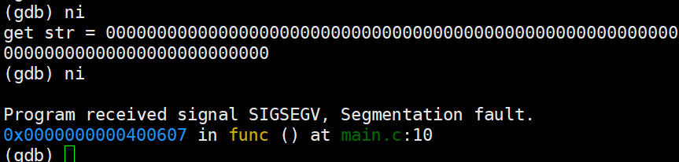

==============
编程安全&RUST
==============
学习要求: 
 - 熟练使用掌握C语言
 - 已经学习过计算原理
 
学习时间: 7 days

前言
======

参考
--------
这门课程真的很好: https://reberhardt.com/cs110l/spring-2021/

官方基本入门书籍: 
 原版英文: https://doc.rust-lang.org/stable/book/title-page.html
 中文: https://rustwiki.org/zh-CN/book/

补充: 
  - CS234 Program Analysis and Optimizations
  
说明
-----
主要围绕讨论C语言得编程安全，然后看如何解决这些问题，最后在看RUST是如何解决这些问题

编程安全
=========

bug和安全
==========

栈覆盖
--------
看一下下面得代码，看看有什么问题

.. code-block:: C

	#include <stdlib.h>
	#include <stdio.h>
	
	void func()
	{
		char str[100];
		gets(str);
	
		printf("get str = %s \n",str);
	}
	
	int main()
	{
		func();
		return 0;
	}

我们尝试调试一下:

.. image:: ./image/1.png
 :width: 400px

在进入函数 实际查看一下栈内容:

.. image:: ./image/2.png
 :width: 800px

从这个图，我们也可以得知新的函数得栈大小为 0x70,并且变量str 也指向了栈得新地址；我们知道栈是向上增长得；
设想一下，如果我们写入字符串超过0x70(102bytes) 会发生什么

.. image:: ./image/3.png
	:width: 800px

程序最后报错了，原因你也一定清楚了，PC指向了非代码段

让我们在回顾一下，上面错误是引起了系统异常，如果我们把内容覆盖成为一个恶意代码得地址？好吧，那你电脑可能就会被攻陷了；让我们尝试修复一下这个代码：

.. code-block:: C

	struct Packet {
		int len;
		char *data;
	};

	void writePacket(struct Packet *p)
	{
		printf("packet:%s len is %d\n",p->data,p->len);
		char str[100];
		if (p->len < 100) {
			snprintf(str, p->len, "%s", p->data);
		}
		printf("get str is %s\n",str);
	}
	
	int main()
	{	
		struct Packet p = {10, "123456789"};
		writePacket(&p);
		p.len = -1;
		p.data = "00000000000000000000000000000000000000000000000000000000000000000000000000000000000000000000000000000000000000000000000000000000000000000000";
		writePacket(&p);
		return 0;
	}

你会发现，明明做了检查了 为什么还是会失败? 好吧，snprintf第二个参数是size_t，是unsigned int; 这里发生了类型转换，就算检查成功，负数会变成一个很大的无符号数 

OK，我们可以把上面的问题怪程序员吗？
 - 我们无法保证每一个编程人员都是优秀的程序员(基础理论很扎实，具备安全意识)
 - 无法保证优秀的程序员不会犯错：是的，常在河边走 哪有不湿鞋 

总结
^^^^^
本小节，我们尝试向你展示bug很多时候是无法避免的，而且bug带来的问题以及影响是非常大的

发现bug的技术
-------------
为了发现代码中的bug，自从程序诞生以后，就一直在发展了，到今天主要使用的是两个策略:

动态分析:
  - 把程序在一个环境运行起来
  - 程序加一个监控器，用于观察程序运行期间是否存在不正确的行为

静态分析: 
  - 模拟人们阅读检查代码，需要特定检查规则，通过语法和词义分析，查找代码是否存在问题

动态分析工具：valgrind
^^^^^^^^^^^^^^^^^^^^^^^^
valgrind 主要用于监控堆内存，核心实现是对malloc/free wrap，这样程序堆上的内存都在他的监控之下，从而可以判断程序对这些内存的合法使用，可以用来检查

 - 堆内存的非法访问(访问没有申请或者已经释放的内存 uaf)
 - 堆内存的重复释放(double free)
 - 堆内存泄漏(mem leak)

下面是一个示例:可以看到 valgrind 可以监控到堆内存的越界以及泄漏，但是无法识别栈上的内存越界
 
.. code-block:: c
	
	#include <stdio.h>
	#include <stdlib.h>
	
	void stack_access(int stack_size, int access_size)
	{
		char str[stack_size];
		str[access_size] = 'a';
	}
	
	void heap_access(int alloc_size, int access_size) 
	{
		// allocate a heap mem
		char *str = (char *)malloc(alloc_size);
		// access heap mem overflow
		str[access_size] = 'a'; // maybe happend  stack  overflow
		free(str);
	}
	
	void user_after_free() 
	{
		// allocate a heap mem
		char *str = (char *)malloc(8);
		free(str);
		str[1] = 'a'; // happend  uaf
	}
	
	void double_free() 
	{
		// allocate a heap mem
		char *str = (char *)malloc(8);
		free(str);
		free(str);
	}
	
	int main()
	{
		//stack_access(10,9); // ok 
		//stack_access(10,10); // stack overflow 
		//heap_access(10,9); // ok 
		//heap_access(10,10); // heap overflow
		//user_after_free(); // heap overflow
		double_free(); // heap overflow
		return 0;
	}

缺点:  
  - 由于只有程序对于堆的使用分析。比如统计出来有内存泄漏,但是无法明确知道内存泄漏原因，缺少程序信息
  - 无法监控栈上内存: 栈上的内存溢出、访问越界等问题无法发现(栈上的内存无法从程序推导，如果你看过汇编，栈上内存使用都是利用rbp + offset 使用，并没有人告诉我们这个内存是谁在使用，这个内存有效范围是多少)

动态分析工具：llvm Sanitizers
^^^^^^^^^^^^^^^^^^^^^^^^^^^^^^
valgrind由于缺少源码信息，sanitizer 我们知道，他是LLVM 的一个工具，这个工具可以在编译阶段利用分析源码，获得更多的信息，相比较valgrind 功能更加强大，可以用来发现栈上的内存问题 

 - addressSanitizer: 检测到内存越界、double free、uaf 等问题
 - leakSanitizer: 查找是否存在内存泄漏
 - MemorySanitizer：内存消毒，查找是否使用未初始化的内存
 - UndefinedBehaviorSanitizer： 查找是否存在空指针访问、整型越界
 - ThreadSanitizer： 线程并发相关

动态分析的痛点
^^^^^^^^^^^^^^^^
动态分析最根本的问题在于: 
 - 只能够发现已经发生的问题
 - 如果程序依赖外部输入，并且外部输入的可能性非常多(常常是这样的 而且几乎等于无限种可能,我们预期的输入可能只是一个很小的范围，非预期的输入可能是无限的)，

一般我们需要利用FUZZ 和 动态分析工具一起使用；FUzz通过随机输入，用以测试程序，FUZZ在生产环境是一个非常有效的工具，但是还是有可能无法进入异常代码；随机并不等于一定会触发异常  

静态分析工具： clang-tidy
^^^^^^^^^^^^^^^^^^^^^^^^^^
静态扫描工具，原理就是分析源码，其中使用最为广泛的技术就是数据流分析

存在的缺陷是: 
 - 某段代码非常复杂(比如 存在while循环)，静态分析就会失效，为甚么? 如果静态分析把循环测试一遍 那不就等于是在运行程序了吗？开销太大
 - 会又可能产生误报，一些根本永远不可能存在的分支经常也会被统计进来

实验
^^^^^
通过实验学习这些工具并加深理解 
https://reberhardt.com/cs110l/spring-2021/assignments/week-1-exercises/

总结
^^^^
本节我们学习了 动态bug检查工具: valgrin  santizer fuzz ; 以及静态分析工具 clang-tidy；他们都有各自适用的场景，也都有各自无法解决的问题，那么到底有没有更好的方案? 

回归到本质；检测bug 是因为代码有bug，但是是否思考过 为什么代码会有bug？

因为任何一个程序员(包括我)，我们的关注点在于 如何写出功能正常的代码；但是黑客们的关注点是如何能找到这个代码的漏洞；

两者不同的关注点，决定了精力分配的不同；所以核心点在于，是不是改变程序员的行为习惯？或者是让编程语言自身就具备解决这些问题的能力？ 确实是，比如JAVA，他的GC以及类型系统，可以说解决了内存泄漏以及内存访问越界的问题；但是由于java性能可能还是没有那么好，因此我们又有了RUST

RUST
=====

介绍
-----
RUST 是一门聚焦 安全、性能 的语言 

思考: 我们都知道，所有的程序本身最终都是指令，指令是没有意义的；C语言基本上算是最接近汇编的语言，C语言自己本身
是不负责 更高级的特性(比如访问某个数组越界 爆栈、内存泄漏)，一般都需要编写对应的代码、或者依赖编译器去完成这些工作，不可避免的，这些检查会带来性能的下降(为了安全检查，需要更多的指令) 

当然，也有高级语言 比如JAVA PYTHON等等，在java里面编程，写代码的人不需要关心内存的申请和释放，这些工作java垃圾回收机制负责解决；

事实上，很多高级语言内部提供了并发、内存、安全机制，RUST就是这样一门语言,专注于安全和性能;

基本工具
------------
RUST提供了一些工具负责用于提升开发效率和标准:
 
 - Cargo，内置的依赖管理器和构建工具，它能轻松增加、编译和管理依赖，并使其在 Rust 生态系统中保持一致。
 - Rustfmt 确保开发者遵循一致的代码风格。熟悉clang-format/python-format的人对这个一定不陌生
 - Rust Language Server 为集成开发环境（IDE）提供了强大的代码补全和内联错误信息功能。

安装
-----
参考书中的install章节: https://rustwiki.org/zh-CN/book/ch01-01-installation.html

cargo
------------
总结
^^^^^ 
 - 新建空项目: cargo build 
 - 项目文件 Cargo.toml :版本 依赖 说明
 - 项目文件 Cargo.lock: 记录依赖详细版本
 - 项目文件 src: 项目源码
 - 构建项目: cargo build {--release}
 - 构建文件 target/debug{release}/ : 构建产出
 - 构建并运行项目: cargo run 
 - 清理项目： cargo clean
 - 检查项目： cargo check
 - linter: cargo clippy

开发环境工具
--------------

https://www.rust-lang.org/tools 官网指导 我们使用VIM 

在线平台
^^^^^^^^^^
入门学习的利器，可以在线验证知识点，加深理解
https://play.rust-lang.org/

VIM：语法支持  
^^^^^^^^^^^^^
这里假设你已经知道如何使用基本的 cargo 命令, 如果是在linux开发，得到类似C语言里面的ctags/csscope的文件、定义跳转，需要配置VIM 

rust.vim 插件安装 参考: https://github.com/rust-lang/rust.vim

.. code-block:: console
    :linenos:
	
	git clone --depth=1 git@github.com:rust-lang/rust.vim.git ~/.vim/bundle/rust.vim

VIM：补全支持
^^^^^^^^^^^^^
使用 rust-analyzer 可以支持RUST 定义跳转以及自动补全功能
https://rust-analyzer.github.io/

.. code-block:: console
    :linenos:
	
	$ rustup component add rust-analyzer

rust-analyzer 被默认安装在~/.cargo/bin

安装coc.vim 

核心理念
---------

所有权
^^^^^^^
所有权(这里指内存)是RUST的一个核心设计理念，但是我想说，所有权的概念并不是只在RUST里面存在，实际上在任何一个语言都存在； 设想一下，C语言里面，任何一个对象， 如果是通过malloc(堆上)分配出来的,必然也需要有人去释放他,一般如果你曾经有过类似的开发经验，相信看到过类似 xxx_create() xxxx_destroy()的成对出现的函数，但是C语言里面虽然有所有权的概念，但是并不清楚，可能API只是简单告诉你，你从我这里分配了内存，使用完以后，你需要自己释放他，随着代码规模以及并发的出现，到底应该是谁去释放，可能就说不清楚了，因此会出现类似于 double free,UAF的问题；RUST 通过加强所有权的概念,明确编程人员必须要有这个意识，否则代码就会编译不通过 让我们看下面这个例子： 

.. code-block:: c

	fn main() {
		let john = "bear jony".to_string()
		let kent = john 
		println!("{}", john)
	}

试试看，会发生什么，rustc 会提示我们 john是无效的变量，why? 

所有权的原则: 
 - RUST中，每一个堆上的内存，都有一个变量对应，这个变量是这个内存的所有者
 - 在同一时间，变量只允许有一个所有者
 - 当拥有所有权的变量从作用域退出后，该内存被释放

实现这个机制的方法是RUST的默认行为

如果变量不是在堆上申请的(基本类型)，则需要实现copy(如果实现了copy 就不应该在实现drop)

.. code-block:: c

	fn main() {
		let john = 10;
		let kent = john; 
		println!("{}", john);
	}

上面代码是没有错误的，这个时候，在栈上会存在 john 和 kent 两个变量

堆上内存的复制 可以通过类型的clone 实现，下面这段代码是正常的，会在函数结束后，销毁两份内存

.. code-block:: c

	fn main() {
		let john = "bear jony".to_string();
		let kent = john.clone(); 
		println!("{}", john)'
	}

堆上内存的销毁会在离开作用域之后，自动通过调用类型的 drop 实现，类似于C++里面的析构函数

借用
^^^^^
借用基本概念，为什么需要借用? 看下面代码：

.. code-block:: c

	fn show_vec(kent: Vec<i32>) {
		println!("{}", kent[0]);
	}
	fn main() {
		let john = vec![1,2,3];
		show_vec(john); 
		println!("{}", john);
	}

上述代码执行rustc 编译也会报错，原因是因为函数传参，也会把所有权从john传递给函数,这样导致的结果就是主函数失去了变量所有权(虽然我们可以通过函数返回值再把所有权交接回来)

RUST中提出了借用的概念,借用的核心概念类似C里面的引用(只是类似),他的理念是这样的：

 - 所有者可以把内存临时借用给其他人，借用内存的那个人，临时拥有内存，用完要归还给所有者
 
思考一个问题，如果借用也是一个类型，借用有没有所有权的概念？

.. code-block:: c

	fn main() {
		let s = String::from("你1234567");
		let s1 = &s;
		let s2 = s1; //s1有所有权概念吗? 是否会把所有权交给s2n? 
		
		println!("{}", s1);
		println!("{}", s2);
	}

 
讲到这里，就必须要提 可变变量,我的内存借给别人，他能不能修改？如果我内存借用给了好几个人，这些人都对内存
修改会出现什么情况？

可变变量
^^^^^^^^^^
RUST 默认变量都是不可变的 先参考下面代码

.. code-block:: c

	struct Vector {
		int len;
		int capacity;
		int *data;
	}
	
	struct Vector *vec_new(int capacity) {
		struct Vector *new = (struct Vector *) malloc(sizeof(struct Vector));
		new->capacity =  capacity;
		new->len =0;
		new->data = (struct int *)malloc(sizeof(int) * capacity);
		return new;
	}
	
	void vec_push(struct Vector *vec, int a) {
		if (vec->len == capacity) {
			free(vec->data);
			int *old = vec->data;
			vec->data = (struct int *)malloc(sizeof(int) * 2*vec->capacity);
			vec->capacity = 2*vec->capacity;
			memcpy(vec->data,old,sizeof(int)*len);
		}
		vec->data[len] = a; 
		vec->len++;
	}
	
	int main() {
		struct Vector *vec = vec_new(1);
		vec_push(vec,1);
		int *n = &vec->data[0];
		vec_push(vec,2);
		printf("n = %d\n",*n);
	}

看一下上面代码有什么问题？*n引用了vec的某个内存，但是经过vec_push 执行扩容以后，该内存失效了
出现这个问题的原因是：当有人在使用(这里是read)，但是同时有人可以修改内存

可变变量的核心问题就是 : 解决内存异常修改的

首先，RUST默认变量都是不能够修改的(类似于C里面,默认给每个变量加了const修饰);

.. code-block:: c

	fn main(){
		let john = vec![1,2,3];
		vec.push(4);
	}

上面代码会报错，如果希望某个变量是可以修改，可以通过增加mut 修饰 

.. code-block:: c

	fn main(){
		let mut john = vec![1,2,3];
		vec.push(4);
		println!("{}", john[3]);
	}

我们已经知道变量可以借用，并且变量也有可变变量一说，那么他们俩碰撞会有什么样的火花？

定义一个不可变变量，传入一个不可变的引用：

.. code-block:: c

	fn int_add(kent: &i32) {
		*kent+=1; //尝试修改引用内存，因为是一个不可变引用 因此会报错
	}
	
	fn int_show(kent: &i32) {
		println!("{}", *kent); //访问一个不可变引用 可以工作
	}
	
	fn main(){
		let john = 1;
		int_add(&john); //不可以工作
		int_show(&john);//可以工作
		println!("{}", john);
	}

看到，因为传入函数的是一个不可变的引用，因此函数内部不允许修改变量

不可变变量 + 可变引用：

.. code-block:: c

	fn int_add(kent: &mut i32) {
		*kent+=1; 
	}
	
	fn main(){
		let john = 1;
		let mut_refer = &mut john;//不可以工作 不可变变量不能有可变引用
		int_add(mut_refer); 
		println!("{}", john);
	}

可变变量 + 可变引用：

.. code-block:: c

	fn int_add(kent: &mut i32) {
		*kent+=1; //尝试修改引用内存
	}
	
	fn main(){
		let mut john = 1;
		let mut_refer = &mut john;//可以工作，可变变量可以有可变引用
		int_add(mut_refer);
		println!("{}", *mut_refer);
	}

这里我们使用了一个新的语法，引入了可变变量引用的变量 mut_refer,这样，该引用生命周期会延长

因此：
 - 如果原始变量是可变的，可以使用可变引用；也可以使用不可变引用
 - 如果原始变量是不可变的，不可以使用可变引用;

可变变量:同时拥有可变引用和不可变引用：

.. code-block:: c

	fn int_add(kent: &mut i32) {
		*kent+=1; 
	}
	
	fn int_show(kent: &i32) {
		println!("{}", kent);
	}
	
	fn main(){
		let mut john = 1;
		int_show(&john); //可以工作
		int_add(&mut john); //可以工作
		println!("{}", john);
	}

让我们在升级一个版本

.. code-block:: c

	fn int_add(kent: &mut i32) {
		*kent+=1; 
	}
	
	fn int_show(kent: &i32) {
		println!("{}", kent);
	}
	
	fn main(){
		let mut john = 1;
		let imu_refer = &john;
		let mut_refer = &mut john;
		int_show(imu_refer); //可以工作
		int_add(mut_refer); //可以工作
		println!("{}", john);
	}

我们看到报错了？为什么？

这里在同一个生命周期范围内，出现了两个引用，一个可变引用 一个不可变引用；RUST不允许这种情况出现

 - 可变变量，允许作为不可变的引用借给多个人
 - 可变变量，只允许作为可变引用同一时间借给一个人，此时不允许在作为可变或者不可变引用借给其他人
 
上面两条原则核心目的在于解决内存在同一时间只允许被一个人修改(此时不允许任何人访问);允许多个人同时访问；
有点类似于读写锁的概念；但是他是在编程上就做了这个限制

让我们看最后一个例子：

.. code-block:: c
	
	fn main()
	{
		let mut s = String::from("hello"); //可以通过s修改字符串
		let s1 = &mut s; // 可以通过s1修改字符串
		
		//版本1
		println!("{}",s1); //Rust 可以检查s1引用生命周期在这里结束 并且在借给S1使用期间 没有再次使用变量
		println!("{}",s); // 完成S1借用 这里已经归还给了变量s 之后只有s自己使用
		
		//版本2
		println!("{}",s);  // 此时S已经借给了s1，并且s1还没有使用完，这个时候使用变量，是不正确的(借给别人怎么还能使用呢)
		println!("{}",s1); 	
 	}

总结
^^^^^
所有权、借用、(不)可变变量、(不)可变引用 这些概念以及使用规则是RUST 关于内存最重要的理念，正是因为有了这些规则对代码的约束; 极大程度的减少了内存bug

入门语法
---------
是时候简单介绍一些基本类型和语法 以便于继续下面的学习

基本类型
^^^^^^^^^^
和C类似，RUST的基本数据类型有：

 - 符号整数：  i8 i16 i32 i64 i128 以及 isize(平台相关 指针宽度)
 - 无符号整数: u8 u16 u32 u64 u128 以及 usize
 - 浮点数： f32 f64 
 - char: 单个unicode字符,4byte 
 - bool: 只能是true 和 false 
 - 单元类型 unit：() 只能为空

.. note::

	基础类型的赋值(copy) 是值copy（内存都是栈上内存）,虽然基础类型没有所有权转移，但是依然遵循借用规则

.. code-block:: c

	fn main() {
		let mut s = 10;
		let mut s1 = &mut s;
	
		println!("{}",s); // 错误，s已经作为可变变量借用给了 s1
		println!("{}",s1);
	}

String类型
^^^^^^^^^^^
在RUST里面有两个string 类型， 我们先介绍String 类型， 需要注意的有两点: 

 - String 是一个长度可变的字符串，内存从堆上分配
 - String 遵循所有权
 - String 内部以UTF-8编码
 - String 类型的基本结构为 3word字节 (capcity：  data:  len: )
 
.. code-block:: c

	let mut s: String = String::from("Hello "); // mut tell use this s is mutable
	s.push_str("world!");
	s.replace_range(.., "123"); // 可能破坏 UTF-8编码
	let s2 = String::from("second word");
	let s3 = s1 + &s2; // 这里 s1的所有权已经move
	println!("{}", s1); // 错误

字符串切片
^^^^^^^^^^^
字符串切片是字符串部分值得*引用*，初始化为：
 
.. code-block:: c

	fn main() {
	
		let mut s = String::from("hello world");
	
		let hello = &s[0..5];
		
		let world = &s[6..11];
		
		s.clear(); //错误， s此时被 world 切片引用
		println!("{}",world);	
	}

当字符串被切片引用期间，字符串不能修改

切片得优势: 允许我们在仅使用部分内存时，依然能够享受 所有权 借用规则

变量声明
^^^^^^^^
RUST的变量声明格式为 :  let  + {mut} + 变量名 + {: 类型}   

 - mut 是可选的，用来声明可变变量，可变变量下一小节说明
 - :类型: 类型说明是可选的，关于默认类型推导后面专门说明
 
.. code-block:: c

	#声明变量
	let int32: i32 = 123;
	let mut int32: i32 = 123;

变量类型推导
^^^^^^^^^^^^^^
上一小节，我们说变量声明的类型可能是可选的，RUST 提供以下几种机制，在编译阶段，自动推导出类型

 - 显示给出类型：  let a : i32 显示声明a 的类型为i32 
 - 通过后缀:  let a = 12i32， 利用初始值的后缀 声明a的类型为i32
 - 默认类型:  let a = 12;  RUST 默认整数类型为 i32 浮点型默认为 f64 
 - 上下文推断: RUST 不仅仅只是根据初值定义类型，还可以通过上下文的使用 决定类型

关于(不)可变 在之前我们已经介绍过 不在强调

(不)可变数组
^^^^^^^^^^^^^^
Vec 是RUST提供的可变数组类型 下面是一个示例：

.. code-block:: c

	let mut v: Vec<i32> = Vec::new();
	v.push(2);
	v.push(3);
	// Even here, the ": Vec<i32>" type annotation is optional. If you omit it, the
	// compiler will look ahead to see how the vector is being used, and from that, it
	// can infer the type of the vector elements. Neat!

固定大小的数组，C里面的固定数组，发生访问越界是不会报错的，Rust如果发生数组越界 会报错

.. code-block:: c

	let mut arr: [i32; 4] = [0, 2, 4, 8];  // 声明使用 类型；大小
	arr[0] = -2;
	println!("{}", arr[0] + arr[1]);
	
函数声明
^^^^^^^^^^^^
 - fn用来声明函数，其余和C一样

函数参数
^^^^^^^^^
 - 通过(var1 : datatype,  var2 : datatype) 定义了两个类型的变量

语句&表达式
^^^^^^^^^^^^^
本小节对于习惯使用C 但是第一次解除RUST的人可能有点别扭，RUST有一个叫做表达式的概念；
从代码直观编程上看，语句是有”;“ 作为结尾的， 表达式没有 ";"  下面是一个最直观的例子

.. code-block:: c

	fn main() {
		let y = {
			let x = 3;
			x + 1
		};
		println!("The value of y is: {}", y);
	}
	
这里使用的是一个块表达式

函数返回值
^^^^^^^^^^^^

 - 通过类似 fn a() -> i32 {} 定义一个返回值是i32类型的函数
 - 函数返回值 必须通过表达式的形式返回,RUST没有return 关键字 

下面是一个简单的示例:

.. code-block:: c

	fn main() {
		let x = plus_one(5);

		println!("The value of x is: {}", x);
	}

	fn plus_one(x: i32) -> i32 {
		// x + 1;错误
		x+1 //正确
	}

练习:shopping list
^^^^^^^^^^^^^^^^^^
请先尝试自己通过google 或者chatgpt 完成一个小程序实现如下功能：终端接收购物清单，结束输入done 然后打印

.. code-block:: c

	🍓  cargo run
		Finished dev [unoptimized + debuginfo] target(s) in 0.03s
		Running `target/debug/part-2-shopping-list`
	Enter an item to add to the list: apples
	Enter an item to add to the list: bananas
	Enter an item to add to the list: cucumbers
	Enter an item to add to the list: done
	Remember to buy:
	* apples
	* bananas
	* cucumbers

错误处理
---------
错误处理机制，在任何一门语言都是常见并且必要的，在进入RUST 的错误处理之前，先回顾一下主流语言的处理方式和存在问题

C的错误处理
^^^^^^^^^^^^^
C里面最常见的错误返回一般是: 
 
 - 0 表示成功，-1表示失败， 错误原因通过修改errno记录
 - 如果返回值是一个指针(void *) NULL表示失败，非NULL表示成功
 
不得不说，其实C里面的错误处理是最简单，看一下下面的示例

.. code-block:: c

	/*
	 * 成功返回0 失败返回-1
	*/
	int func(chat *str)
	{
		int errno = 0;
		errno = recive_packet(str); // return recive packet size
		if (errno < 0) {
			printf("recive_packet is errno\n");
		}
		
		return errno; // this is wrong; errno maybe any num
		return errno < 0 ? -1 : 0;
	}
	
	int main()
	{
		char str[20];
		int ret = func(str);
	}

看一下上面代码；应该是C里面经常会犯的错误；由于每个函数对错误可能都有不同的理解,因此C对于错误的处理有这些痛点: 
  
  - 不同函数对于返回值有不同的解释
  - 错误在逐层向上传递的时候,每一级都处理正确，如果哪里处理不正确，就可能会产生bug
  - 由于每一级都需要错误检查，因此代码中可能存在大量的错误检查代码，影响可读性

异常
^^^^^^
由于C/C++经常由于对返回值漏检查，因此，现在大多数语言都使用了异常机制，如果你使用过异常机制，你会发现他得最大特点在

 - 如果函数调用链某一个环节发生了错误(没有处理异常) 该异常会一直向上传递，直到有人捕获他或者触发main crash 
 - 异常得好处在于，如果错误没有被捕获，程序不会在错误状态下继续运行
 - 不需要向C一样，在每一级都处理异常，优化了代码
 
但是异常也引入了一些新的问题，在C里面，由于错误会被一层一层处理，因此一旦错误发生，是比较容易追溯；而且当前函数只需要关注calle可能得错误即可；
但是由于异常引入，导致可能错误陷入很深，并且如果中间调用者也不对错误进行正确捕获，最终也会导致异常无法追溯

总结一下，错误处理在编程中是必须要处理得，好的错误处理应该完成这些功能

什么是好的错误处理
^^^^^^^^^^^^^^^^^^

 - 每一级调用的错误是明确的，并且需要正确的处理
 - 虽然错误都要捕获，但是最好不要有很多检查代码，错误处理代码应该尽可能优雅简洁，可读性要好，尽量和正常逻辑有明显得分界线(C做的不好 异常得try catch 是一个好的例子)
 

enum 枚举
^^^^^^^^^^
在正式介绍RUST 错误处理之前，先简单介绍一下 RUST 中的枚举,枚举基本上和C 类似，看下面代码 

.. code-block:: c
 
	enum COLOR {
    Red,
    Yellow,
    Blue,
	}

	fn func(color: COLOR) {
		match color {
			COLOR::Red =>  println!("red"),
			COLOR::Yellow =>  println!("Yellow"),
			//COLOR::Blue =>  println!("Blue"), this would error
		}
	}
	
	fn main() {
		func(COLOR::Red);
		func(COLOR::Yellow);
		func(COLOR::Blue);
	}   

一个简单的枚举使用示例，match 类似于switch case, 一个match 必须要匹配所有的枚举值，当然也有一种默认写法 

.. code-block:: c
 
	enum COLOR {
    Red,
    Yellow,
    Blue,
	}

	fn func(color: COLOR) {
		match color {
			COLOR::Blue =>  println!("Blue"),
			_ =>  println!("not blue"),
		}
	}
	
	fn main() {
		func(COLOR::Red);
		func(COLOR::Yellow);
		func(COLOR::Blue);
	}   

试一下把 _ =>  println!("not blue"), 放到第一行 看看会发生什么？ match 是顺序匹配的, _ 隐含有匹配所有的含义

枚举也允许指定不同的类型，看示例 

.. code-block:: c
 
	enum COLOR {
    Red(i32),
    Yellow(String),
    Blue,
	}

	fn func(color: COLOR) {
		match color {
			COLOR::Red(a) =>  println!("red value is {}",a ),
			COLOR::Yellow(s) =>  println!("string value is {}",s),
			COLOR::Blue =>  println!("blue"),
		}
	}
	
	fn main() {
		func(COLOR::Red(100));
		func(COLOR::Yellow("Hello".to_string()));
		func(COLOR::Blue);
	}   

Result&?
^^^^^^^^^^^^^
Result 是一种枚举类型 

.. code-block:: c

	enum Result <T,E> {
		Ok(T),
		Err(E),
	}

这段代码利用了类似C++泛型的概念，暂时先不关注；Result 是预定义在RUST 标准类型库的，也就是我们不需要自己定义，可以直接使用

.. code-block:: c

	fn get_num(i: i32) -> Result<i32, &'static str> {
		if i%2 == 0 {
			Ok(i)
		} else {
			Err("not invaliable") 
		}
	}

	fn main() { 
		match get_num(11) {
			Ok(i) => println!("get num {}",i),
			Err(s) => println!("get num failed {} ",s),
		}
	}

Result 枚举返回值主要解决什么问题？ 

 - Result 明确了函数一定有是有正确和错误返回值的(Ok Err) 
 - Result 明确了调用者必须要合理对待区分不同返回值

还有哪个问题没有解决？
 - match 引入了代码检查分支，此时代码依然还是比较冗余的，可读性不好 

让我们看一个片段

.. code-block:: c

	fn read_file(filename: &str) -> Result<String, io::Error> {
		let mut s = String::new();
		let result = File::open(filename);
		
		let mut f = match result {
			Ok(file) => file,
			Err(e) => return Err(e);
		};
		
		match f.read_to_string(&mut s) {
			OK(_) => Ok(s),
			Err(e) => Err(e),
		}
	}

为了正确处理返回值，我们依然不得不写很多的match 逻辑，为了简化这种逻辑，RUST 提供了 精简版的写法

.. code-block:: c

	fn read_file(filename: &str) -> Result<String, io::Error> {
		let mut s = String::new();
		let mut f = File::open(filename)?;

		f.read_to_string(&mut s)?;
		Ok(s),
	}

?的意思是，如果返回值是Err,则会在当前代码停止并直接返回错误，如果OK，则帮助我们把ok内容返回

.. code-block:: c

	fn read_file(filename: &str) -> Result<String, io::Error> {
		let mut s = String::new();
		File::open(filename)?.read_to_string(&mut s)?;
		Ok(s),
	}

Result panic& unwrap expect
^^^^^^^^^^^^^^^^^^^^^^^
panic 使用场景一般发生在: 当某个错误发生以后，程序无法恢复 最简单的panic 是: panic! 宏

.. code-block:: c

	panic!("this error unrecoverable")

RUST 还提供了一种错误处理，如果calle的错误我们不需要自己处理(不是忽略) 默认错误发生动作不再是return(见?) 而是直接panic 可以使用 unwrap 和 expect 

.. code-block:: c

	fn read_file(filename: &str) -> String {
		let mut s = String::new();
		let mut file = File::open(filename).unwrap(); //OK，解压OK内容并且返回，否则panic 
		let mut file = File::open(filename).expect("failed to open file"); // OK，解压OK内容并且返回，否则panic 并提供更多信息
	}

option
^^^^^^^
Option 也是一个enum 类型 

.. code-block:: c

	enum Option <T> {
		Some(T),
		None,
	}

相比较Result,Option 不在提供Err的返回，而是用Some替换了Ok,用None 替换了Err, 这种相比较Result 有以下好处：

 - 当我们有一个函数 比如是 get_vec 从数组获取某个元素，当获取不到的时候，不应该被看作是错误或者是异常，而应该作为空值正常处理

 .. code-block:: c
 
 
	use std::fs::File;
	use std::io::Read;
	
	fn read_file_no_err(filename: &str) -> Option<String> {
		let mut s = String::new();
		let mut f = match  File::open(filename) {
		    Ok(file) => file,
		    Err(e) =>   { 
		            println!("open failed"); 
		            return None;
		    },
		};
		
		match f.read_to_string(&mut s) {
		    Ok(_) => Some(s),
		    Err(e) => return None,		    
		}
	}
	
	fn main() {
	    let op = read_file_no_err("./a.txt");
	    if op.is_some() {
	        println!("read string {} ", op.unwrap());
	    } else {
	        println!("read None");
	    }
	}

这里我们重新定义了readfile的返回值，如果失败，返回None，成功则返回读取的字符串

Option如何获取Some的值？ Option也支持和Result的一样的语法, ?

 .. code-block:: c

	fn get_num(num: i32) -> Option<i32> {
		if num % 2 == 0  {
			return Some(num);
		}
		None
	}
	
	fn test(num: i32) -> Option<i32> {
		//let some_val = get_num(num)?;
		//let some_val = get_num(num).unwrap();
		let some_val = get_num(num).expect("invalid num");
	
		Some(some_val+1)
	}
	
		
	fn main() {
		let val = test(13);
		if val.is_some() {
			println!("get num success {}", val.unwrap());
		} else {
			println!("get num None");
		}
	}
	
总结
^^^^^^
 - RUST 支持错误返回类型经常使用 Result 和 Option 两个枚举类型 
 - Result 和 Option 都支持 ? 辅助，正确情况可以用来获取 Ok/Some value, 错误情况支持 对 Err() None的返回
 - Result 和 Option 都支持unwrap/expect，正确情况可以用来获取 Ok/Some value, 错误情况触发panic 
 - Option 相比较Result 多了 is_some 和 is_none 的判断，使用者根据自身情况使用
 - Option 相比较Result 多了 unwrap_or, 当返回值为None的情况下，用来返回默认值 

控制流
-------

C的控制流 我们直到有 if, switch ,(do)while ,for, goto  
RUST的控制流关键字为：if,while,for,loop

if分支
^^^^^^^^
下面是一个典型示例，注意观察if后面不需要(),并且if后只能是 bool类型

.. code-block:: c 

	fn main() {
		let number = 6;

		if number % 4 == 0 {
			println!("number is divisible by 4");
		} else if number % 3 == 0 {
			println!("number is divisible by 3");
		} else if number % 2 == 0 {
			println!("number is divisible by 2");
		} else {
			println!("number is not divisible by 4, 3, or 2");
		}
	}

loop
^^^^^
我们直到,C里面的所有loop实现，其实都是 跳转+test指令完成的，RUST的loop版本默认是不带test
下面是一个简单的示例,该函数会一直执行loop中的语句 

.. code-block:: c

	fn main() {
		loop {
			println!("again!");
		}
	}
	
如果需要增加test，可以通过if + break实现

.. code-block:: c

	fn main() {
		let mut cnt = 0i32;
		loop {
			cnt+=1;
			println!("again!");
			if cnt == 9 {
			    break;
			}
		}
	}
	
另外需要注意,C语言只能通过goto语句实现多层嵌套的跳转，RUST对此做了升级，支持loop 增加label

.. code-block:: c

	fn main() {
		let mut count = 0;
		'counting_up: loop {
			println!("count = {}", count);
			let mut remaining = 10;
	
			loop {
				println!("remaining = {}", remaining);
				if remaining == 9 {
					break;
				}
				if count == 2 {
					break 'counting_up;
				}
				remaining -= 1;
			}
	
			count += 1;
		}
		println!("End count = {}", count);
	}

这里可以简单认为，RUST 支持给loop打label，并且break 隐含有goto的含义

break  还支持另外一个功能，那就是带着返回值退出循环，该功能主要用于异常循环退出的解释

.. code-block:: c

	fn main() {
		let mut counter = 0;
	
		let result = loop {
			counter += 1;
	
			if counter == 10 {
				break counter * 2;
			}
		};
	
		println!("The result is {}", result);
	}

while
^^^^^
和C一样，C里面 while 只不过是do while的变异版本，RUST里面，while也是loop的一种封装版本，把if break作为
while 的条件，由于基本和C实现一样，只给出示例，不过多说明

.. code-block:: c

	fn main() {
		let mut number = 3;
	
		while number != 0 {
			println!("{}!", number);
	
			number -= 1;
		}
	
		println!("LIFTOFF!!!");
	}

for
^^^^^
RUST的for实现有点类似于python等上层语言，支持对高级类型的遍历，下面是一个对vector类型的遍历

.. code-block:: c

	fn main() {
		for number in (1..4).rev() {
			println!("{}!", number);
		}
		println!("LIFTOFF!!!");
	}

大练习：RUST实现链表
---------------------

在真正实现链表之前，先让我们介绍一些前置内容

box
^^^^

BOX 在RUST 里面是一个堆内存指针的概念，见代码

.. code-block:: c

	fn main() {
		let box_ptr: Box<i32> = Box::new(10);
		println("{}",box_ptr);
		println("{}",*box_ptr);
	}

上述代码隐含有: 

 - 在堆上分配了一个4byte的内存，并用10去初始化他(BOX内部类型必须是大小确定的) 
 - box在生命周期结束后，会自动调用drop，释放内存(内存自动释放)
 - 使用"*box_ptr" 和 "box_ptr" 效果是一样的，因为RUST会自动解引用

结构体定义
^^^^^^^^^^^

.. code-block:: c

	struct Node {
		value: i32,
		//Option是因为next可能为None,为什么这里用Box<Node> 而不是 &Node ? 
		next:  Option<Box<Node>>, 
	}
	
	struct LinkedList {
		head: Option<Box<Node>>, //指向节点头
		size: usize, // 声明链表大小
	}

之前我们已经学习过引用(借用)了，结构体里面不允许使用 &Node 引用类型，想一下，RUST为了保证所有权，需要检查借用期间是否有其他可变变量(引用),在使用，而定义在结构体里面的引用无法实现这个功能, 无法解释自己是从哪里借用的

面向对象的方法
^^^^^^^^^^^^^^^
可以给类定义方法，看代码

.. code-block:: c

	struct Node {
		value: i32,
		//Option是因为next可能为None,为什么这里用Box<Node> 而不是 &Node ? 
		next:  Option<Box<Node>>, 
	}
	
	struct LinkedList {
		head: Option<Box<Node>>, //指向节点头
		size: usize, // 声明链表大小
	}

	impl Node {
		pub fn new(value: i32, next: Option<Box<Node>>) -> Node {
			Node {value: value, next: next}
		}
		
		pub fn show(&self) {
			println!("{}", self.value);
		}
	}	
	
	impl LinkedList {
		pub fn new() -> LinkedList {
			LinkedList {head: None, size: 0}
		}
		
		pub fn size(&self) -> usize {
			self.size //思考一下 是否会涉及 所有权转移 为什么？
		}

		pub fn display(&self) {
			let mut curr : &Option<Box<Node>> = &self.head; //思考 为什么要用引用？
			println!("show list({}): ", self.size);
			while curr.is_some() {
			    let curr_node : Option<&Box<Node>> = curr.as_ref(); // 思考一下 这里会发生什么？
			    let curr_node : &Box<Node> = curr_node.unwrap();
				curr_node.show();
				curr = &curr_node.next;
			}
		}
	}

	fn main(){
		let list : LinkedList = LinkedList::new();
		assert_eq!( 0 , list.size());
		list.display();
	}

所有权在讨论
^^^^^^^^^^^^^^
让我们尝试解决一下上面的几个思考: 

.. code-block:: c

	struct Test {
		value: String,
	}
	
	impl Test {
		pub fn new(value: &str) -> Test {
			Test {value: value.to_string()}
		}
		pub fn failed_func(&self) {
			let s = self.value;  // value是String类型，通过赋值会发生 所有权转移
			println!("{}",s); //如果上述成立，在执行完这条语句后，s会释放掉self.value的内存
		}		
	}
	
	fn main(){
		let t = Test::new("Hello");
		t.failed_func();
	}

RUST 默认不允许 通过引用 ：访问内部数据 导致内部数据的所有权转移，这样做的后果是 导致结构体属性的内存所有权改变

在继续看另外一个问题: 

.. code-block:: c
	
	fn main(){
		let mut s: Option<String> = Some("hello".to_string());
		let s_ref: &mut Option<String> = &mut s;
		
		let s_val  = s.unwrap(); // 你知道这个使用s已经被转移了吗？
		let s_val  = s.unwrap(); // 二次unwrap 失败
	}

其实我们遇到的很多所有权转移的问题，大部分原因是我们不清楚他发生了转移,

.. code-block:: c
	
	fn main(){
		let mut s: Option<String> = Some("hello".to_string());
		let s_ref: &mut Option<String> = &mut s;
		
		//如果我们知道unwrap会转移所有权，就能理解这里为什么这里不允许这样用了
		// 在借用期间, 居然想转移所有权? RUST 不允许
		//let s_real:String = s_ref.unwrap();
		
		//如果确实希望转移所有权(你必须知道自己在做什么 后果是什么)
		//let s_real: Option<String> = s_ref(或者s).take(); 	
		//如果不希望转移所有权，但是又确实希望使用，但是没有办法解压怎么办？
		let s_real2: Option<&String> =  s_ref.as_ref();
		println!("{}", s_real2.unwrap());
		let s_real2: Option<&String> =  s.as_ref();
		println!("{}", s_real2.unwrap());
	}
	
 - option take提供了强制转移所有权的能力，会把之前的值设置为None,返回新的所有权	
 - option as_ref 支持返回一个Option<&Some>的变量，可以解压使用内存引用
 
 
链表实现push/pop
^^^^^^^^^^^^^^^^^^

.. code-block:: c

	struct Node {
		value: i32,
		//Option是因为next可能为None,为什么这里用Box<Node> 而不是 &Node ? 
		next:  Option<Box<Node>>, 
	}
	
	struct LinkedList {
		head: Option<Box<Node>>, //指向节点头
		size: usize, // 声明链表大小
	}

	impl Node {
		pub fn new(value: i32, next: Option<Box<Node>>) -> Node {
			Node {value: value, next: next}
		}
		
		pub fn show(&self) {
			println!("{}", self.value);
		}
	}	
	
	impl LinkedList {
		pub fn new() -> LinkedList {
			LinkedList {head: None, size: 0}
		}
		
		pub fn size(&self) -> usize {
			self.size
		}

		pub fn display(&self) {
			let mut curr : &Option<Box<Node>> = &self.head; 
			println!("show list({}): ", self.size);
			while curr.is_some() {
			    let curr_node : Option<&Box<Node>> = curr.as_ref(); 
			    let curr_node : &Box<Node> = curr_node.unwrap();
				curr_node.show();
				curr = &curr_node.next;
			}
		}
		
		pub fn push(&mut self, val : i32) {
		    let new_node : Box<Node> = Box::new(Node::new(val, self.head.take()));
		    self.head = Some(new_node);
		    self.size+=1;
		}
		
		pub fn pop(&mut self) -> Option<i32> {
            let pop_node: Option<Box<Node>> = self.head.take();
            let pop_node: Box<Node> = pop_node.unwrap();
            self.head = pop_node.next;
            self.size-=1;
            Some(pop_node.value)
		}

	}

	fn main(){
		let mut list : LinkedList = LinkedList::new();
		assert_eq!( 0 , list.size());
		list.display();
		for i in 0..9 {
		    list.push(i);
		}
		list.display();
        while list.size() > 0 {
            println!("pop:{}",list.pop().unwrap());
        }
		assert_eq!( 0 , list.size());
	}

